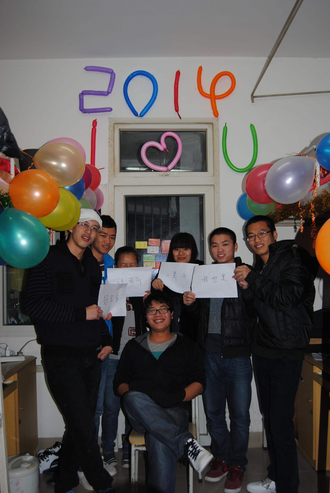
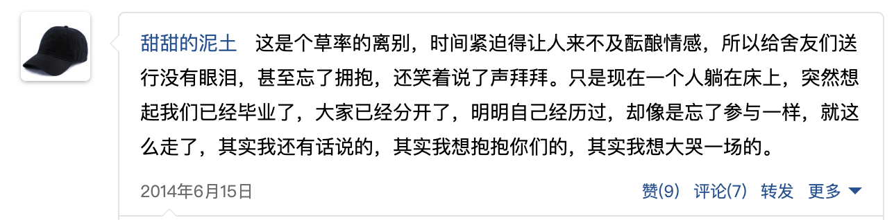
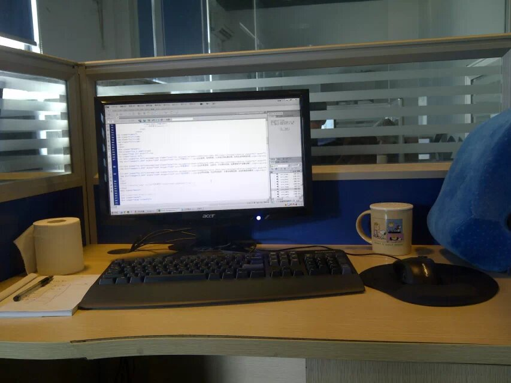

## 2014 初出茅庐

照片是和同学们最后一次的跨年，墙上的气球帮我们记录下了时间。

翻到了一条当时的空间说说：

毕业那段时间，应该算是人生的小低谷，学校 3 年，几乎没认真学习过，所以专业知识可以说一片空白。虽然这是大部分人的状态，对于我而言会更加困难。

有的同学选择了专升本，美化一下学历，也可以延缓一下毕业的焦虑。

有的同学借助家庭关系顺利的就业甚至创业。

有的同学选择参加培训班，有点“实际经验”再找工作。

也有同学毕业直接就做了和专业不关联的工作。

只有若干同学是凭着学习还不错，掌握了部分技能而顺利找到专业工作的。

而我由于“穷人家的限制和政治正确”觉得必须从事专业相关的工作才“合情合理”。没有升本和参加培训的念头，也没有考虑过从事其他行业。但是那张毫无学术价值的毕业证敲不开任何一家公司的门。

（如果当时没有那么多的“穷人枷锁”，可能我直接从事房地产销售或者汽车销售没准已经财富自由了，^\_^）

「高考就是人生的分水岭，你进入什么大学，接触什么样的环境，什么样的老师和同学都是天差地别的。我所处的大专院校，客观的说，学业不精虽然有个人不努力的部分，但是更大的成分在于它就是个很差的学校，课程差，学习氛围差，老师的教学水平差，当然，来读这个学校的生源也差。很不幸我就是这些差差差当中的一员，负负没有得正。当然是咎由自取，高中没有认真读书的关系。后悔但是不埋怨。」

所幸的是当时唯数不多的专业学的比较好的一个同学（黄恩灵），他对于专业的认知在同学中是比较高瞻远瞩的，建议我这种不爱学习的，比如不想写 C++ 和 JAVA （他个人选择的方向），可以考虑写 web 前端，它入门简单且市场需求也旺盛。

于是在学校正式毕业时候，我没有回家，在学校附近租了一个小小的单间，150 块每月，是的，没有看错，150 块，这个价格我记得特别清楚。就一个房间+一个卫生间，摆下一张床和一个小桌子，就没了。买了一本 html+css+javascript 入门的书，只记得是蓝色封面的。

这个小房间给我留下非常深刻的记忆，有篇当时记录的文字。

::: details 闲杂琐碎

<!--@include: ./2014-小小出租屋.md-->

:::

这两个月把生活成本压到最低，几乎是就用 1000 块解决一个月的所有开销，虽然家境不好，但是我家人也没有催过我快点找工作，我把想法和她们说，说我现在再自学 1-2 个月，你们再给我 1-2 个月的生活费。（我妈当时在建瓯给一个大排档端盘子，工资是 1800 元，她扣除自己在建瓯的 300 房租，给我 1000，就剩下 500 当作自己的生活费。）

每天定了起床的时间，简单吃点东西，就开始对着书本敲键盘，那是我最自律的一段时间。如果书上的东西学的顺利，感觉自己掌握了一点东西，给自己的奖励就是中午出去快餐的时候，允许多买一瓶 1.5 元的雪碧。那个炎热的夏天，我的小幸福就是那瓶雪碧。

自学了快 2 个月，终于大概都懂了点皮毛，于是又接着面试。所幸凭着那么一点点皮毛面试通过了一家做企业模板的公司，我甚至记得当时面试官问了我其中一个问题是，知道 html 标签的哪些行内联元素和块元素。

入职工资是 3500 ，第一个月的工资是发的现金，忘记了是没办理好薪资卡，还是试用期是这样，由于没有满月，领了 1700 块，我依然记得那天去财务那边领钱，拿着 1700 的一叠巨款，手都不争气的有点发抖。

那可是我焦虑迷茫了 2 个月后，第一次拿到工资，终于可以不用继续问家里要钱了，更重要的是有了工作，没那么焦虑不安了。

不过面试简单，意味着业务简单，工作就是套模板，用 xslt 这个几乎被淘汰的模板语言，后台也是落后的 asp，做着几乎是重复性的工作，甚至很多工作和 web 前端都没有关系，套完模板需要填充数据，自己在对应的后台录假数据。以现在的眼光看，录数据这种毫无意义的纯手工的工作完全可以脚本化，自动化，但是介于当时那个团队的技术水平，没有人提出，更没有人实现。

于是在做了一年之后，我想着要么公司加工资，要么就要出去找过工作了，因为当时也发现自己做的和当时行业热门是脱轨的，技能也没有更大的长进空间了。于是就和经理提了加薪的申请，没有通过，所以果断提了辞职。

对于第一家公司，其实我是心怀感激的，不管它多差多落后，它接纳了当时什么都不懂的我，当时的面试官也就是我入职后的组长，对我也是比较照顾，挺乐意教我，让我比较顺利的适应了当时的工作。

对于加薪不成也是可以理解的，当时做的事情技术性摆在那，就是一个懂点皮毛的毕业生就可以完成，没有继续锻炼你的空间，也无需你特别厉害。你不做，他就继续找个毕业生接着做就好，所以当时离职是明智的，要不然此时我真不知道自己的职业路径会是什么。

所以第一家公司的总结就是，让我稍微入门了 web 前端这个行业，然后结交了至今还有联系的朋友：李坤严 和 徐天宏。

感谢 QQ 空间帮我保存了一张工作的图片：

在这边待了不到一年，第一次参与公司的年会。

<Pictures :width="300">

</Pictures>
