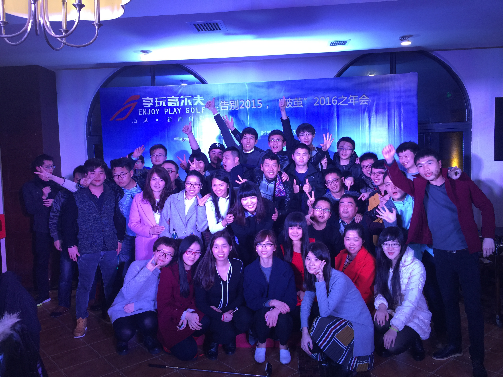
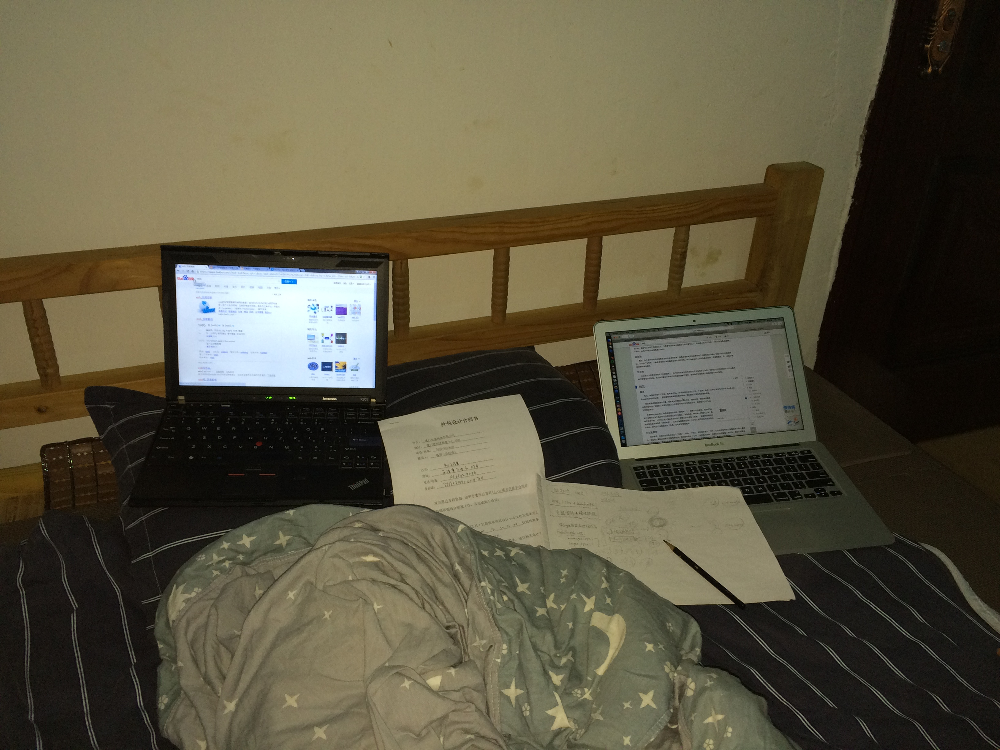
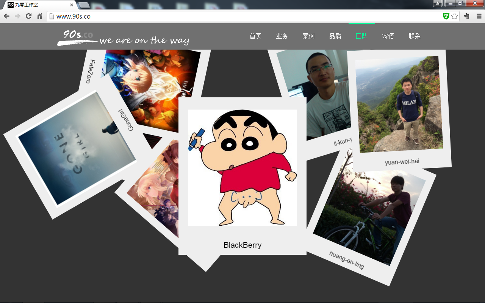
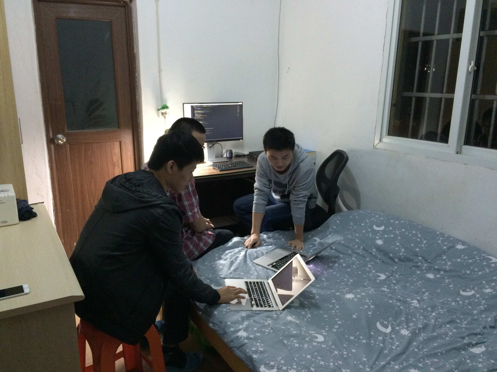
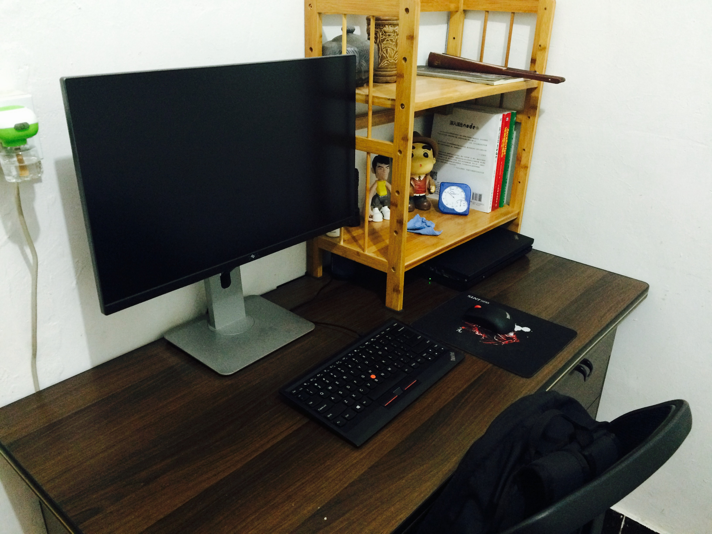

## 2015 混乱的一年

这是混乱的一年，也是见证了当时资本盲目入场互联网，又狼狈退场的一年。

从第一家公司离职之后，我去面试了一家公司，当时觉得面试官人很亲善，技术也很厉害，感觉聊得也不错，当时非常想入职，可是最终并没有收到 offer，不过和那位面试官的缘分并没有就此结束，后来发现他是当时我所在的前端群的群主，于是加了 QQ，算是巴结了一位同行大佬。这位面试官叫黄森斌，这里埋个伏笔。

入职的第二家公司是开发它的门户站，面试我的是个 PHP 后端，感觉人也挺和善的，入职后也确实是这样，乐意指导，不摆架子。我从之前做多个同质化的模板到只要专心做一个门户站，感觉专注多了，可以好好的写代码，也更认真，一些小动画可以自己尝试实现。此时就感觉换工作太正确了，工资也涨了，第一家公司是 3500，我要求涨薪到 4000 没有结果，这边直接给了 4500，当时就暗下决心，借助开发这个网站，好好学习 JQuery。

可是好景不长，这家公司只工作了 2 个月，就欠薪不发，离职了一部分人，我也离职了。不过这 2 个月，认认真真做的这个门户站感觉自己那些基础的皮毛知识串联了起来，更有信心了。而且也立刻找到了一家新公司入职。

（现在才知道当时那家公司是不想给赔偿，故意用欠薪的方式让人主动辞职，那时候自己也年轻，不懂这些，直接签了离职协议走人了，欠薪后面也发了。）

新入职的一家公司是传统企业，想做石材的商城，从卖家变成平台，那时候的互联网是很火热的，各种传统资本想入局互联网，各个都想搞平台，搞商城，入职的时候吹牛说要投多少钱，要做上市，进入之后发现只是买了个二次开发的商城，在修修改改，只有一个 PHP 外加我这个前端人员，不过我那时候也是萌新，无所谓，反正有工资，有事情，就做了。而且这边在上家 4500 的基础上涨了 500，当时觉得 5K 也不错了，而且离我当时租的地方很近，走路去上班。（此时我已经从岛外那个 150 块的出租房搬到岛内来了，住下边社，现在已经拆迁了，变成了建发的楼盘）

由于觉得当时配合的 PHP 技术很水，沟通也不顺畅，于是我还游说了上家公司的 PHP 经理来面试，由于当时上家公司的欠薪操作，我经理确实被我说动摇了，来面试，也面成功了。

戏剧性的来了，我在这边刚刚做满一个月，而且第二天就是我经理要来入职的时间点，这家做石材商城的公司说项目被取消了，要解散我们，也让我经理不用来入职报道了，非常突然，不过当时也欣然接受，因为这个领导本人还是挺好的，入职的这一个月相处下来也很融洽，而且他也只是听安排做事。

于是在这边刚刚好做了一个月之后又离职了，工资好像是当天就结算给我们。只是当时还是太年轻，不懂要 N+1 赔偿。而且尴尬的是我上家的经理，那边已经提了辞职，这边马上要入职了，又通知项目取消了。

于是我又风风火火的开始面试，入职了一家外包公司，工资又涨了 1000，来到了 6K。他是一边做外包项目，一边开发自己的高尔夫商旅业务。这家虽然是外包，不过是我当下经历过最有技术氛围的公司了。

技术领导是个 java 程序员，感觉挺极客的，平时开发都用 Linux，浏览器用火狐，脱离鼠标纯键盘操作，键盘是 61 建的，当时就觉得，哇，这是大佬啊！ 确实，他能力不错，带领我们做项目的时候就能感受到，而且虽然他是个后端，当时对于 javascript 的掌握都比当时任何一个前端好，刚进去时候他交给我一个任务，是在类似一个微信公众号的编辑器里，实现拖入一个图片，自动采用七牛上传，然后插入到文档中。

这对当时的我来说简直太难了，甚至毫无头绪，根本不知道应该怎么做，然后他居然让我先学习，于是我刚入职的那段时间，是每天不用做事，直接翻开犀牛书在那边看。

不过虽然没事做，但是心里更慌，一边学习，一边对要实现的功能无头绪，于是和经理坦白这个功能我搞不定，他也没有继续为难我，就开始做那个高尔夫的项目了。

我也是在这家公司才接触 Git，那个经理对技术挺有追求也比较关注当时最新的东西，因为我记得那时候，他就给我提起过前端可以考虑学习一下 react，对于厦门当时的环境来说，确实比较前沿了。

可是我们开始外包的项目之后，就非常忙了，外包嘛，就是赶，时间越快，盈利越大，在这家公司我们甚至有段时间每天 11 点下班（还有个学名叫封闭式开发，一群人困在一个办公室里面），外包公司确实是个血汗工厂，不过对于当时的我来说，并没有很介意，总之就是跟着 java 后台配合做前台页面。 第一次用 ajax 调用后台数据。

这家公司的氛围也很好，平时的群里聊天很热闹，我记得当时大家还都使用英文名，我猜也是那个技术经理要求的吧，所以导致我现在完全不记得任何一个人的真名。

又是好景不长，（也幸亏不长，否则我可能会继续在那边待更久）我们一个长期的外包项目,一个洗车的服务平台 《车爷》，对方公司运营不善倒闭了，由于失去了这个稳定的外包项目，导致我们公司也只能解散这支开发队伍，不过资本家就是资本家啊，他居然还是让我们主动辞职，我当时已经知道可以要赔偿了，可是架不住大家都配合公司啊，公司的意思就是让我们带薪找工作，可以去面试，算打卡上班，算他有一点点良心吧。不过当时互联网还是火热的时候，大家找工作都非常快速，所以应该没人要求赔偿，中国人好糊弄，维权意识不强，又讲究情面。

我们队伍解散是 2016 年的事情了，所以是有在这个公司参加 15 年的年会的。

15 年还有个小插曲，我和黄恩灵还尝试着找外包项目。我们也确实接到了一个项目，当时在 QQ 群看到消息，我就火速联系了对方，然后请假去对方公司面谈的，是的，就那么一点点狗屁经验的我，就独自一人去面谈了，吹嘘了一波，加上当时黄恩灵已经是他们公司的小队长，我就给对方吹牛说是某某大神和我一起接单，所以顺利拿到了项目，现在想想主要是我要价不高吧，是 6 千还是 7 千给忘记了，当时还沉浸在未来要搞自己外包公司的美好幻想中。

拿到合同的那天晚上，我们还注册了域名 `90s.co`，打算以后做个自己的官网，来接外包。

这是当时开发的我们的网站截图。

这是我当时住的地方， 250 块一个月，在下边社，房东很好，价格便宜，我和堂姐，阿坤，都住这边。黄恩灵租隔壁栋。这张图片是当时摆拍的，非常规状态。

发个当时的桌面：

