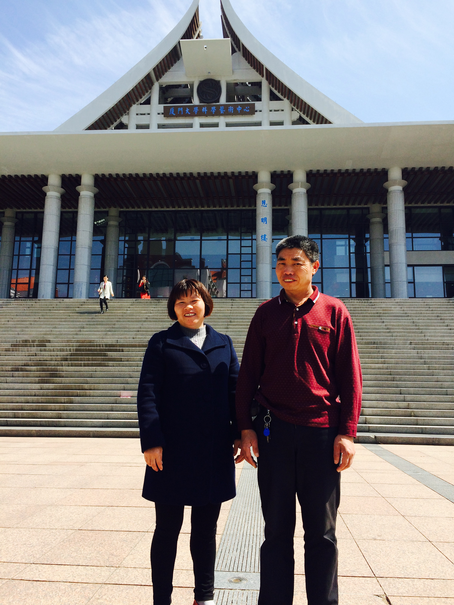
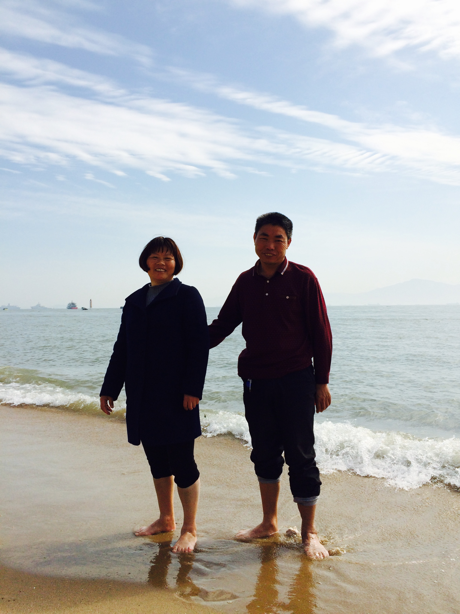
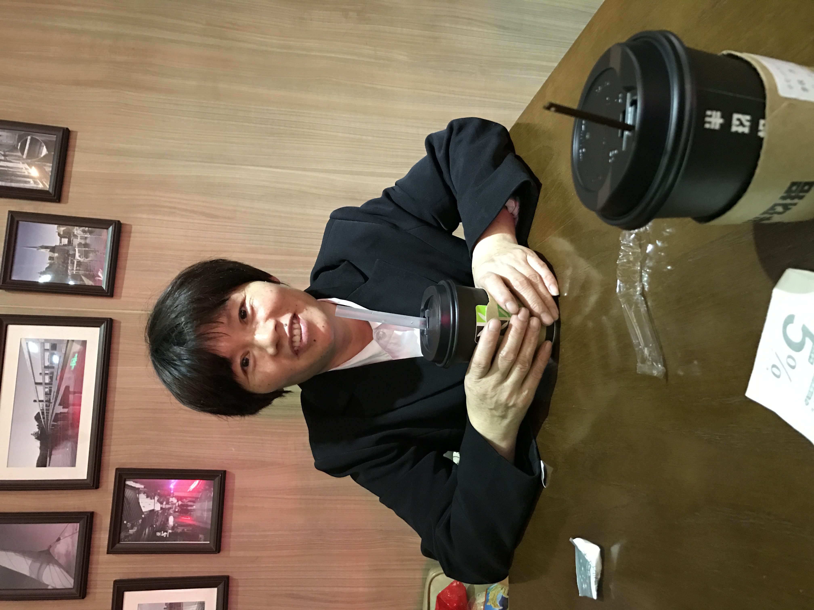
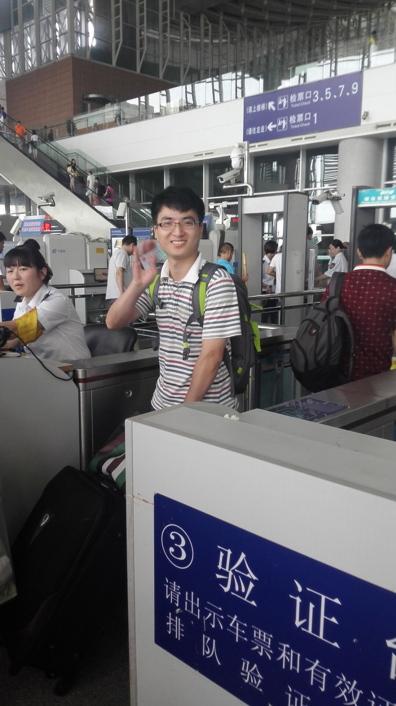
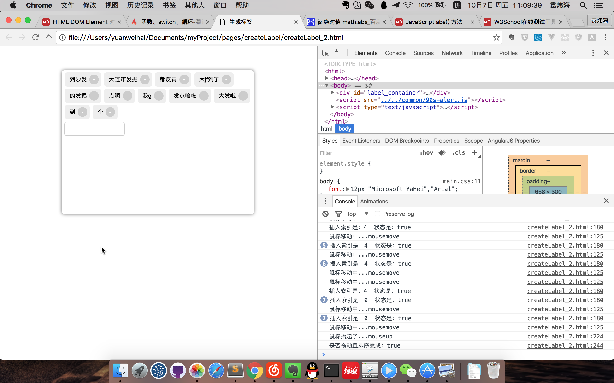
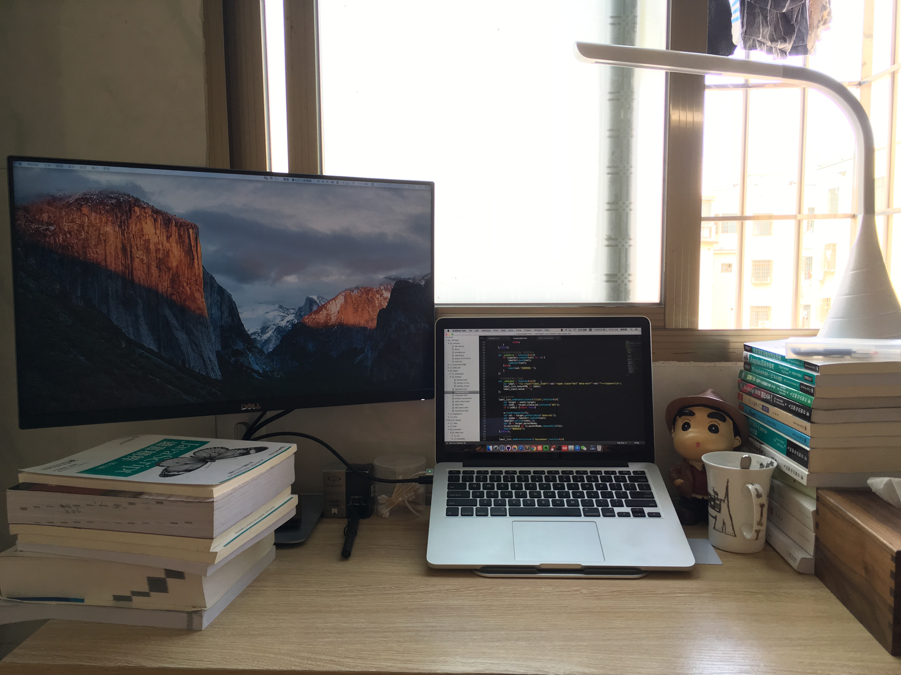

## 2016 相聚 & 离别

时间来到了 2016，当时感觉工作也稳定了，可以带我爸妈来厦门找工作了，因为此时我妈妈还在建瓯那边端菜，月薪 1800，而且无休息日。 我觉得太辛苦工资低，不如来厦门看看机会。

带我爸妈来厦门是最正确的决定，虽然当时帮他们找工作也很挫败，后来机缘巧合，我们住的附近的希尔顿酒店招保洁，得知消息的我们吃过晚饭直接骑车去打听，确实缺人，第二天安排统一面试，我妈妈就去了，于是开启了她的新篇章，她从酒店保洁阿，做到小区的保洁主管，从穿普通工服，到了穿黑色工服，这是她的人生进步，我这边不继续展开。

<Tip>我们去厦门大学玩</Tip>

<Tip>爸妈第一次到海边</Tip>

<Tip>经过自己努力，当上了保洁主管</Tip>

16 年黄恩灵和阿坤都先后去了深圳，毕竟厦门的互联网和一线城市确实差了一个层次，无论是技术还是薪资水平，我由于家人已经来了厦门，也不想换地方，就继续待在厦门了。

<Tip>送阿坤去车站</Tip>

接着我的故事，前面说那家外包公司在 16 年倒闭了，此时我经过 2 年的摸爬滚打，也算一个老成的新人了，于是找工作不再是人要我，我就去了，开始挑一些觉得靠谱的公司和项目，也拒绝再做外包了。

于是，我入职了一家集团公司，是做卫浴的，过去开发和维护他们的商城。有点类似小米商城，但是肯定没有他们厉害，也是一个二次开发的系统，但是正规很多，技术团队也总共有 10 人吧，工资来到了 7K，当时想着是实体企业，而且还是集团 ，应该不会再倒闭了吧！工作环境也不错，有一栋独立的电商楼，还有食堂，吃饭比较便宜。

我也从湖里搬到了海沧，在这家公司的这段时间，应该算是比较轻松自在的，状态很好，工作内容不难，事情也不多，有条不紊的做事即可，下班吃过饭我还经常去海沧湾散步，当时住在海沧石塘，很大的城中村，小吃特别多，到现在依然怀念那边的烟火气。

我一个人住那边也有很多的自由时间，吃过饭回家就开始玩电脑或者学习，那时候算是我 javascript 算是真正入门的阶段吧，开始学习封装插件，网上看到有意思的效果也会尝试自己去实现。

<Tip>在写拖拽排序</Tip>

<Tip>当时在海沧的桌面</Tip>

那段时间我周末经常是早上起来写代码，脸也没洗，早餐也没吃，就坐电脑前面折腾，到了中午 才洗漱一下，出门找吃的，印象比较深的就是有一家肥肠面，经常去吃。还有每天早餐都吃的肠粉，还有一家铁板豆腐。

嗯，现在回想起来，那段时间可能是我最惬意的日子了，无忧无虑，时间充足。
