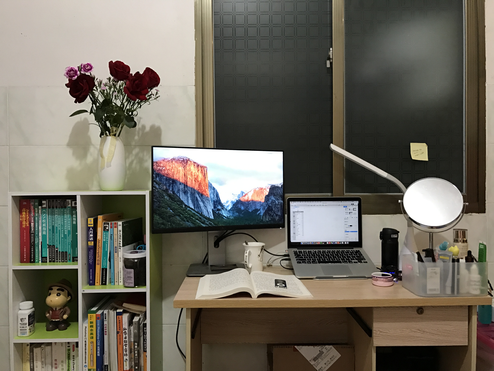
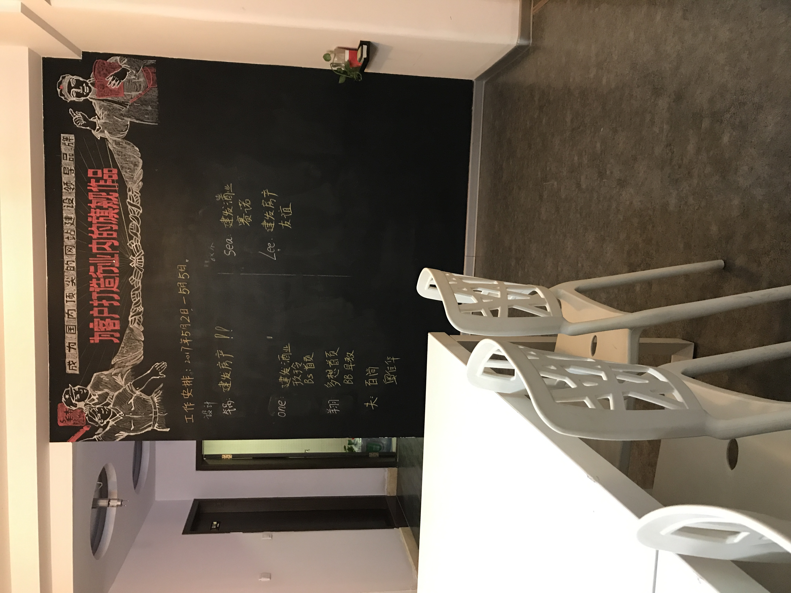
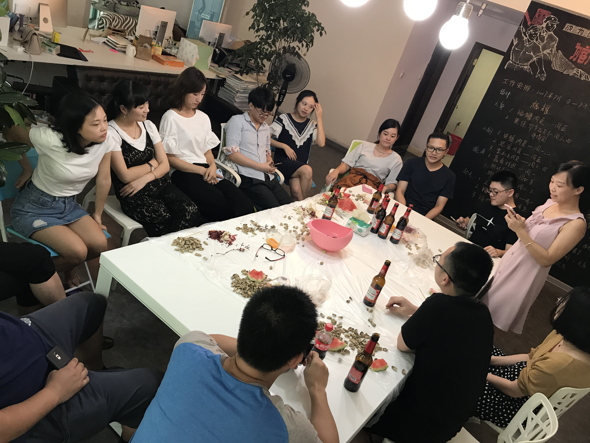
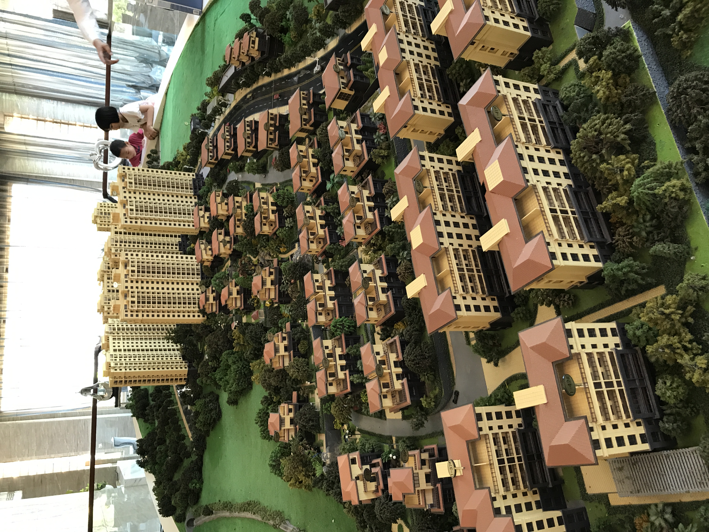
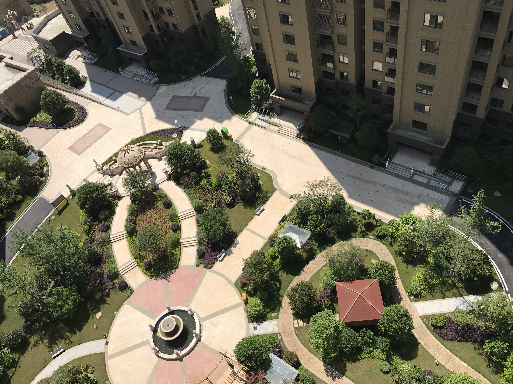

## 2017 秋平来厦

最重要的事件：

秋平来厦门了，由于情节跌宕起伏，篇幅也过长，甚至可能超过这篇文章。也按下不表。

原来一个人住的单间，变成了 2 个人，所以变成了这样：

<PictureTip>刚到厦门的场景</PictureTip>

秋平来厦门继续找了汽车销售的工作，也在海沧，我们就继续住这边。此时虽然工作比较稳定，但是 7K 的工资已经不能满足我对未来的规划了，于是又提了离职，重新开始找工作。

我加入了一家做服装定制的公司，面试过程挺顺利的，工资 8500，以为会有好的开始，谁知道这将成为我记忆最差的一家公司。主要是当时的后端人员，极度傲慢，当时他们做的项目也没有进行前后端分离，我们只能在 php 的框架里面写页面，按照他们的规矩去写代码，最难受的是如果是修改 bug，我记得是我改了代码之后，推到服务器了，还需要去喊后端重启一下还是怎么的，才能看到效果。反正流程非常反智，工作氛围异常压抑，当时的前端组长也是啥事不管，直接丢需求过来。那些老员工在这种混乱的状态中已经很适应了，但是对新人极度不友好，后端各个屌得要死，真的是非常难熬的一个月，事情也没有如期做好，我属于被劝退的，好像也是凑整一个月时间，不过这并没有打击到我的信心，因为我非常确定问题是他们的，而不是我这个新入职的。而且我立刻就找到了一份工资 9K 的工作了。

这家公司对我的影响是积极的，在今后的工作中遇到其他新人，不会摆出莫须有的傲慢，业务上的问题也会友善的给对方解答，不会因为自己只是更熟悉业务，就有莫名其妙的优越感和傲慢的态度。

从那家傻逼公司离职之后，我立刻就到这边入职了，滑稽的是我之前是这两家做选择，优先去了上家，因为这家是做企业官网定制的。不过虽然也是外包，但是和 14 年那家做模板类官网还是有区别的。这边只做高端定制，客户几乎都是大企业，一个官网的价格在 8-9W，甚至 10W+，看了它们过往的优秀案例，觉得非常有挑战，如果在这方面精通，也是前端的方向之一。

入职之后才发现，我是去救火的，因为之前面试我的人离职了，我本来还幻想入职之后跟着那位大佬一起学习做酷炫的动效呢。不过由于给的薪资有 9K，我就决定自己扛下去了，第一次接触这样高定制化的官网挑战还是不小的，各种交互效果。设计师的想法是天马行空的，这种高端定制的项目往往那是设计优先，让客户看了满意了，就让开发去实现，如果实在不好做才降级处理。

而页面效果如果要做到耳目一新，几乎离不开 svg 和 canvas ，这两者之前都没接触过。不过对于常规动画，由于自己在 16 年折腾封装插件的经验，我封装了一套常规动画插件，对于普通动画，实现起来非常快速，只要在元素上挂上对应的类名即可。

这家公司的工作氛围还挺好的，都是年轻人，漂亮小姐姐，可能是老板娘招人的喜好之一，颜值都不错，毕竟需要对接企业客户。平时大家经常一起玩狼人杀什么的。

不过终究是做外包，无法持续深入到在同一个项目上，导致厌倦期很快就来了，而且经常和设计师抠像素细节也烦了，于是还不到一年时间，我又提出离职了。

在这期间发生一件算大的事情吧，就是在建瓯买房了。这个其实不是我规划内，是我妈回一趟老家，去看了楼盘，然后就下定的，给了 5W 定金，当时她打电话问我意见，我觉得月供没问题，就答应买了。此时的我其实还是刚完成自给自足的状态，没有存款，问吴静和阿坤借了 4W，加上我爸妈的钱才凑齐的首付。不过在年底之前我就还清了两位朋友的钱，在此再次感谢两位好友。

<PictureTip>冠达山庄</PictureTip>

接着我入职了一家做 《保密》项目的公司，而且这个家公司之前其实已经面试过了，当时觉得它刚成立，没有优先入职。 在整个 10 年的前端职业生涯中，这家公司对我而言算是一个非常重要的转折点，我从一个野生军进入正规军的变化。

虽然是做《保密》项目，但是流程非常规范，回首我之前的那些经历，都是草班团子，流程没有规范可言。第一次经历完整的开发流程： 需求评审 - 技术评估 - 技术调研 - 开发阶段 - 测试阶段 - 复盘等。

当时的团队成员，感觉除了自己，其他都是大佬，有工作经验久的，有厦大毕业的，有留学归来的。每个人都可以是我的老师，我也是在这家公司才步入现代的前端开发，使用了 vue 框架以及配套的现代的前端工程。 如果说之前的开发方式是刀耕火种，那么在这家公司进入了工业时代。

虽然技术是垫底的，但是那段时间算是进步很快的，而且可能个人沟通协调能力不错，被提拔为前端 leader，是的，技术最差的我做了 leader。 当时的经理算是很器重我吧，把前端部分交给我，让我来统筹安排，负责接下来的面试等。

第一次负责项目，积极性是很高的，我经常吃饭睡觉都在思考功能如何实现，怎么样才能更好，偶尔周六还主动去公司加班，那么段时间应该是进步最快的阶段了。

因为是《保密》项目，所以待遇也不错，当时开的是 10K，而且涨薪到 13K 的申请已经提上去了，是经理主动给我提的。每个月的团建经费充足，那是我吃过最多次牛肉火锅的日子了。后来因为不可抗拒因素，我们项目暂停了，团队解散，我没能在这边达到 13K，第一次顺顺利利的领了 N+1 的赔偿金。

晒几张当时的工作环境，应该在厦门算第一梯队了吧：

<PictureTip> 我在世贸双子塔上，每天都可以远眺郑成功像</PictureTip>

<PictureTip>每月都有充足的团建经费</PictureTip>

印象中某个月的经费快过期，经理安排我下班去超市买零食，必须买够两千块左右，我们几个同事一起过去满满推了两个大购物车。
