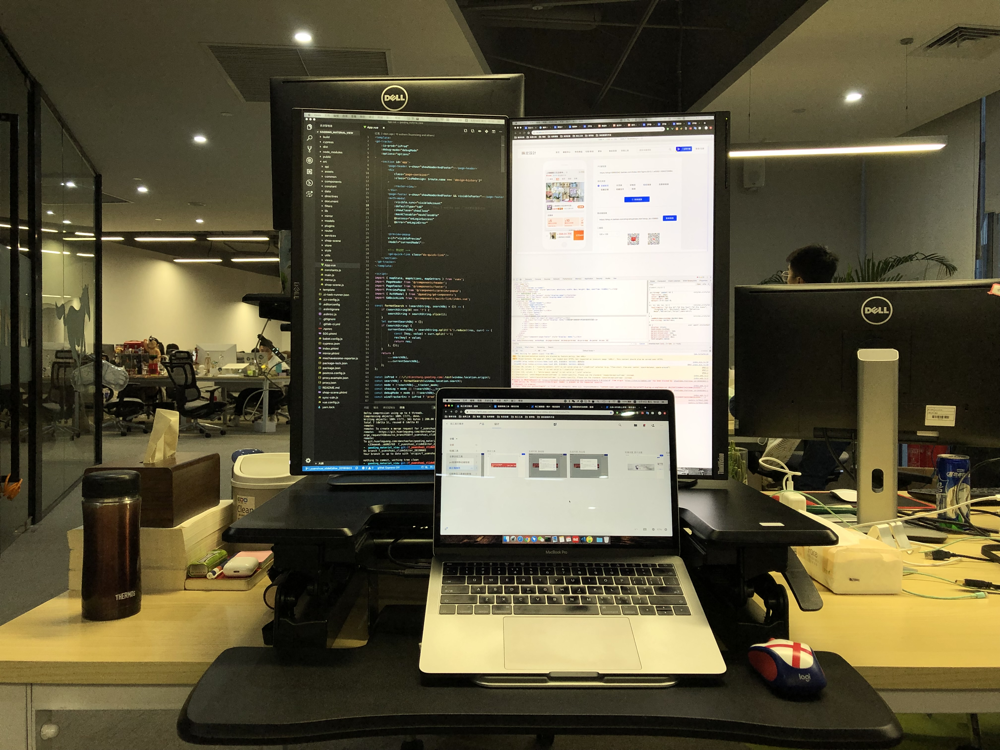
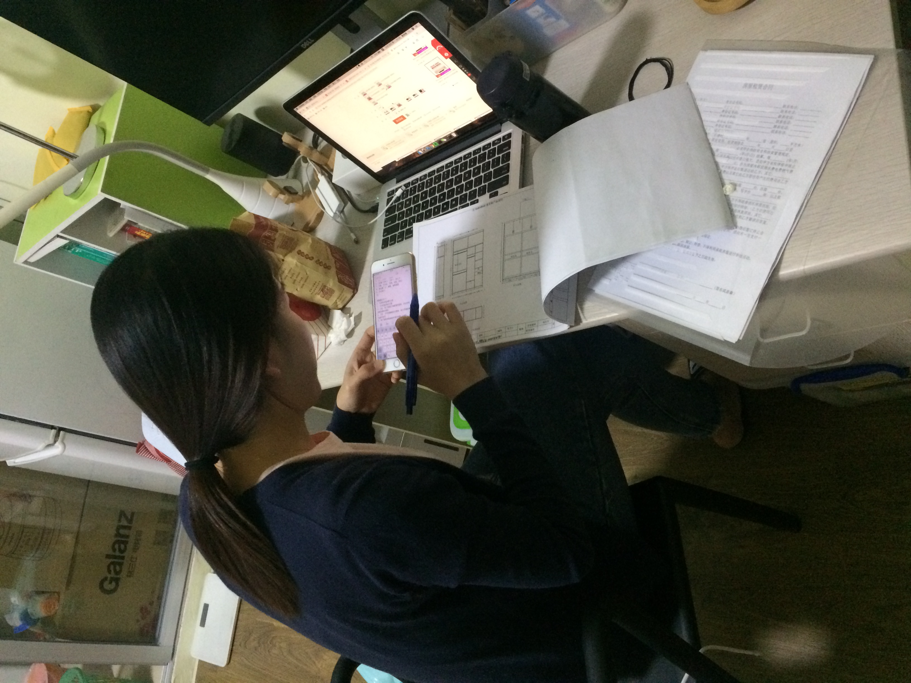

## 2018 稿定科技

18 年的工作也是一个比较好的转折，由于上家的工作经验和带队经验，在后面的面试中加分不少，我顺利的入职了一家专门服务国企单位的公司，也算是以小组长的身份入职的，月薪我就开了 13K（上家提了申请，还没来得及通过就解散了，我就以上家的基础谈的）

在这边做了 3 个月左右，完成了一套权限管理系统的前端部分，感觉挺顺利的，算是将上一份工作的经验做了一次总结性验证。

即将转正之际，我在招聘网站看到一家招聘内容写得非常专业，一看就是好公司的放出的岗位，我试探性的投了简历，然后面试，居然通过了。面试我的还是圈内有名的前端大佬，觉得很荣幸，我几乎是毫不犹豫的，就给当下的公司提出了离职申请，在完成项目交接之后，就去新公司入职了。

这家新公司，应该算是厦门的大厂了，一切都很前沿，我从一个刚有点见过世面的感觉，又回到初出茅庐的状态了。这家公司做在线编辑器，对于前端的技术钻研是远超普通项目的，而且也是第一次见识纯前端团队就有几十人的公司，当时团队还有前端圈的明星人物。夸张点说就是刘姥姥进大观园了。诚惶诚恐的过了试用期转正了。

我进入的阶段应该是公司高速发展的阶段，从入职的 15K，公司主动加薪两次到了 19K。员工数量从 300 人加到了 600 多人。

在这边工作了 3 年多，是我当下在职最久的一段工作经历了（3 年+）。个人的进步也是很大的，接触了复杂的大项目，也经历了多人协作，远程协作。也带队负责过一些小项目。

18 年由于入职了这家公司，个人经济也渐渐好起来了，于是就规划在给老家买的房子装修一下当作婚房，装修的事情我几乎没有怎么关注过，都是我老婆在跟进处理，我当时只负责好好上班即可。所以装修总体来说没有什么争吵，还算顺利吧。由于是从毛胚开始弄，前前后后应该花费 20W 左右，这里必须郑重感谢一下阿坤，得知我有装修的计划，直接豪借了 10W 给我，帮助我顺利完成新房装修。

<PictureTip>在出租房沉迷装修计划的苏小姐</PictureTip>
