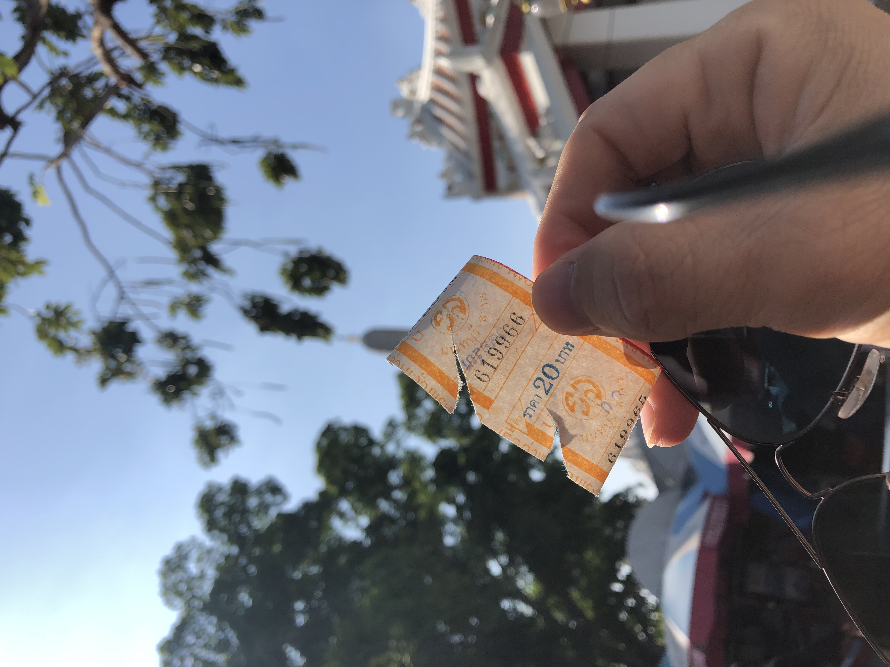
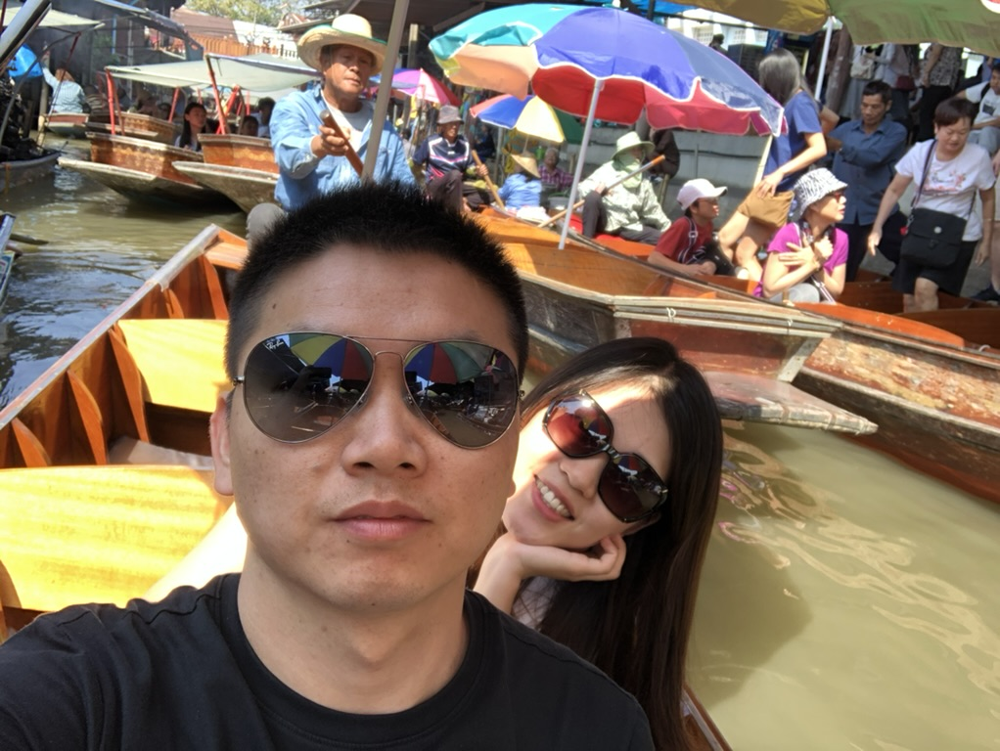
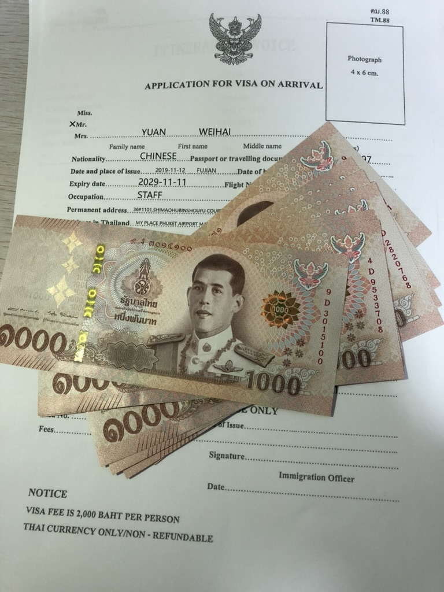
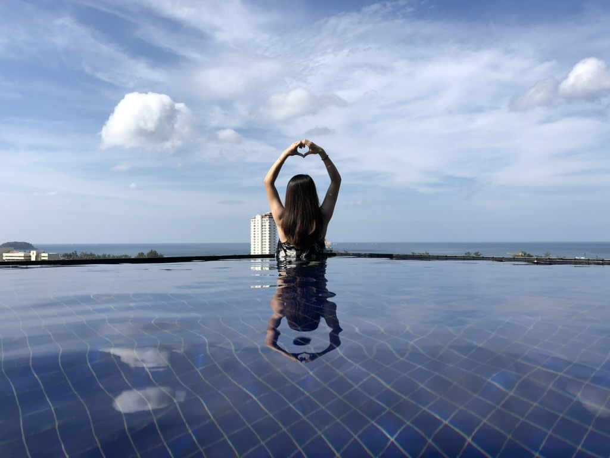

## 2019 结婚

2019 年在一场盛大的稿定年会中开启了。

<video controls src="./2019/new-year.mov" />

公司当天包场了整个酒吧，我也是第一次去酒吧，躁动的音乐，丰富的食物，琳琅满目的活动奖品。可以说是参与过最热闹的年会了。

当年社会环境和公司都处于经济繁荣的状态，一切都欣欣向荣。大家都以为这盛世会一直持续下去，直到疫情来了。

19 年的大事就是结婚了，和那位初中就认识的苏小姐，一切如我所愿。咱暂且不说婚后是否甜蜜吧，起码当下的自己是最幸福的人了。

花了大几千拍了那么多结婚照，就没有一张我喜欢的，还是回老家办证的时候，花 15 块去路边照相馆简单拍个最真实的照片更入我眼。

<Tip>真实，最值得留念</Tip>

结婚后，我们去泰国度蜜月，这也是我毕业以来第一次出行旅游，以前从来没有过真正意义上的 `旅行`，没有出过省，更没出过国。

<Pictures :width="330">

</Pictures>

19 年还有一个标志性的节点是我还清了所有外债（之前装修的借款和结婚的借款）。再次感谢阿坤，吴静和刘世强，3 位好友帮我顺利完成了装修和结婚。

就在一切都在往好的方向发展的时候，最大的黑天鹅来了 —— `新冠肺炎`。

大家本来是在家准备过年的，武汉那边的疫情越来越严重，大家都在支付宝关注每天的确诊人数。接着武汉开始封城，蔓延到全国各地。

2019 年是中国有史以来最安静的春节吧，哪怕抗战时期可能都比它热闹。大家都被封闭在各自的家里，不能出行，不能办酒席，不能走亲戚，交通也停止了。

全国乃至世界的话题都是新冠肺炎，大家迎来了比非典还艰难的时期。

幸运的我们赶在疫情来临之前顺利办了酒席和过完了蜜月，有种后知后觉的庆幸。
