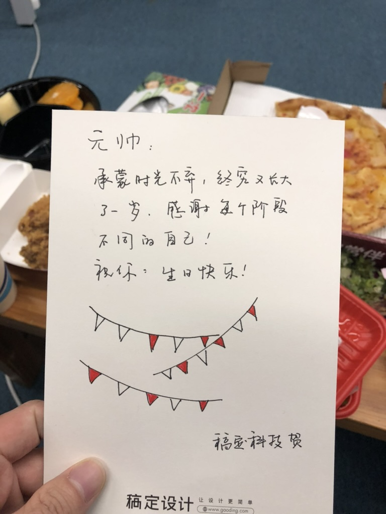
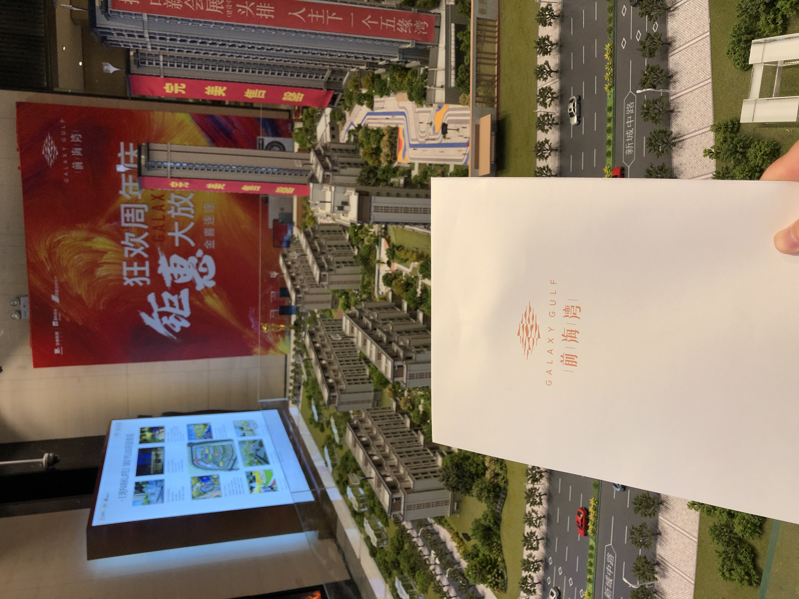
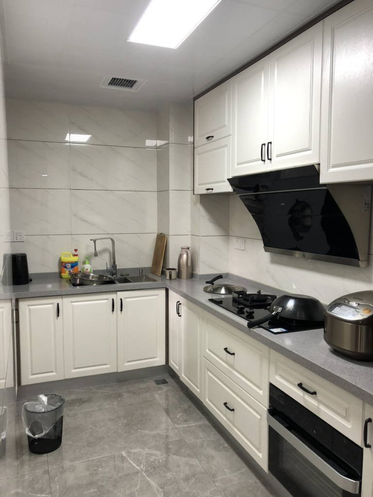
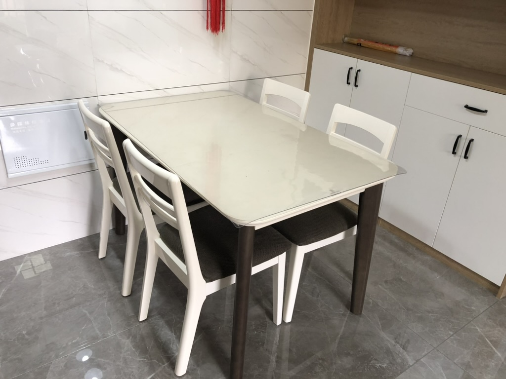
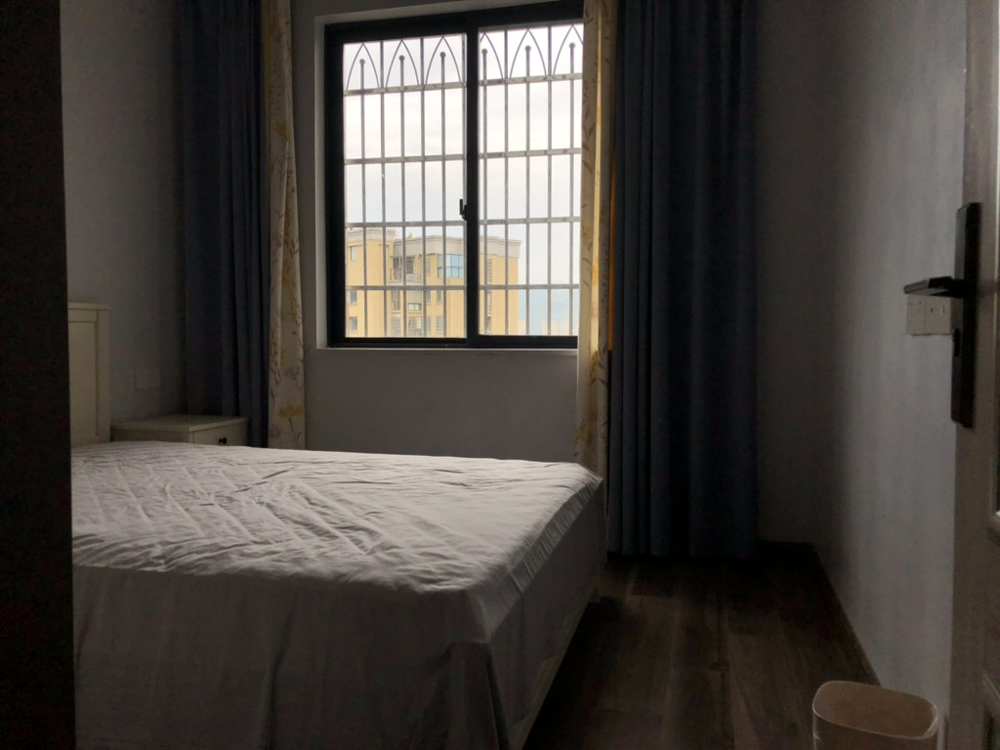
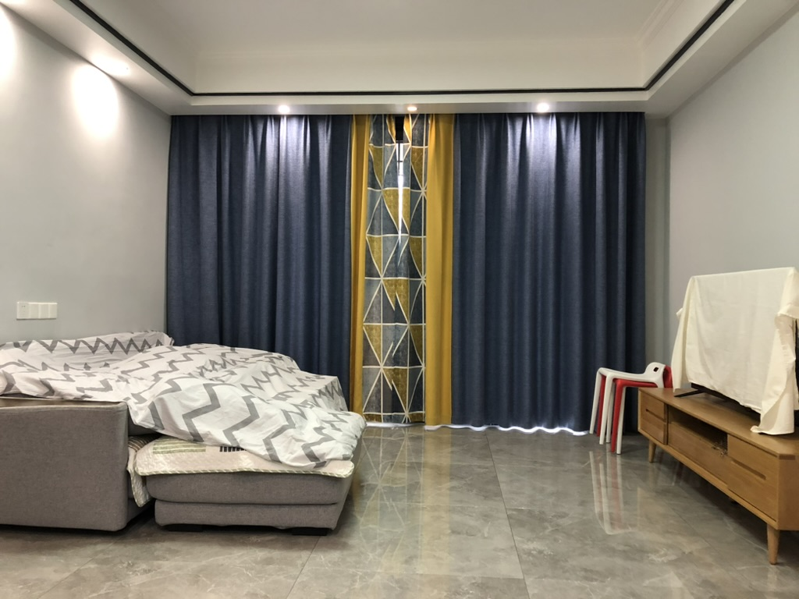

## 2020 厦门买房

<Pictures>

</Pictures>

<Tip>工作依然是在稿定</Tip>

2020 处于疫情最严重的时期，大家上班都要戴口罩，出入公共场所都需要健康码，这是这个年代的所有人都无法忘记的时期。哎，你还别说，其实 2024 年的今天，我已经有点淡忘那些日子了。 时间是最好的解药。

由于没有了外债，想法就多起来了。苏小姐居然敢去了解厦门的房产信息，看着看着觉得我们居然可以够得着，于是开始了厦门看房之旅。

从海沧集美的远郊看到翔安新城，从 57 平看到了 101 平，我们看了一个月的房子，就决定买了，火速把家里的那套房子挂到市场，前后一个月时间就找到买家，顺利完成买售手续，拿到卖房的钱，再借了一圈亲朋好友，凑齐了 107W 的首付。在厦门安家了。

卖房的时候是委托中介进行的，见识了房屋中介这个龌龊的职业，把唯利是图演绎的淋漓尽致。他们只管成交，不管卖家亏多少，后者买家是否真的合适。好在房子最终还算顺利的进行了交易，大概流程如下：

::: details 不重要的过程

-   1、银行解押 （可以代办）
-   2、领他项权证 （本人去领），拿他项权去建设局解压（其实也可以代领，银行不作为而已）
-   3、建设局办理网签 - 公安局做地址变更
-   4、买家申请贷款（通过之后）
-   5、过户 （代办）
-   6、交接钥匙

有个小插曲是在买家申请到贷款之后，邮政迟迟没有把钱打进我的卡里，我经过几轮投诉才处理完成。

-   95580 邮政总行 投诉办理工单 5 天的周期
-   0591-83291463 福建银保监局纪委办公室 （告知 12378 要多打几遍才能进去）
-   0591-88301101 （不受理投诉）让先联系当地银行办理人，不能处理就再拨打 12378
-   12378 投诉电话
-   0599 - 3833388 谢 建瓯邮政贷款主任

经过这一番操作，最终那个自称是姓谢的主任给我打电话，摆了一通官腔，好在最终很快就收到钱款了。

:::

<Pictures>

</Pictures>

<Tip>没住几天就卖掉的老家的房子</Tip>
