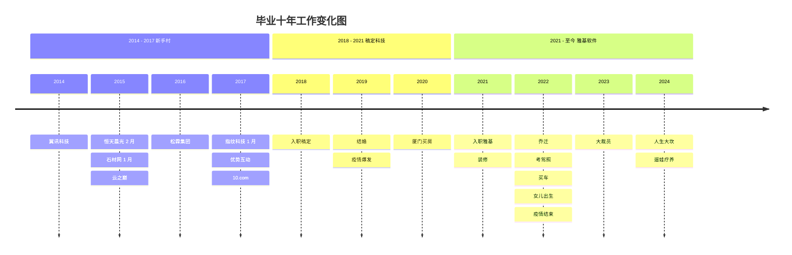
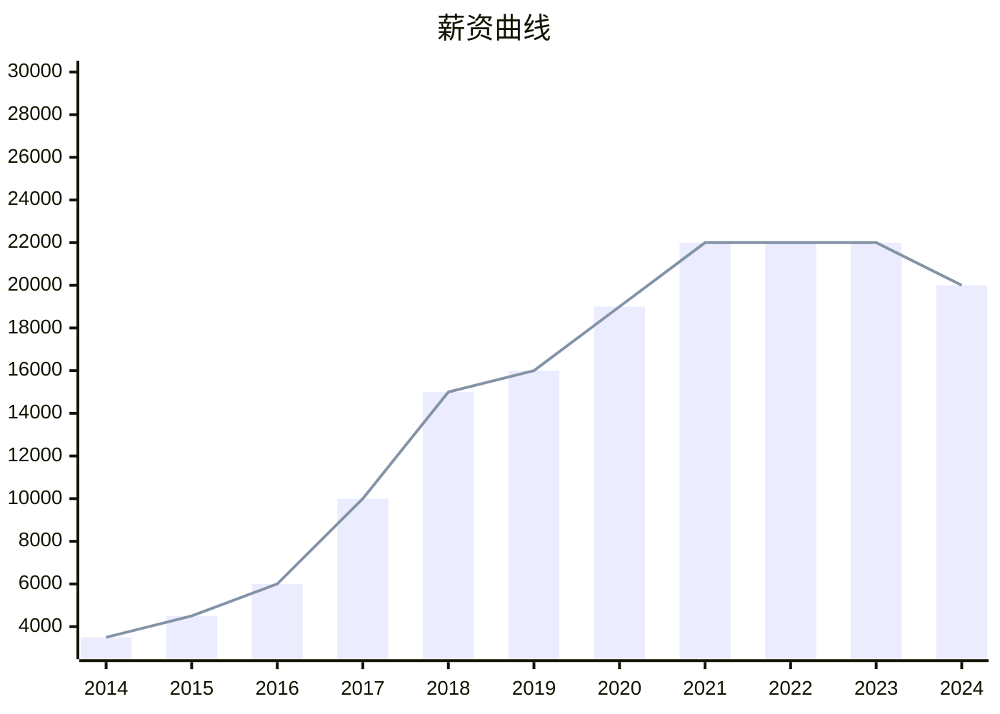

# 毕业十年

## 前言

终于有时间来写这篇文章了，拖延症是非常可怕的，本来文章的标题是《来厦十年》， 自从 2011 年来厦门读书，到 2021 年就在厦门待过 10 年了。当时就想着写一篇流水账似的文字记录，可是拖延症一拖再拖，从 2021 年拖到 2024 年。

由于过年前的这几天，项目上没有什么紧急的事情需要做，同事们也部分请假提前回家了，可以合理的摸鱼，强迫自己趁着零散的记忆还算深刻，来完成这篇拖延了很久的文章吧。

在厦时间线：
2011 ~ 大学 ~ 2014 ~ 工作 ~ 2024

既然标题都改了，那么今天就略过大学部分，直接从毕业开始讲吧。

本文将以工作的变换为主线，毕竟对于打工人来说，工作才是生活的重心，其它事情基本都是在工作的附属。哪怕人生大事，都是在工作中见缝插针的去完成。

<!--@include: ./2014.md-->
<!--@include: ./2015.md-->
<!--@include: ./2016.md-->
<!--@include: ./2017.md-->
<!--@include: ./2018.md-->
<!--@include: ./2019.md-->
<!--@include: ./2020.md-->
<!--@include: ./2021.md-->
<!--@include: ./2022.md-->
<!--@include: ./2023.md-->

## 2024

具体查看 [2024 年终总结](../year-end/index.md)

## 尾巴

这是一篇从 2024 年年初开始写，然后搁置了一年，年末又接着写，才勉强应付完成的文字，时间久远，拼拼凑凑。

这十年间，有人渐行渐远，有人成为新的朋友。人际关系就是一种动态平衡，就像宇宙空间一样，所有星球都是在不停运转才能维持现状的平衡。

物理学上叫相对静止，没有绝对静止。

所以没有什么是一成不变的，唯一不变的就是永远在变。我们能做的就是拥抱变化。

可以看出从 2014 年到 2017 年，我都是处于新手阶段的混乱期，频繁更换工作。幸运的是 2017 年加入的 10.com 让我成长很大，接着顺利进入稿定科技，以及后续来到雅基软件。才能让过去的十年看起来还算圆满。

我享受了互联网发展带来的红利，但是也为厦门这座城市贡献了十年且透支了未来 20 年。

希望时代不负我，我不负家庭，愿接下来的十年有好事发生！！
