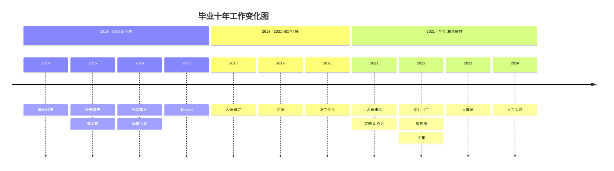
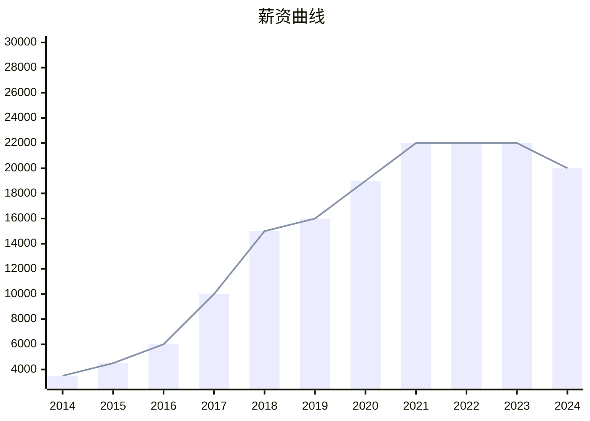

# 毕业十年

## 前言

终于有时间来写这篇文章了，拖延症是非常可怕的，本来文章的标题是《来厦十年》， 自从 2011 年来厦门读书，到 2021 年就在厦门待过 10 年了。当时就想着写一篇流水账似的文字记录，可是拖延症一拖再拖，从 2021 年拖到 2024 年。

由于过年前的这几天，项目上没有什么紧急的事情需要做，同事们也部分请假提前回家了，可以合理的摸鱼，强迫自己趁着零散的记忆还算深刻，来完成这篇拖延了很久的文章吧。

在厦时间线：
2011 ~ 大学 ~ 2014 ~ 工作 ~ 2024

既然标题都改了，那么今天就略过大学部分，直接从毕业开始讲吧，大学的部分就等某年某月的某一天(唱起来了)，再来补上。

<!--@include: ./2014.md-->
<!--@include: ./2015.md-->
<!--@include: ./2016.md-->
<!--@include: ./2017.md-->
<!--@include: ./2018.md-->
<!--@include: ./2019.md-->
<!--@include: ./2020.md-->
<!--@include: ./2021.md-->
<!--@include: ./2022.md-->
<!--@include: ./2023.md-->

## 2024

具体查看 [2024 年终总结](../year-end/index.md)

## 尾巴

这是一篇从 2023 年年末开始写，然后搁置了一年，2024 年年末又接着写，才勉强应付完成的文字，时间久远，拼拼凑凑。

