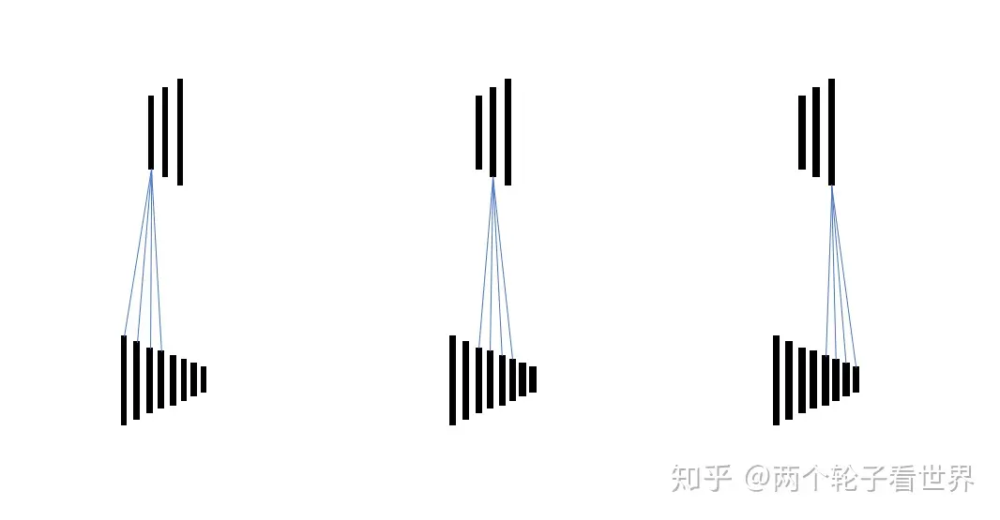
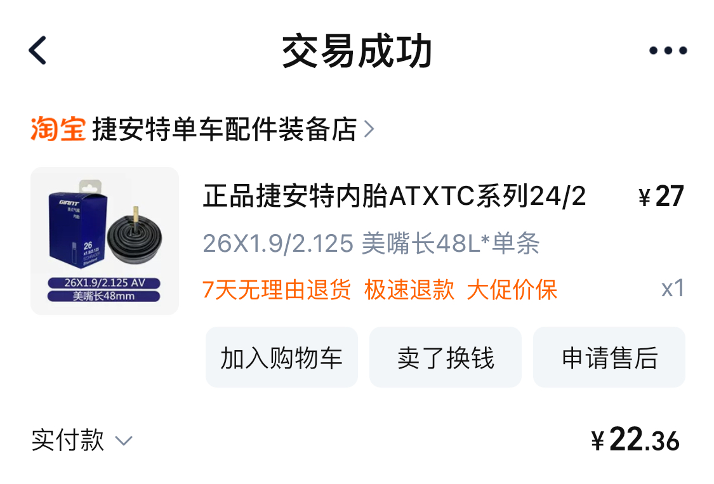
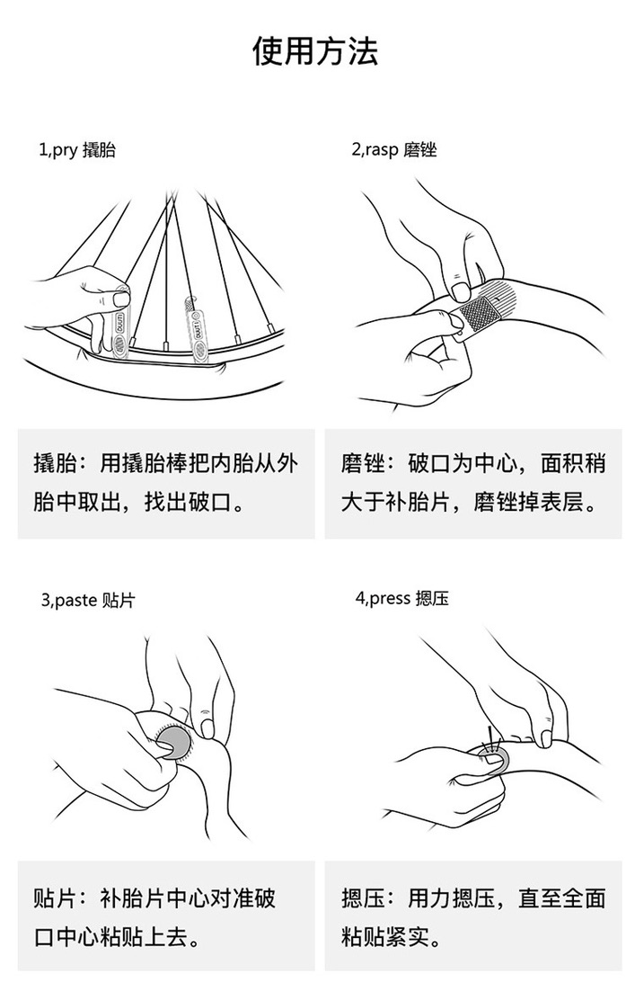
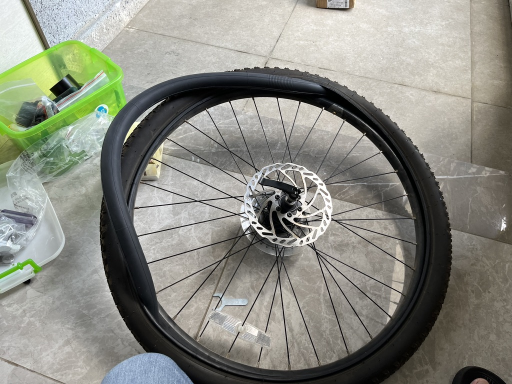

# 骑行知识

## 捷安特 ATX 660

## 正确使用变速器

### 1、踏频

保持稳定的踏频 RPM（Revolutions Per Minute），表示每分钟踩了几圈。一般是 80-90，根据自身条件来调整，关键是稳定。

合理的踏频能够有效使用身体机能，防止肌肉和膝关节损伤。

让双脚保持适当的踩踏力度，如果遇到道路上下坡，通过变速器来调整速度，目的是通过改变速度来保持踩踏的力度稳定。不空踩也不费力的踩。

### 2、牙盘和飞轮的搭配

### 3、变速的时机

预测前方道路变化，要保持速度，提前变速，轻踩踏板，先飞轮后牙盘。 因为飞轮的盘数更多，可以进行更精确的调整，等飞轮调整到需要跨牙盘刻度的时候，再调整牙盘。

## 轮胎

### 合理的胎压

一般自行车轮胎上都会刻印出该轮胎需要的胎压标准，比如 ATX660 的原装轮胎显示的是

`REO PRESSURE 35 PSI / 240 kPa / 2.4 BAR`

和

`MAX PRESSURE 65 PSI / 450 kPa / 4.5 BAR`

我喜欢采用 PSI 的单位，所以取中间值 50 PSI 来当作标准胎压。如果是冬天会打到 55 PSI 来适应低温的影响。

### 换内胎

轮胎上显示 `26 x 1.95`，所以内胎选择尺寸范围内的就好。如我买的是 `26 x 1.9/2.125`。

### 补内胎

不管是拆胎还是装胎，都要从气嘴开始，先将气嘴拆装，再拆装整个内胎。

拆胎，将气体全部放掉。

装胎，稍微打一些气，更好塞入外胎。

## 配件

前后反光灯都拆掉了，没有夜间骑车的需求，城市中路灯覆盖充足，不喜欢功能性不强的配件挂在车上。
