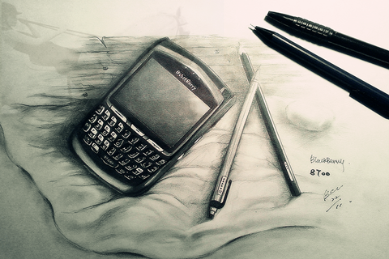
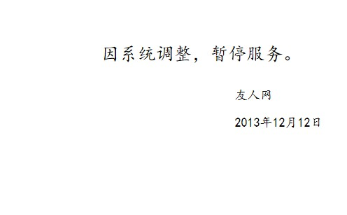
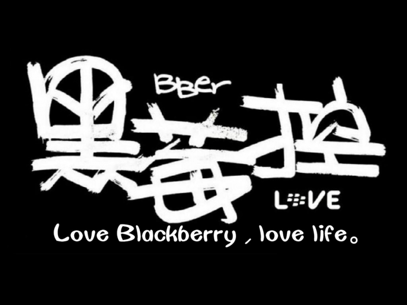
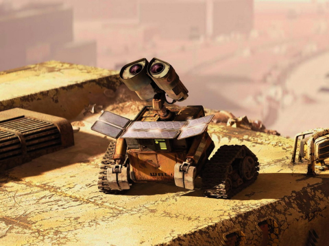
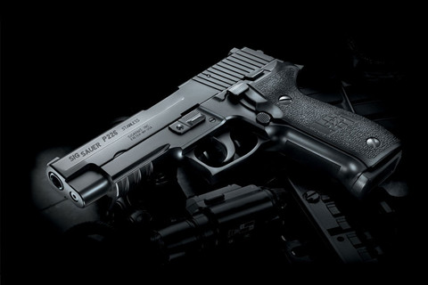
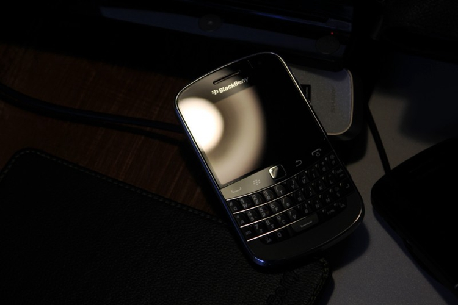
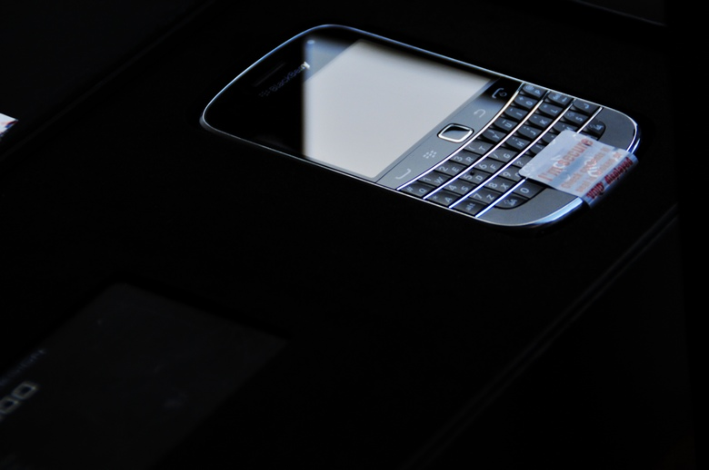
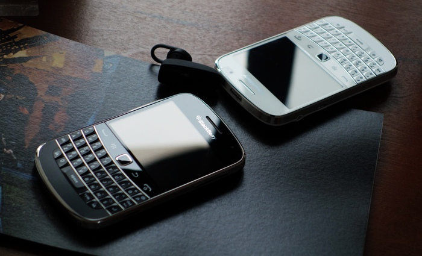

# 我与黑莓的故事

## 初识

2010 年，高补的时候，由于厌学依旧，并没有发奋图强，再创辉煌。无聊了就喜欢看各种论坛，手机评测等等。无意中逛到了《友人手机网》 在里面发现了 8700 论坛。

这个网站的运营模式是给每个手机型号创立了一个类似聊天室的东西，你可以在该型号的房间里发表内容。而使用同一个型号的手机的网友也会进来，在这边回帖。类似 QQ 空间评论的方式进行文字沟通。可能更像百度的贴吧模式。

我无意中点进了黑莓 8700 的空间，看到里面很热闹，有一群固定的 IP 在里面聊天。天南地北的聊，热情友善。看着他们聊黑莓的各种型号，讨论怎么解决断网问题等等。就开始百度关于黑莓手机的信息，一看就爱上了黑莓。

**无论从外观设计，还是系统定位都完美符合我的审美。**

不过那时候没有钱购买，就只是看。论坛上很多网友分享自己使用某某机型的经历，我也喜欢看。

那时候还流行盖楼，就是网友 A 发了一个帖子，其他人去跟 +1 ，看看这个楼会盖到几层。十几年前的互联网没有这么发达，网友们的乐趣居然这么朴实无华。

<PictureTip>先见之明的保留了一张截图</PictureTip>

用段位来表示论坛的等级，需要多发帖，多回复，被点赞就可以积累经验值。那时候还想成为九段大佬呢！

随着安卓和苹果的兴起，玩机的人渐渐都去威锋网之类的新兴论坛，友人网逐渐没落了。

<PictureTip>当初很机智的截图</PictureTip>

## 折腾

时间来到大学时期，由于有去做兼职，并且黑莓的的旧型号也不贵，我就买了几个自己非常喜欢的经典型号。开始在 52blackberry 上面下载各种主题。收集好看的壁纸等。

当年收藏的壁纸：
<a-row>
<a-col :span="8"></a-col>
<a-col :span="8"></a-col>
<a-col :span="8"></a-col>
<a-col :span="8"></a-col>
<a-col :span="8"></a-col>
<a-col :span="8"></a-col>
</a-row>

我前前后后折腾过的黑莓手机有： 7290，8310，9000，9900，Q20

### 黑莓 9000

黑莓 9000 应该是 bold 系列非常经典的型号了。之前在论坛就一直听大家对它的赞叹。包括握持手感，外放音质，屏幕显示都非常棒。

这是我拥有的第一款黑莓手机，视如珍宝，真的超级喜欢这个外观和手感。拿着很踏实，当年一直比较排斥触屏操作，觉得按键的体验才是最符合人体工学的。

全键盘的设计和滚轮的操作是黑莓的象征性特征。按键手感非常好，打字是一种享受。我会不自觉的将它托在双手间拇指来回按压，享受快感。

它的后壳是仿皮的，配合厚实的机身，证明了极致的轻薄并不是提升手感的最优解。

由于我不喜欢玩游戏，也不太喜欢用手机看视频，所以在大学的大部分时间，我都是用黑莓手机度过的。（那时候对手机的依赖程度还没那么大，放现在，就移动支付这点就无法忍受了。）

所以使用黑莓，它让我回归了手机本质的体验。优秀的通话质量，完美的手感，愉悦的打字体验，阳光下依然非常清晰的屏幕显示效果。

它提供的刚好是我需要的，它没提供的，刚好是我不在意的。

-   通话

-   聊天打字

-   屏幕观感 小说阅读

-   系统简洁

-   外观设计

一些美图：

 love what you do, do what you love 

