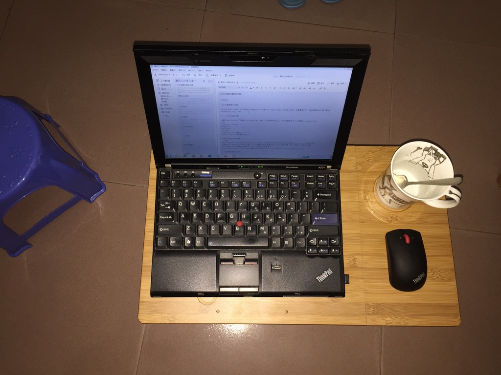
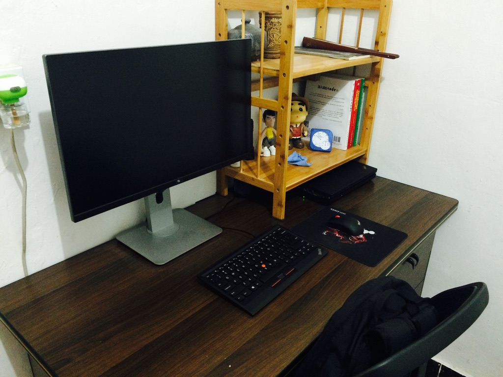
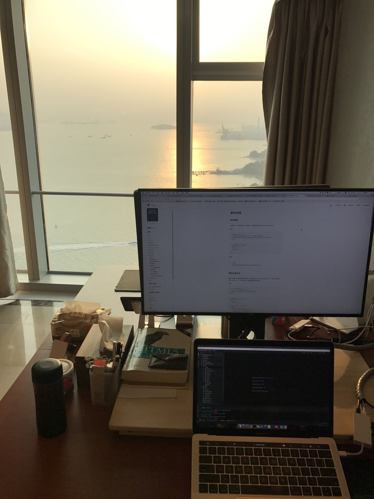
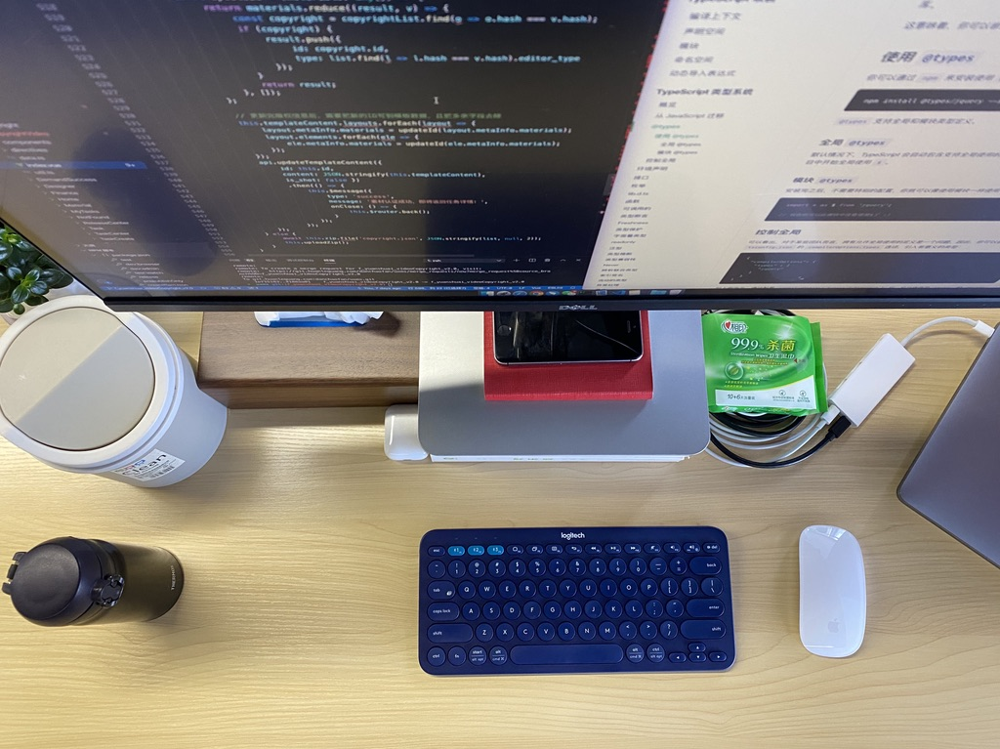
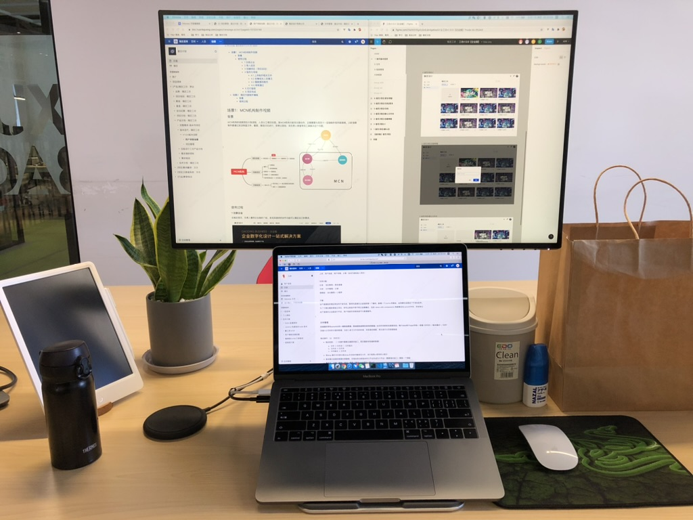
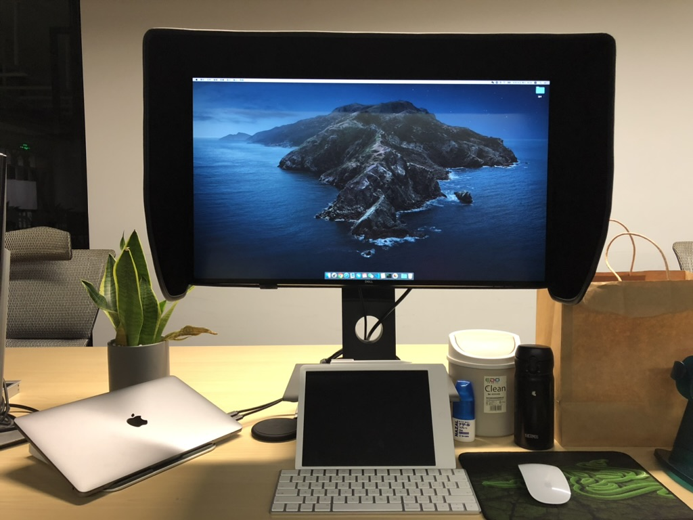
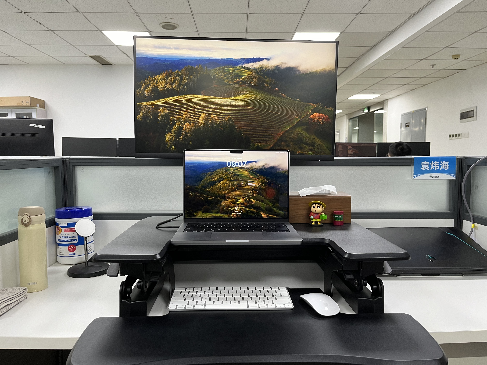

# 我的桌面

从小就喜欢给家里整理抽屉

删繁就简，重新摆放

秩序感比较强，小时候去山上砍柴火，堆放在家里都会码得整整齐齐

还会因为家人没有整齐摆放而生气

所以对于最可控的桌面，完全属于自己的领域，我有十足的折腾精神让自己满意

主要都是以简洁为主

下面简单列一下这 10 年的桌面演变

### 2014 年

毕业那年在学校附近的出租房，使用的是购买的二手 Thinkpad x201

全新的要一万多（通过破机器牵线从一个工程老板手上购买）

当时的桌面很简陋，最大的愿望就是能买个显示器

### 2015 年

还是使用那台 Thinkpad x201

购买了戴尔 U2414 显示器，把笔记本当作主机使用了

当时住在城中村下边社（如今已经是建发的楼盘）

### 2016 年

换工作到海沧，在石塘村的民租房

使用的是当时京东 618 活动 12 期免息购买的 MacBook 2015

这是最后一款 logo 会亮的 MacBook

至今（2024）依然还在家里当娱乐机使用

当时这个桌面是我最专注的时期，经常学习到深夜，第二天起床牙齿没刷继续写代码

当时沉迷于用原生 js 封装各种插件

### 2017 年

换工作到世贸双子塔

这应该算是拥有过的景观最好的桌面了

从双子塔 55 层，一眼望去就是大海，对望鼓浪屿的郑成功雕像

### 2018 年

在稿定科技，第一次尝试竖屏和升降桌

升降桌到现在（2024）依然是刚需，久坐太伤身了

升降桌的搭配当时在稿定也引领了一次风潮吧

### 2019 年

从热衷多块屏幕到尝试只使用一个 4K 显示器

想回归简约（我非常热衷于来回折腾桌面）

（没坚持多久，一块显示器很影响效率）

### 2020 年

在繁杂和简约中找到一个平衡点

4K 显示 + 笔记本屏幕 （上下布局）

我喜欢上下浏览，而不喜欢左右浏览

::: details 题外话
所以当显示器越做越宽的时候，我是悲观的

直到 2023 年，LG 才尝试推出一款 21:18 的显示器（适合上下分屏）
:::

对显示器的防眩光能力特别在意

所以一直都是使用雾面屏（镜面屏对眼睛不友好）

对眩光的在意程度甚至让我购买了遮光罩（正常只有专业需求的人会使用）

### 2021 年

工位是半包围结构的，特别喜欢这样界限分明的办公桌

不容易被同事的杂乱影响到

排列方式是我折腾多次得到的最优解，脖子几乎没有酸痛过了

未完待续...

关于桌面搭配我有很多话说，只是不知道从哪里说起，以后有机会写一篇长篇文字

