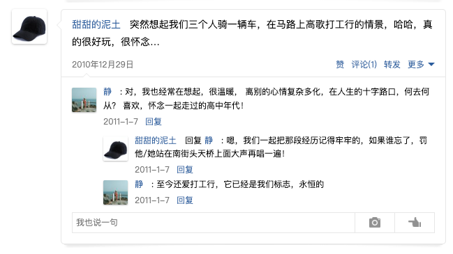
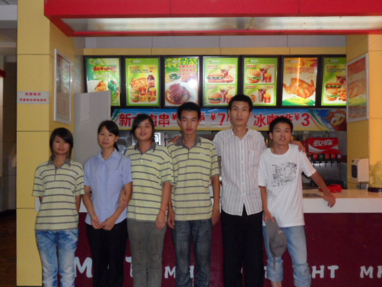

# 暑假工和兼职

现在是 2024 年，而我那些兼职的回忆已经都是十多年前的了。这些经历在自己的过往人生中虽不算浓墨重彩，但却有笑有泪的发生过很多故事。所以决定给这些故事以及参与故事的朋友们留一篇文字。

我有四段印象深刻的兼职经历：

-   2010 年高中毕业在建瓯曼哈特(类似肯德基)的店铺做汉堡，送餐
-   2011 年高补毕业在福州豪森酒店当礼宾员
-   2011 国庆在一家工厂流水线当打包员
-   2011 - 2013 期间在中国移动当学生促销员

## 建瓯曼哈特

2010 年高考结束，成绩意料之内的不理想，所以我早就有了补习一年的心里准备。于是考试完就和李刚约定一起在建瓯找个暑假工，度过这个属于他人庆祝的暑假。

当时一起找工作的还有吴静，只是后来吴静在一家酒店当服务员，我和李刚在曼哈特做汉堡。

印象非常深刻的是当时骑着我那辆自行车载着李刚和吴静（自行车横梁坐着李刚，吴静坐在后座）我们仨风风火火的穿行在大街上。一时兴起，不顾旁人眼光的唱起了 [《打工行》](https://c6.y.qq.com/base/fcgi-bin/u?__=EKpUh)。

那时候的我们是年轻的，热血的，哪怕吃苦，都是激昂的状态。

也是由于这段经历，我们仨的铁关系一直稳定到现在。就是那种你无需多言的老铁关系。

言归曼哈特，当时我和李刚在曼哈特，时薪低得可怕，具体我不记得了，总之是一小时低于 10 块，应该是 4.5 元一个小时。（不会超过）

不过当时的我们不在意这些，有个地方上班，暑假能继续留在建瓯就行了。

在曼哈特我们的工作内容就是做汉堡，炸鸡，炸薯条，烤翅什么的。（这么多年过去了，我还不喜欢去肯德基，因为觉得没有我自己做的好吃 ^\_^ ）。

我们当时偶尔犒劳自己的时候，也会凑单买一个。选最大块的鸡肉，用最干净的油锅，加最嫩的青菜，嗯...，味道真的很不错。

没什么客人的时候，经理就会安排我们去发传单，这是最不喜欢的部分。

不过也有美差，就是去送餐。一般距离较远的地方店里有个 3 块的摩的预算（打摩的过去，走回来）。我们都是选择自己骑车去送，这样偷偷摸摸的赚了 3 块钱打车费。

当时在汽车站附近的宾馆经常有人点外送的餐，我和李刚在后厨只要听到前台同事在接外送电话时，说出“时代宾馆”之类地址，就会相视一笑。因为送餐的机会来了，而且还可以赚 3 块外快。我们约定好每天轮流去送，同流合污。

怎么表达这 3 块钱的快乐呢，就是直到 14 年后的今天，此时的我在这写这些文字的时候，嘴角依然控制不住的上扬。

如果一天下来有赚到送餐的外快，我们下班回家的路上就会买一瓶冰镇红牛。这是那个夏天属于我们的快乐。

关于那段经历还有个细节值得说道，我们每天去吃午饭的餐馆，我和李刚一般都是只点 2 份青菜，然后配 2 大碗米饭。

我记得那家饭馆的醋溜土豆丝炒得特别好吃能下饭，那时候我们也算体力劳动，真的是每天对着 2 份青菜硬干两碗米饭下去。

那家老板也特别好，不会因为我们只点青菜而不悦，反而会给我们的分量多一些。

（工作后我有次回到建瓯，特意走到那个巷子去看看，想再去吃一顿醋溜土豆丝配米饭，可是那家饭店已经不在了。）

当时接触到的同事也非常友好，感觉说工友比较合适。大家都坦诚相待，是我正式工作之后不可能再遇到的那种真诚。

高中同学的名字我已经忘记差不多了，但是相处不到 2 个月的那些工友的名字我却张口就来：黄明文，李云琴，陈美玲，吴智斌、、 店长是任阳河吧？

美好的故事，都需要个大尾巴狼，这样才能激发小兔子们的团结激情，稳固革命友谊，所以大家当时都把店长当作共同的敌人。

现在想想，店长也不算坏人，他也有和大家一起开玩笑，聚餐。只是介于身份需要有点距离感吧。

当然对于当时的我们可不管那么多，你让我发传单，让我打扫卫生，那么你就是坏人。

说起那个店长，我还要感谢他让我认识了李克勤，有天我在午睡，被音乐吵醒了，但是并不气恼，因为感觉音乐很好听，是一首粤语歌。问了店长，他说是李克勤的《一生不变》。还给我推荐了宝丽金，说这个系列的都好听。

后来每次听到[《一生不变》](https://c6.y.qq.com/base/fcgi-bin/u?__=LeWA4K) 我都仿佛自己睡在曼哈特那个二楼闷热的小房间。

这段暑假工非常充实，甚至我整个 8 月份一天都没休息。身体累但是不疲惫，睡一觉又精神抖擞。每天去上班，都是开开心心的，因为在后厨可以和大家一起聊天。前台的同事也经常忍不住，躲进来和我们聊天。

但是故事的结尾都是带点悲凉的，因为我开学离开之后，那边的同事也陆续离开了。再过一两年，曼哈特彻底倒闭了。店铺转让做其他生意了。

每次在建瓯路过曼哈特，我还会忍不住多看两眼，看看二楼的那个小房间的位置。

虽然现在和那些工友已经不联系了，但是这份感情一直都在，总希望哪天走在街上，抬头遇到一个人特别眼熟，然后喊住他，嘿，好久不见！

拍这张照片的时候很多同事没在

## 福州豪森酒店

这是 2011 年的暑假，复读一年的高考结束之后，不管结果理想不理想都不会再复读了。

想着找份暑假工做着，赚点钱，去上大学还可以买点自己想要的东西。于是在考试后的几天，就和班上的一个同学（当时算有点共同兴趣爱好，喜欢折腾手机，那时候还是弄塞班系统）一起前往福州，寻找暑假工。

为什么可以这么果敢？

从来没出过远门，一切都是未知，就敢买上火车票去了。

因为吴静已经在福州上了一年大学了。我们约定好由她带着我们去找暑假工。我甚至连到福州当天的住宿问题都没有确定就去了。

很不幸，过程不顺利，我们坐着公交车奔走于吴静提前在网上了解的饭店位置，询问之后都是不要男生，如果是吴静倒是可以考虑。

说个题外话：从建瓯到福州的跨越，对于当时的我，算是一点小小的震撼。当时觉得，哇，公交车好大，人人手里都拿着诺基亚。此时 iPhone 4 才刚推出不久，最流行的智能手机还是诺基亚。公交车上的我，一个小癖好就是观察所有乘客的手机型号。渴望着早点找个暑假工，赚钱买个手机。

找不到工作，天也要黑了，没办法，住旅店是不可能的，当时兜里就没几百块。于是和堂姐袁丹说了下情况，她热情的邀请我去她家暂住几天。我记得她家在福州火车站附近，我和同学一起搭乘公交车到某个站点等她，她出来接我们。算是帮我解决了非常大的困难，吃饭和住宿对于当时的我来说，确实是很窘迫的。所以时隔这么多年了，我依然挺感激的。

所幸在袁丹家住了几天后，吴静帮我们打听到了一家新开的酒店在招暑假工，我和同学一起过去面试，顺利找到工作了。

该酒店当时的名称是 《福州豪森酒店》，现在应该是改名了，但是据说是某位地产老板开的，而我们的员工宿舍也安排在该地产老板的小区里。

夸张点说，有点刘姥姥进大观园的感觉了。该酒店因为是新开的，一切都很豪华。我记得经理第一次带我们熟悉场地的时候，步入大厅的那一刻，有种摸不清方向的感觉，看得我晕头转向。但是又不想体现出没见过世面的样子，提起精神谨慎的跟着经理走着。

而且酒店的伙食还特别好，起码对于一个农村家庭长大的我来说，菜色多且量大管饱。还有各种水果酸奶等。总之感觉顿顿吃得都跟过节一样，唯一不爽的就是打菜的厨师。那种底层人看不起底层人的蔑视，那种同属底层但是他莫名有的傲慢，让我至今对后厨这类人群没有好感。（如果是前台那些漂亮小姐姐，打菜的就把好的东西多给她们，到我们的时候就爱答不理的随便应付。）好消息是菜实在多样，且我是从农村过来的，就这样的跨越，我已经非常满足，每天吃饭都很享受。

工作内容就是礼宾员，轮流站在大堂门口，给客人问好，或者带客人去办理入住。如果客人有行李，需要询问是否需要帮忙等等。

是三班倒的好像，总之也有夜班，夜班轻松一点，不用站门口，但是要擦拭行李车，用专门的洗涤剂和抹布清理干净。给对讲机等设备充电，把国旗降下来，然后由早班的同事去升国旗。（我当时就问过，为什么不一直挂着呢，每天升降一次感觉很浪费时间，没有人给你回答，一句，规定如此，照办就是。）

我们作为礼宾员有一点点小特权就是，我们是可以夸区域走动的，我们可以去大厅，中餐厅，西餐厅，住客楼层。而假如你只是中餐厅的服务员，那么你只能呆在中餐厅的区域。

当时在那边的暑假工挺多的，我们部门就有好几个，所以上班不算太累，大厅的站岗我们就轮流站 30 分钟，时间也算挺快过，休息的时候，我们就聚集在前台的后面有个办公室，大家都在那边聊天。酒店的前台都挺好看的，可能由于我们是学生的原因，她们也乐意和我们聊天。

有个大堂副理，人挺好的，不会像那些臭厨师一样。他挺乐意和我们平等交流。

我记得我的经理叫 sky，讲话含糊，我经常听不懂他说什么，好在我的将近两个月的上班期间，他基本不在。都是一个叫 kiven 的老员工`管理`我们。嗯，我们被要求所有人都用英文名相称，毕竟五星级嘛，洋气就对了。所以我的英文名 alan 就是在那时候取的。
