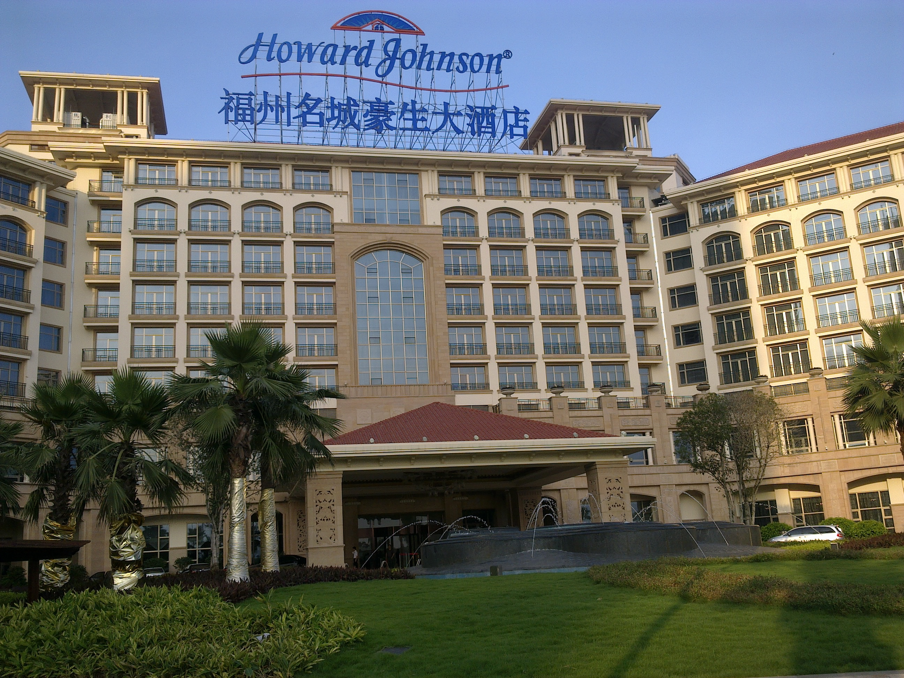
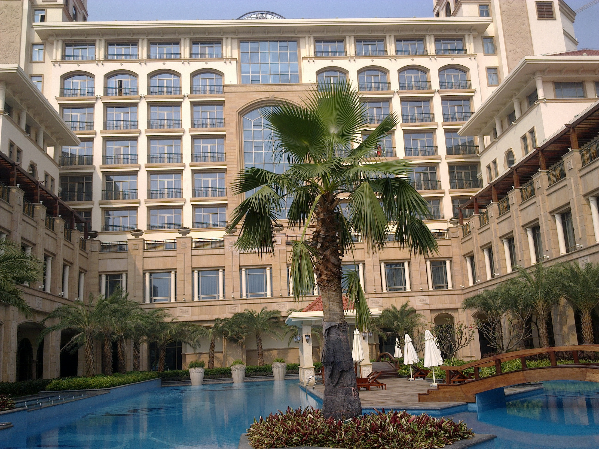
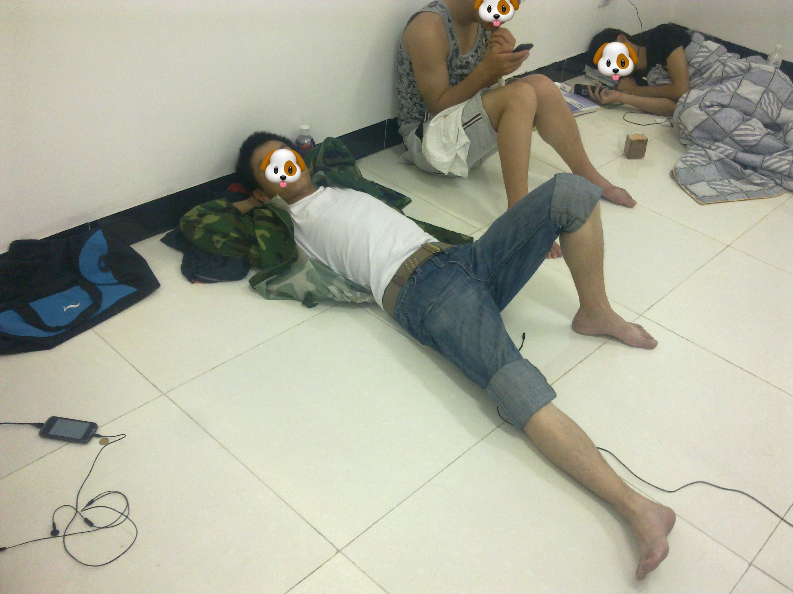
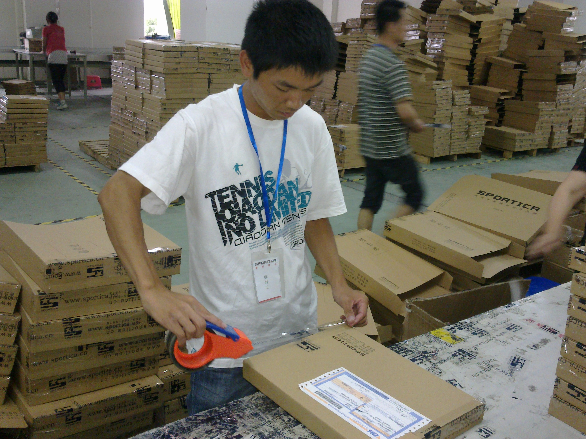
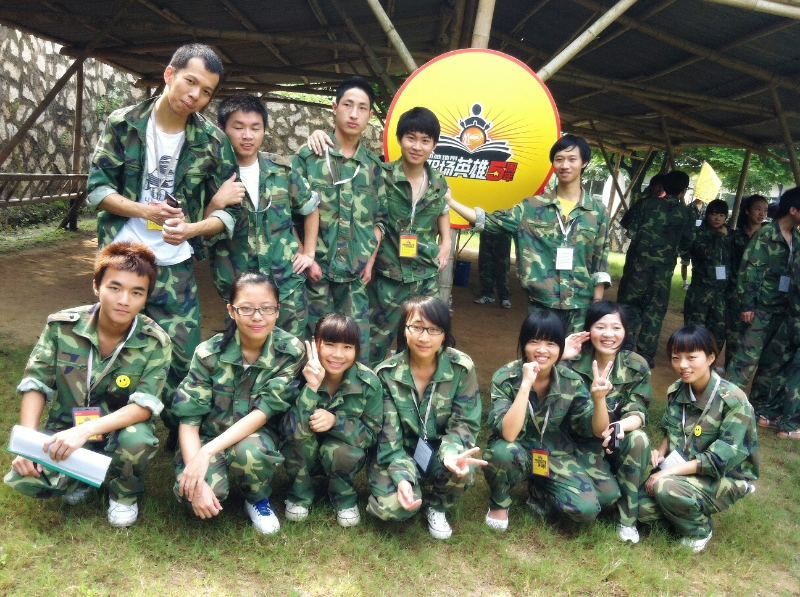
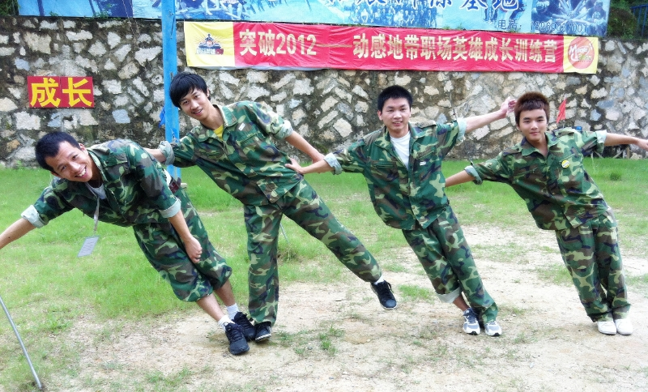

# 暑假工和兼职

现在是 2024 年，而我那些兼职的回忆已经都是十多年前的了。这些经历在自己的过往人生中虽不算浓墨重彩，但却有笑有泪的发生过很多故事。所以决定给这些故事以及参与故事的朋友们留一篇文字。

我有四段印象深刻的兼职经历：

-   2010 年高中毕业在建瓯曼哈特(类似肯德基)的店铺做汉堡，送餐
-   2011 年高补毕业在福州豪森酒店当礼宾员
-   2011 国庆在一家工厂流水线当打包员
-   2011 - 2013 期间在中国移动当学生促销员

## 建瓯曼哈特

2010 年高考结束，成绩意料之内的不理想，所以我早就有了补习一年的心里准备。于是考试完就和李刚约定一起在建瓯找个暑假工，度过这个属于他人庆祝的暑假。

当时一起找工作的还有吴静，只是后来吴静在一家酒店当服务员，我和李刚在曼哈特做汉堡。

印象非常深刻的是当时骑着我那辆自行车载着李刚和吴静（自行车横梁坐着李刚，吴静坐在后座）我们仨风风火火的穿行在大街上。一时兴起，不顾旁人眼光的唱起了 [《打工行》](https://c6.y.qq.com/base/fcgi-bin/u?__=EKpUh)。

那时候的我们是年轻的，热血的，哪怕吃苦，都是激昂的状态。

也是由于这段经历，我们仨的铁关系一直稳定到现在。就是那种你无需多言的老铁关系。

言归曼哈特，当时我和李刚在曼哈特，时薪低得可怕，具体我不记得了，总之是一小时低于 10 块，应该是 4.5 元一个小时。（不会超过）

不过当时的我们不在意这些，有个地方上班，暑假能继续留在建瓯就行了。

在曼哈特我们的工作内容就是做汉堡，炸鸡，炸薯条，烤翅什么的。（这么多年过去了，我还不喜欢去肯德基，因为觉得没有我自己做的好吃 ^\_^ ）。

我们当时偶尔犒劳自己的时候，也会凑单买一个。选最大块的鸡肉，用最干净的油锅，加最嫩的青菜，嗯...，味道真的很不错。

没什么客人的时候，经理就会安排我们去发传单，这是最不喜欢的部分。

不过也有美差，就是去送餐。一般距离较远的地方店里有个 3 块的摩的预算（打摩的过去，走回来）。我们都是选择自己骑车去送，这样偷偷摸摸的赚了 3 块钱打车费。

当时在汽车站附近的宾馆经常有人点外送的餐，我和李刚在后厨只要听到前台同事在接外送电话时，说出“时代宾馆”之类地址，就会相视一笑。因为送餐的机会来了，而且还可以赚 3 块外快。我们约定好每天轮流去送，同流合污。

怎么表达这 3 块钱的快乐呢，就是直到 14 年后的今天，此时的我在这写这些文字的时候，嘴角依然控制不住的上扬。

如果一天下来有赚到送餐的外快，我们下班回家的路上就会买一瓶冰镇红牛。这是那个夏天属于我们的快乐。

关于那段经历还有个细节值得说道，我们每天去吃午饭的餐馆，我和李刚一般都是只点 2 份青菜，然后配 2 大碗米饭。

我记得那家饭馆的醋溜土豆丝炒得特别好吃能下饭，那时候我们也算体力劳动，真的是每天对着 2 份青菜硬干两碗米饭下去。

那家老板也特别好，不会因为我们只点青菜而不悦，反而会给我们的分量多一些。

（工作后我有次回到建瓯，特意走到那个巷子去看看，想再去吃一顿醋溜土豆丝配米饭，可是那家饭店已经不在了。）

当时接触到的同事也非常友好，感觉说工友比较合适。大家都坦诚相待，是我正式工作之后不可能再遇到的那种真诚。

高中同学的名字我已经忘记差不多了，但是相处不到 2 个月的那些工友的名字我却张口就来：黄明文，李云琴，陈美玲，吴智斌、、 店长是任阳河吧？

美好的故事，都需要个大尾巴狼，这样才能激发小兔子们的团结激情，稳固革命友谊，所以大家当时都把店长当作共同的敌人。

现在想想，店长也不算坏人，他也有和大家一起开玩笑，聚餐。只是介于身份需要有点距离感吧。

当然对于当时的我们可不管那么多，你让我发传单，让我打扫卫生，那么你就是坏人。

说起那个店长，我还要感谢他让我认识了李克勤，有天我在午睡，被音乐吵醒了，但是并不气恼，因为感觉音乐很好听，是一首粤语歌。问了店长，他说是李克勤的《一生不变》。还给我推荐了宝丽金，说这个系列的都好听。

后来每次听到[《一生不变》](https://c6.y.qq.com/base/fcgi-bin/u?__=LeWA4K) 我都仿佛自己睡在曼哈特那个二楼闷热的小房间。

这段暑假工非常充实，甚至我整个 8 月份一天都没休息。身体累但是不疲惫，睡一觉又精神抖擞。每天去上班，都是开开心心的，因为在后厨可以和大家一起聊天。前台的同事也经常忍不住，躲进来和我们聊天。

但是故事的结尾都是带点悲凉的，因为我开学离开之后，那边的同事也陆续离开了。再过一两年，曼哈特彻底倒闭了。店铺转让做其他生意了。

每次在建瓯路过曼哈特，我还会忍不住多看两眼，看看二楼的那个小房间的位置。

虽然现在和那些工友已经不联系了，但是这份感情一直都在，总希望哪天走在街上，抬头遇到一个人特别眼熟，然后喊住他，嘿，好久不见！

拍这张照片的时候很多同事没在

## 福州豪森酒店

那是 2011 年的暑假，复读一年的高考结束之后，很遗憾，它没有成为一个逆风翻盘的励志故事，而是符合事实的不声不响。

想着找份暑假工，赚点钱，去上大学可以买自己想要的东西。于是在考试后的几天，就和班上的一个同学（当时算有点共同兴趣爱好，喜欢折腾手机，那时候还是捣鼓塞班系统）一起前往福州，寻找暑假工。

为什么可以这么果敢？从来没出过远门，一切都是未知，就敢买上火车票去了。

因为吴静已经在福州上了一年大学了。我们约定好由她带着我们去找暑假工。我甚至连到福州当天的住宿问题都没有确定就去了。

很不幸，过程不顺利，我们坐着公交车奔走于吴静提前在网上了解的饭店位置，都不需要暑假工。

说个题外话：从建瓯到福州的跨越，对于当时的我，算是一点小小的震撼。当时觉得，哇，公交车好大，人人手里都拿着诺基亚。此时 iPhone 4 才刚推出不久，最流行的智能手机还是诺基亚。公交车上的我，一个小癖好就是观察所有乘客的手机型号。渴望着早点找个暑假工，赚钱买个手机。

找不到工作，天也要黑了，没办法，住旅店是不可能的，当时兜里就没几百块。于是和堂姐袁丹说了下情况，她热情的邀请我去她家暂住几天。我记得她家在福州火车站附近，我和同学一起搭乘公交车到某个站点等她，她出来接我们。算是帮我解决了非常大的困难，吃饭和住宿对于当时的我来说，确实是很窘迫的。所以时隔这么多年了，我依然挺感激的。

所幸在袁丹家住了几天后，吴静帮我们打听到了一家新开的酒店在招暑假工，我和同学一起过去面试，顺利找到工作了。

酒店当时的名称是 《福州豪森酒店》，现在好像是改名了。据说是某位地产老板开的，而我们的员工宿舍也安排在该地产的楼盘里。住宿条件很好，4 人间，有空调，不用交电费，所以如果是夜班回来，白天也可以很好的睡觉。印象中我那个房间当时是住了包括我 3 个人，我床铺下面的是一个日本餐厅的厨师，一个很憨厚老实的小哥，名字不记得了，但是我对他印象不错。我记得离开那边的时候他还礼貌的送我出小区。另外一个舍友是前台的接待小哥，沉默寡言，但是也不讨厌。总之当时的宿舍体验给我的感觉很好。

夸张点说，有点刘姥姥进大观园的感觉了。因为酒店是新开的，一切都很豪华。我记得经理第一次带我们熟悉场地的时候，步入大厅的那一刻，有种摸不清方向的感觉，看得我晕头转向。当时的行政部门以及食堂等场所都是在地下楼层，也是第一次在地下空间的建筑里穿梭，只觉得新奇。但是又不想体现出没见过世面的样子，提起精神谨慎的跟着经理走着。

而且酒店的伙食还特别好，起码对于一个农村家庭长大的我来说。菜色多且量大管饱。还有各种水果酸奶等。总之感觉顿顿吃得都跟过节一样，唯一不爽的就是打菜的厨师。那种底层人看不起底层人的蔑视，那种同属底层但是他莫名有的傲慢，让我至今对后厨这类人群没有好感。（如果是前台那些漂亮小姐姐，打菜的就把好的东西多给她们，到我们的时候就爱答不理的随便应付。）好消息是菜实在多样，且我是从农村过来的，所以这略带瑕疵的跨越，我已经非常满足，每天吃饭都很享受。

工作内容就是当礼宾员，轮流站在大堂门口，给客人问好，或者带客人去办理入住。如果客人有行李，需要询问是否需要帮忙等等。还有一项工作是给接送顾客的专车记录公里数和油耗。

工作是三班倒，有夜班，夜班轻松一点，不用站门口，但是要擦拭行李车，用专门的洗涤剂和抹布清理干净。给对讲机等设备充电，把国旗降下来，然后由早班的同事去升国旗。（我当时就问过，为什么不一直挂着呢，每天升降一次感觉很浪费时间，没有人给你回答，一句，规定如此，照办就是。）

我们作为礼宾员有一点点小特权就是，我们是可以夸区域走动的，可以去大厅，中餐厅，西餐厅，住客楼层。而假如你只是中餐厅的服务员，那么你只能呆在中餐厅的区域。

当时在那边的暑假工挺多的，我们部门就有好几个，所以上班不算太累，大厅的站岗我们就轮流站 30 分钟，时间也算挺快过，休息的时候，我们就聚集在前台的后面有个办公室，大家都在那边聊天。酒店的前台都挺好看的，可能由于我们是学生的原因，她们也乐意和我们聊天。

有个大堂副理，人挺好的，不会像那些臭厨师一样。他挺乐意和我们平等交流。

我记得我的经理叫 sky，讲话含糊，舌头卷不直，我经常听不懂他说什么。好在我的将近两个月的上班期间，他基本不在。都是一个叫 kiven 的老员工带我们(挺烦人的一个人，属于那种内卷型的优秀员工吧)。嗯，我们被要求使用英文名相称，毕竟五星级嘛，洋气就对了。所以我的英文名 alan 就是在那时候取的。

最开心的事情就是帮客人拉行李去入住，出手阔绰的客人会给个 10 块 20 块的小费。所以比较期待老外来入住，因为印象中老外给小费的概率大一点。

Can I help you （示意老外是否需要帮他拉行李）

this way please （带老外去指定的房间）

thank you （拿钱走人）

嗯，就这几句应付就行了。

关于小费我印象中最多的一次是 50 块，一对男女半夜叫夜宵，厨房做好由我送上去（前面说过只有我们可以夸区域走动，其他部门的不行），送到之后那个男的给了我一张 50，激动得我走路差点蹦哒起来。

在酒店那种地方，江湖气会稍重一点。有几个司机是本地人，挺屌的，看不起我们这些礼宾员。（额... 坦白说我也不知道他的优越感是建立在什么地方，可能是他们穿白衬衫上班，而我们穿礼宾服吧，哈哈）

有客人需要用车，我需要去休息室叫他们出车，此时叫谁就会是一个问题，你喊到他，他会一脸不悦的说我刚才出过了，你喊别人。也有两个挺好相处的师傅，笑眯眯的，不会摆架子。所以我当时就不卑不亢的针对那个最屌的司机。只要是他出车，我必定详细登记公里数和油耗，让他没有便宜可以占。（因为有的时候出车公里数短，油耗基本不会变，司机可能私下收了客人的钱，然后不上报这个单子。出行记录是在礼宾部的表格里，我们也可以把这次的油耗算到下一个单子去）

还有一个腐败的地方就是由于酒店的一个奇葩规定： 司机去机场接客人，算 200 的费用。 但是从酒店送客人去机场，居然要收取来回的费用，400 块。我至今不知道这样的规定是如何制定出来的。所以如果有客人需要用酒店的车送去机场，花这个冤枉钱，我会和司机一起贪污 200 块，把送客人的订单写成接机（因为公里数和油耗是一样的）。

这样操作下来，成功打入了司机团队，大家对我都客气一点了，不会再用鼻孔看我了。至于那个最屌的司机，依然照旧，因为我也故意不和他交好。我清楚的知道，我只要和其他几位司机打好关系，他一个人，为难不了我。这就是江湖。

印象较深的事情还有一个就是和客人吵架，一个喝醉的客人，东倒西歪的走在大厅，我过去问他是否需要帮忙，他来了一句，滚！ 我立刻回他，滚你妈逼！他还想起争执，被他同伴拦住了，然后给前台投诉，说我辱骂他云云。。

前台对于这种情况，自然见怪不怪，什么下三滥的人都见过。她首先喊我去休息室休息，不要在大厅被客人看到，然后去安抚客人。要知道，这是在五星级酒店，最讲究奴性服务的地方，辱骂客人，是一件很大的事情，但是我是暑假工啊各位，我怕啥？ 所以我内心比较淡定，可以在休息室休息，不用站岗。前台经理处理完客人的事情，进来给我了解情况，然后说要写什么检讨什么的。（类似黄牌警告之类的？）总之就是走个流程，她们还安慰我不用担心什么的。说她们会处理。

这件事第二天就在接待部和礼宾部传开了，前面提到过的那个大堂副理，人很好的那个，笑眯眯的给我说，alan，听说你骂了客人，我说是啊，他先骂我的。 然后副理就给我一个鼓励式的微笑，然后说了一句，我们的定价还是太低了，什么阿猫阿狗都可以来入住。

这件事我原本也以为是严重事情，可是却一点惩罚都没有，我觉得暑假工的因素最大。所以领导也不打算上纲上线的处理。口头意思的说一下就过了。

食堂印象、员工宿舍、对骂客人、和司机的江湖事件，工作内容，好像都回顾到了，毕竟时间久远，也只是零星的记忆拼凑起来。

其实当时在那边还有一件不能公开的秘密，就是一些客人会问是否有按摩小妹，为了避免网站被封，这件事还是点到为止吧。

这次暑假工的经历可以算是非常圆满，因为后期我在那边已经如鱼得水，不管是和司机，还是那些前台接待都相处的不错。以至我暑假工结束的时候，他们都表达了美好的祝愿（说了一些场面话，不过我很受用，因为我当时是个小小的暑假工）。

这就是漫长的人生路上一次短暂的相遇，接触了不少人，也经历过一些事，不说成长了多少，但是验证了一些丛林法则。

福州的夏天真的非常炎热，那种炎热，伴随着高考结束的特殊情绪，以及即将去新城市上大学的一些幻想，以及酒店打工所接触到的人与事，这些东西交织在一起，组成了一股特殊的记忆刻在脑海里。

碍于文笔表述的功底，转化率很低，因为我写了这些文字，但是感觉又没表达到位。也罢。 就当作给自己留念的吧，流水线的记叙文有便于后期回顾。

## 工厂流水线

2011 年大学的第一个国庆假期，由于感觉刚来厦门不久（似乎是九月开学？），不想也没必要回家。刚好之前去一起去福州的那个同学说他那边有联系到暑假工，问我要不要一起去。我莽闯的跟着去了。

我记得集合的时间是晚上，一辆破旧的面包车，满满当当的塞下了我们几个年轻小伙，往我们不熟悉的地方开去，大晚上的，车开了挺久，半路上我的心都悬起来了。不过看着身边这些都是一起来的同学，壮了一些胆量。所幸担心的事情没有发生，面包车在一个工厂里停下了，管事的人把大家带到一个空屋子，说反正天气热，大伙就地睡下吧。

真的是不把暑假工当人啊，没有床，甚至一张草席都没有。但是如此艰苦的环境，在面对这一群正值年轻的小伙，并没有呈现出多么苦情的氛围。毕竟对大家来说，这些都是短暂的，不到七天而已。所以一群人开开心心的简单整理了下卫生，就席地躺下了。

刚经历完军训，每个人都很黑

工作内容就是名副其实的流水线操作了，而且还是小作坊的流水线。我们负责把装好衣服的包装盒用胶带封上。（这样的工作，只要上一点机械化，完全可以替代掉人力）。工作内容可以说是非常枯燥无味，但是胜在新鲜啊！我们只是做几天，而且是和几个同学一起，也有玩趣的意味。如果这个当作正经工作，真的是人生无望。

工厂里面有正式工，大部分都是很本分的人，你只有在社会底层，才能接触到中国劳动人民的那种朴实的善良。我接触了几个那边的正式员工，我记得晚上下班还一起打过台球。有个别吊儿郎当的正式员工就很奇怪，他们作为正式员工看待我们这些兼职员工会有种傲慢，拜托啊兄弟，如果一定要傲慢，难道不是我对你们吗？ excuse me ？？

这份兼职很短暂，就是几天时间，想记录下来是因为好歹也算正儿八经的经历过流水线的工作。知道工厂里面打工是什么状态，接触到的人群大概是什么类型。

嗯，，就工作那么几天，我记得还有个工友在几个月后，还来学校找我玩过。

渐行渐远才是常态，所以我不会感伤大家最终没有联系，祝各自安好即可。

## 中国移动学生促销员

这是我经历时间最长的兼职工作了，在中国移动做校园促销。

这份经历应该算是大学生活最值得铭记的，因为经历的事情很多，收获的友谊很多。

我记得当初中国移动来校园做招聘的时候，还举办了挺隆重的面试流程，是那种开放式的面试形式，比如一个教室 30 人，按 6 个人分成 5 组。 然后大家得到一个开放性的题目，各自发挥，阐述观点等。然后考核人员就游走在大家旁边观察，决定谁被录用。

被录用之后，就会被分配到学姐学长的组里面去，因为她们更早加入，算是小组长。后期的培训和促销活动都有组长领队。

我被分配到了湘萍组，就是我学姐，我们组内有玉丽，黄总，凡吉，但是凡吉后期基本没有参与，所以提到湘萍组，我觉得应该就： 学姐、玉丽、我、黄总 4 个人比较贴切。

玉丽是一个积极份子，各种促销活动她的完成量都是最大的，我们组的成绩就靠她支撑了。

黄总是个装逼小王子，光说不做居多。嘴贱但是人不坏。也可能是没有变坏的条件。

学姐是我很尊重的一个人，从带队能力到个人修养都超过我对一个女性的期待。

所以我们组可能是当时那几个团队里面，最团结的。这个团队的存在已经远超兼职本身的意义。

我们经常一起在学校的双皮奶店铺聊天，那家双皮奶量大实惠，现在还挺怀念的。也经常一起在外面吃烧烤，烤鱼，而且玉丽的酒量还很不错，只有凡吉可以对付。

当时中国移动在很多院校都有这样的学生促销团队，所以每批新人都会接受一个比较规范的入职培训。入职培训特别有意思，大家去中国移动的杏林分公司一起听课做游戏。做游戏的居多，其实是为了破冰和培养大家的团队协作能力。

那时候的状态是很好的，大家是被`选拔`出来的，然后一群人凑在一起，组团队，喊口号，玩团体协作游戏。和之前那些兼职完全不一样的体验。

<video controls  src="./assets/video.mp4"  />

感谢黄正桥提供素材

经过培训之后，大家就开始上班了，我们会被安排到不同的营业厅，做些诸如充话费，查话费等这些边缘工作，是站在营业厅的那个机器旁边。帮用户操作。

也会被安排到一些与营业厅合作的供应商那边，帮他们推销手机，手机卡套餐等。

最有意思的是迎新促销，我们会去各个学校，推销移动卡，然后不同团队之间还有比赛。声势浩大，阵势不能输。以过来人的身份去欺骗那些新生办套餐。也不能算骗吧？反正移动，联通，电信，你总要被一家坑，那不如给我坑。🐶

最超乎意料的体验是中国移动居然愿意花巨资让我们做素质拓展。所有费用由中国移动支付。有专车接送我们去漳州长泰某个基地，吃住全包，还有专业的教官带领我们做各种游戏和挑战。

什么空中跳跃，十几个人一起翻越一个高墙，类似种种游戏安排了两天一夜。第一天晚上还给大家来了一次心灵清洗，煽情的音乐，感人的旁白，大家围坐一圈，把你搞的非哭不可。

（我终于理解传销为什么能让很多人死心塌地，洗脑真的很可怕）

不过中国移动这个不算洗脑，就是让大家心情彻底放开，然后第二天尽情玩游戏。

遗憾的是那时候禁止携带手机，少数的几张照片应该是最后一天拍的，也是黄正桥（黄总是我们对他的戏称）提供的。

中国移动的兼职经历，真的非常棒，特别是在学姐的带领下，我们组内成员团结友爱，相互伤害，很有笑点。

这篇文字就当简单记录吧，因为湘萍组的故事，它没有结束，我相信若干年后，大家还会一起相聚。

当下玉丽的小孩要读幼儿园，我的小孩也不到两周岁，黄总还在为脱单犯愁，学姐已经淡出了大家的朋友圈。

大家都在各自奔忙，但是还是会相见的。
