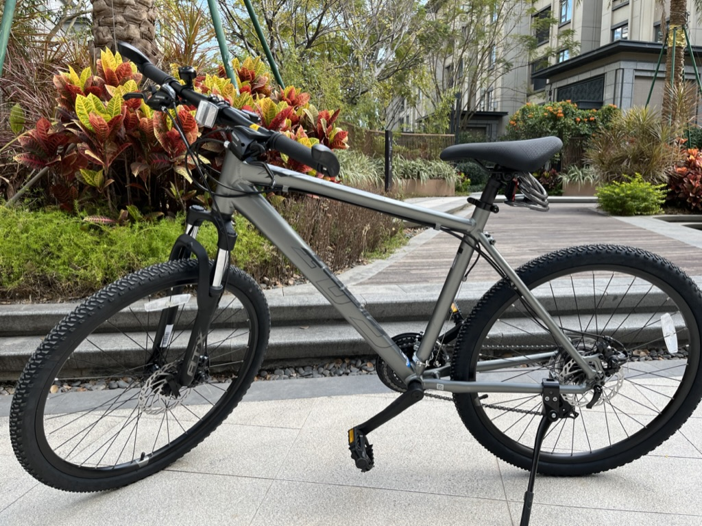
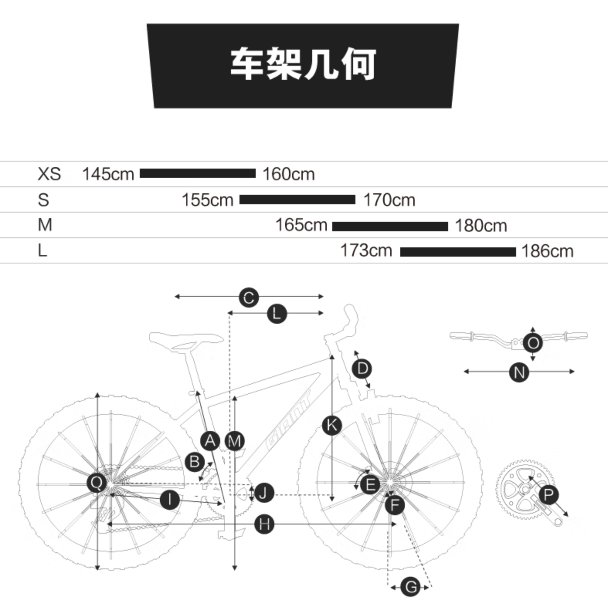

# 自行车选购思路

## 背景

本人于 2024 年 1 月份购买了人生第一辆自行车 —— [捷安特 ATX 660](../../2024/bicycle/index.md)，这是一款入门的山地车。

这边有两个关键词 —— `捷安特` & `山地车`

捷安特这个品牌在我读高中的时候就已经在意识里埋下种子了。毕竟在那个偏远的小县城，我能接触到的正经的自行车品牌几乎只有它，其他基本都是杂牌。在一众平庸的自行车里，车架上印有 GIANT LOGO 的自行车就显得格外耀眼。

走在路上，只要路过的自行车是捷安特的，都会追焦几秒，然后暗暗羡慕一番。

当时的我是无论如何无法说服我的父母给我购买一辆捷安特的。

至于为什么偏偏是山地车呢？ 同样是在那偏远的小县城，正经山地车已经算是稀缺物种了，更高级更贵的公路车基本是没有见过。

所以对于当时的我来说: `捷安特` + `山地车` = `高级`

抛开见识短浅这个客观因素不谈，主观上我也更喜欢越野取向的东西。

比如在街上看到低趴的超跑我只是冷眼旁观，甚至被那噼里啪啦的油门声吵得有点恼火。但是如果一辆改装过越野胎的吉普牧马人开过，我便会心驰神往。高高的底盘和粗壮的轮胎，带你跋山涉水，淡定从容。虽然没有开过，但是感觉脑海里已经模拟过很多次了。

所以山地车前叉的两根避震器让我非常受用，甚至会下意识的用力推压，感受弹簧回弹的爽感。

总之从高中到现在，这几乎快 20 年的时间里，我的内心一直都想着拥有一辆捷安特的山地自行车。

所以当时决定购买第一辆自行车的时候，我几乎没有任何犹豫和品牌筛选，直接到捷安特专卖店选购了 ATX 660.

_这是一个最不理智的又最理智的选择。_

当时觉得 ATX 660 颜值好看，且价格合适，不敢买太高端的，因为需要停在地铁站。

我还给它安装了一个宝宝椅，周末可以带着我 2 岁多的女儿去公园骑行，非常惬意。

捷安特 + 山地车 + 价格适中就是我第一次选购自行车的思路，纯粹的主观且业余。

我觉得这个思路非常好，它不那么明智，但是它可以让你体验一次梦想照进现实的快感。

如果你和我一样，有类似的心结，那么第一次买车就不要犹豫，直接买个当年的白月光即可。

## 问题渐显

当我骑了一段时间 ATX 660，过程中确实体验过挺多快乐和满足感。但是慢慢的，那份青春情结逐渐消退，让我开始客观且科学的审视它是否真的适合我。

我体验到如下一些问题：

### 速度不快 & 骑行费力

由于山地车的结构是针对非铺装路面设计的，所以速度的优先级不高，通过性和减震的优先级更高。无论是宽大的轮胎还是前叉避震，都是为了通过性设计的。代价就是骑行更费力且速度不快。

虽然主观上我确实更喜欢山地车，但是我的实际用途基本都是城市通勤，所以山地车并不适合我当下的使用场景。

### 前变速器不顺畅

由于定位入门，它配备的前变速器并不好用，后变速器还算灵活顺畅。经过我这一年多骑行经验得出，前面的小牙盘是几乎没有使用到的。毕竟是城市通勤，没有那么陡峭的坡需要用到小牙盘。

所以我宁愿前面是个结构简单的**单盘**，无需变速。简单又高效。

### 尺码不对

自行车是区分尺码的，特别是正经品牌的自行车。每个尺码对应不同的身高，不同尺码之间有一定的重叠，具体看个人的骑行偏好来选择偏大的或者偏小的尺码。（据说是应该买小不买大）

捷安特 ATX 660 2025 的尺码参考图:

当时我在店铺试骑的时候是骑的 M 码，个人身高 165 左右。当时店员说 M 码可以匹配我的身高 ， S 码的车架会很小，不推荐（此时我严重怀疑是他觉得 M 能用就用，毕竟 M 是他已经安装好的， S 码他还需要重新装过）

由于我在店铺门口就简单试骑十几米路程，并无法真切感受到尺码是否真的合适。就直接购买了 ATX 660 的 M 码。 事实证明这个车架对我来说是偏大的，在骑行稍久一点就可以感受到我身体的前倾更大，对手臂的支撑压力增大，且 M 码的把横也更宽，肩膀容易酸痛。

专业点说就是骑行几何不科学。

事实证明我的感受是对的，因为今天（2025.05.11）我又去了捷安特的专卖店，店员介绍新款的 ATX 660 2025 款 已经将尺码改小一号了。

就是虽然都是 M 码，但是车架的实际尺寸是有缩小的，这个我几乎可以肉眼就看出来，毕竟我是 2024 款的车架偏大的受害者。

这个尺码不匹配的问题是我这次重新选购的最大原因，毕竟骑行几何不科学，对身体是有伤害的。

速度不够快，前变速器不顺畅都可以将就，但是骑行姿势不对，这个问题就不能忽视了，于是我果断把 ATX 660 挂闲鱼，在原价 1899 的基础上，使用一年的折旧情况下，最终 1150 出手了。

感觉还是挺划算的，毕竟哪怕我重新再买过 ATX 660 的 2025 款，我也只需要填补 700 块。

而这 700 块可以让我享受到 ATX 660 2025 的所有升级，比如：

刹车变成内走线了，更好看
脚撑有专门的安装空位了， 更好看
线刹升级成了液压碟刹，更安全
M 码的尺寸更小了 （店员说是官方修正了 M 偏大的 bug）

这个尺寸的教训比较深刻，建议大家选购车的时候一定要亲自测试，在官方指导的两个匹配的尺寸里来回试骑，才不会选错。毕竟套件可以升级，车架更换成本较大。

网上有说两者选一（买小不买大） 我觉得是不对的。就拿昨天试骑的 2025 ATX 660 来说，我是冲着 S 码去体验的，但是修正后的 M 码就非常合适我的身高，S 码就太小了。所以其他参数可以听别人的，尺寸一定要自己去体验。

选购新车

根据以上我总结出 ATX 660 暴露的问题，我的新车购买思路就变成了如下几个条件：

重要：

平把公路（瓜车）
前面单牙盘
尺码必须亲自测试实车

次要：

筒轴 + 液压碟刹 + 内走线
最好有专门的脚撑孔位 （ATX 660 2025 就升级了专用孔位，看着舒服多了）

平把公路

我不确定平把公路就是专业人士所说的瓜车，感觉它们定位很像，都是介于山地车和公路车之间。

和山地车相比，平把公路胎宽更窄，没有前避震器（不会泄力），所以骑行更轻且速度会更快。

和公路车相比，平把公路胎宽更大，所以通过性更好。

感觉平把公路就是城市通勤的最优解，山地车就在山里跑，弯把公路就在赛道跑，平把公路就是城市通勤。

我个人刚开始是不太喜欢瓜车的，因为我喜欢极致，我觉得山地就山地，公路就公路，你搞个四不像，两头占便宜算怎么回事。我可以嘴硬说你越野不如山地，速度比不过弯把公路啊！

后面才发现是自己的认知狭隘了，我以为的自行车选购是一条线：

对于极致的追求，当然是在这条线的两端做选择才符合性格。但是我忽略了，我们大部分人的使用场景是通勤，所以选择不是在一条线，而是在一个三角形里面，瓜车的定位就在这个三角形的中心，基本是个最优解。

个人不喜欢弯把公路具体原因如下：

穷！ 弯把公路过于专业，价格偏高
骑行姿势要弯腰，是为了速度牺牲舒适性的 （说好的保护腰椎呢？）
压力大，骑着弯把就会在乎速度，可是我又不竞速
通过性差，我还是更喜欢跳马路牙子，公路车太金贵，易爆胎

所以山地车留给诗和远方，普通通勤车看不上，弯把公路车留给专业的大佬，而我，作为普通菜鸟，平把公路将是最优选。

这是我骑行一年的总结出来的经验之一。

单牙盘

前面说过，我在使用 ATX 660 的时候，几乎没有用过最小牙盘，所以觉得对于城市通勤，单牙盘足够了。

首先它更简洁好看，结构简单就不容易出问题。

我后面发现高端一些的如 XTC 800 系列是 2 盘的，而 ATX 是 3 盘的。

所以解除认知误区，并不是盘越多越好，高端的盘数反而少了。

特别是昨天去体验的崔克自行车，他不仅平把公路配备单盘，新款的山地车都全部使用单盘了。这边原理由专业的大佬来解释，我只阐述我的发现和体会。

而且目前在一众候选名单中，只有捷安特 escape 1 是配备 3 盘，其他的平把公路都是单盘结构了。

桶轴

这是在看 CAMP GX 300 的介绍时，强调使用了桶轴，我才去了解桶轴和快拆的区别。

相比快拆，桶轴结构更稳定，不容易产生蹭碟的风险。而且可以清除我在使用快拆时的心理负担。前面说过我喜欢跳马路牙子。用快拆结构的时候，我经常担心拉起横把的时候，轮子掉下来了。这样的场景我假想过无数次，就像以前坐在教室听课，一直担心天花板上的挂扇掉下来砸到头怎么办。

而且桶轴看着也更简洁，车子更好看。

快拆顾名思义就是可以快速拆装，但是我基本只有在更换轮胎的时候需要拆轮子，所以快拆的意义不大。

液压碟刹

这个也是最近才了解到，毕竟在平把公路对于 ATX 系列的山地车算越级了，所以配置就高起来，也就了解到刹车有线拉碟刹和液压碟刹两种，液压碟刹的刹车手感更好，更安全。

内走线

完全是因为颜值，内走线确实好看很多，而且哪怕是 ATX 660 ，升级之后都是内走线了，所以加个这个条件，不算过分。

脚撑孔位

这个在使用 ATX 660 的时候就觉得这个脚撑的安装不舒服，很多自行车都是不设计脚撑的，这又是一个脱离现实的设计，大概只有真正玩车的大佬不安装脚撑吧？大部分普通人还是需要的，所以我觉得有特定的孔位安装会更稳定美观。

而且我发现 ATX 660 2025 已经有特定孔位了，好看很多，所以我希望下一辆车子也有专用的脚撑孔位。

以上，我列出了经过自己骑行一年多，总结出来的浅薄的购车思路。

品牌选择

在我有限的品牌认知里，我只能大概说出这样的排位顺序：

1、崔克、闪电 （国际品牌，高端）
2、捷安特、美利达、喜德盛 （知名国产）
3、CAMP、速比特、JAVA 新势力品牌
4、 飞鸽，永久、凤凰 （不思进取的老品牌）

第二梯队由于捷安特先入为主的原因，我觉得如果是在这个梯队挑选，那么我就只选捷安特，美利达和喜德盛就没必要了。

第四梯队直接负分，这些老字号一点都不上进，吃老本，甚至可能都不如当年的模样。

所以最终的入选车型如下：

品牌

车型

价格

崔克

FX2

4580

闪电

SIRRUS 2.0

4290

捷安特

escape 1

2598

CAMP

GX 300

2688

速比特

开普勒

2399

试骑体验：

崔克 FX2

骑行体验很好，分别试骑了 M 码 和 S 码，感觉 FX 2 的 M 码已经很适合我的身高，可能它的尺寸就是 ATX 660 修正后的尺寸，所以骑行姿势挺好，唯一觉得身子前探了一丢丢，和销售员讨论是可以将原配的 100mm 的把立替换成 90mm 的把立。

至于 S 码感觉一切都很合适，但是它的车架和 M 码是形状不同的，M 码的更舒展。S 码的座管位置有下凹的姿势。

不过高昂的价格可能财务审批不通过，就当体验了解了。反正试骑不花钱，多见识一下也好。

期间店员还让我试骑了 FX3 （6K+），这个一脚上去就感受到区别的越级体验。感觉脚上发力全部都传递到飞轮去了。啊啊啊啊，有钱真好！！

闪电 SIRRUS 2.0

我去试骑的时候只有 M 码的 SIRRUS X 2.0，属于 SIRRUS 2.0 的越野版本，轮子很粗壮，所以如果购买，还是需要买 SIRRUS 2.0。 但是这个 M 码就明显偏大了，所以需要 S 码。

这个价格虽然也要 4K + ，但是淘宝官方店之前看到过有打折活动 ，2789 就可以拿下。所以我目前主要是蹲一波 618 活动，看能不能 2789 拿下。

车架也挺好的，和崔克一样，很有设计感。

捷安特 escape 1

网红车，但是看着挺久没有升级迭代了，不敢买，否则如果像 ATX 660 来个升级，会膈应很久。而且同价位，有配置更高的 CAMP GX 300 可以选择。

它还是 3 盘结构，现在看平把公路，如果还是 3 盘，就会觉得设计老旧。毕竟其他选手都是单盘了。

CAMP GX300

稍微了解一下，是一个比较积极研发的新品牌，所以在相同价格下，配置会比捷安特之类的更高。所以如果不迷信品牌，只看参数，GX 300 很有性价比。

膈应的地方就在于它前叉的货架安装孔，很突兀。

试骑了 455 码（M） 感觉还行，但是没有试骑到 425 的尺码，所以不敢确定是否需要 M 码。

从尺码参考表看我应该选 S 码。

速比特 开普勒

这款是在看图的时候就觉得那个波浪的印花不喜欢，但是它的实体店是离我家最近的，所以就去看了，结果确实不喜欢。

结论

品牌

车型

价格

结论

崔克

FX2

4580

太贵

闪电

SIRRUS 2.0

4290

太贵，可以等活动 2789

捷安特

escape 1

2598

如果 618 之前会更新新款可以考虑，且是单盘

CAMP

GX 300

2688

最优选项

速比特

开普勒

2399

淘汰

结尾

以上，我阐述完了近期关于自行车的选购思路，虽然最终没有定论，希望这个过程可以给大家一点参考。

更希望论坛里的骑行大佬给点建议，毕竟以上所有结论都来自粗浅的实践和一点点推想。

其实我个人骑行的目的健身是次要，但是带着女儿去海边骑车，真的非常惬意。她就坐在你前面，嘴里叽里呱啦的说着唱着，我慢悠悠的骑着。

参与生活就是一件很有意义的事情，我利用一个周末，将以上这些专卖店都闲逛了一遍，也是一个惬意的周末。

由于不赶时间也出于节俭，这些店铺之间的穿梭都是利用地铁、公交、共享单车组合完成。

一个人不赶路，做什么都有意思。
