# 自行车选购思路

## 白月光

本人于 2024 年 1 月份购买了人生第一辆自行车 —— [捷安特 ATX 660](../../2024/bicycle/index.md)，这是一款入门的山地车。

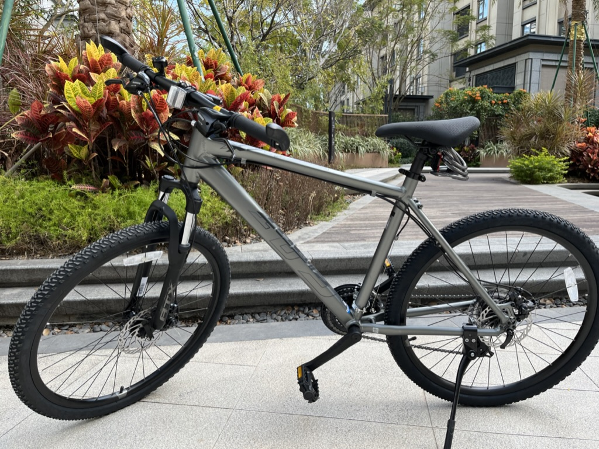

这边有两个关键词 —— `捷安特` & `山地车`

捷安特这个品牌在我读高中的时候就已经在意识里埋下种子了。毕竟在那个偏远的小县城，我能接触到的正经的自行车品牌几乎只有它，其他基本都是杂牌。在一众平庸的自行车里，车架上印有 GIANT LOGO 的自行车就显得格外耀眼。

走在路上，只要路过的自行车是捷安特的，都会追焦几秒，然后暗暗羡慕一番。

当时的我是无论如何无法说服我的父母给我购买一辆捷安特的。

至于为什么偏偏是山地车呢？ 同样是在那偏远的小县城，正经山地车已经算是稀缺物种了，更高级更贵的公路车基本是没有见过。

所以对于当时的我来说: `捷安特` + `山地车` = `高级`

抛开见识短浅这个客观因素不谈，主观上我也更喜欢偏越野的东西。

比如在街上看到低趴的超跑我只是冷眼旁观，甚至被那噼里啪啦的油门声吵得有点恼火。但是如果一辆改装过越野胎的吉普牧马人开过，我便会心驰神往。高高的底盘和粗壮的轮胎，带你跋山涉水，淡定从容。虽然没有开过，但是感觉脑海里已经模拟过很多次了。

所以山地车前叉的两根避震器让我非常受用，甚至会下意识的用力推压，感受弹簧回弹的爽感。

总之从高中到现在，这几乎快 20 年的时间里，我的内心一直都想着拥有一辆捷安特的山地自行车。

所以当决定购买第一辆自行车的时候，我几乎没有任何犹豫和品牌筛选，直接到捷安特专卖店选购了 ATX 660.

_这是一个最不理智的又最理智的选择。_

当时觉得 ATX 660 颜值好看，且价格合适，不敢买太高端的，因为需要停在地铁站。

我还给它安装了一个宝宝椅，周末可以带着我 2 岁多的女儿去公园骑行，非常惬意。

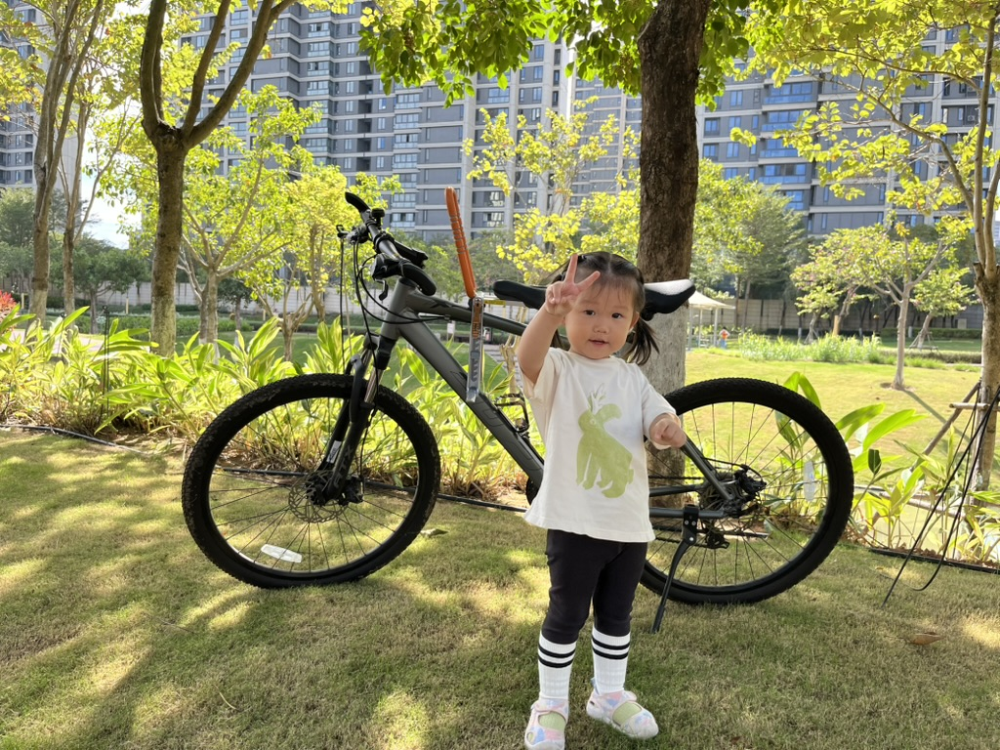

捷安特 + 山地车 + 价格适中就是我第一次选购自行车的思路，纯粹的主观且业余。

我觉得这个思路非常好，它不那么明智，但是它可以让你体验一次梦想照进现实的快感。

如果你和我一样，有类似的心结，那么第一次买车就不要犹豫，直接买个当年的白月光即可。

## 问题渐显

当我骑了一段时间 ATX 660，过程中确实体验过挺多快乐和满足感。但是慢慢的，那份青春情结逐渐消退，让我开始客观且科学的审视它是否真的适合我。

我体验到如下一些问题：

### 速度不快 & 骑行费力

由于山地车的结构是针对非铺装路面设计的，所以速度的优先级不高（比较笨重）。无论是宽大的轮胎还是前叉避震，都是为了通过性设计的。代价就是骑行更费力且速度不快。

虽然主观上我确实更喜欢山地车，但是我的实际用途基本都是城市通勤，所以山地车并不适合我当下的使用场景。

### 前变速器不顺畅

由于定位入门，它配备的前变速器并不好用，后变速器还算灵活顺畅。经过我这一年多骑行经验得出，前面的小牙盘是几乎没有使用到的。毕竟是城市通勤，没有那么陡峭的坡需要用到小牙盘。

所以我宁愿前面是个结构简单的**单盘**，无需变速。简单又高效。

### 尺码不对

自行车是区分尺码的，特别是正经品牌的自行车。每个尺码对应不同的身高，不同尺码之间有一定的重叠，具体看个人的骑行偏好来选择偏大的或者偏小的尺码。（据说是应该买小不买大）

捷安特 ATX 660 2025 的尺码参考图:

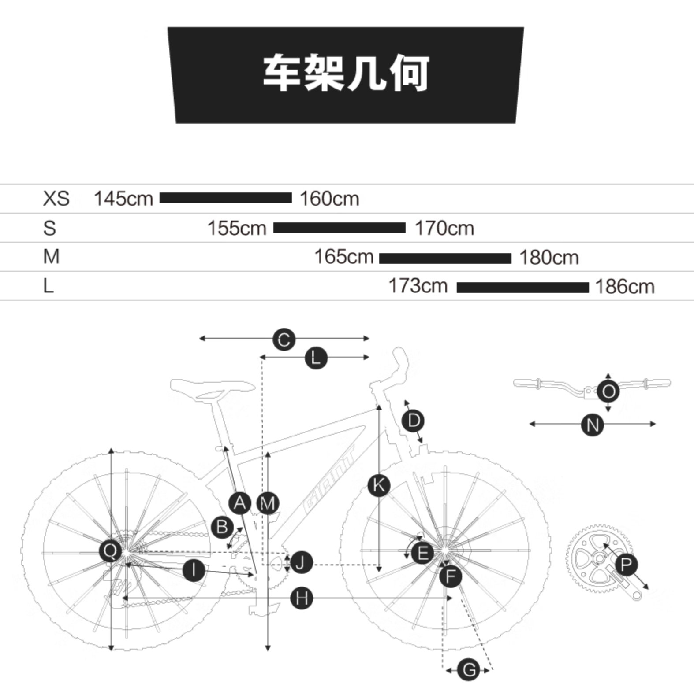

当时我在店铺试骑的时候是骑的 M 码，个人身高 165 左右。当时店员说 M 码可以匹配我的身高 ， S 码的车架会很小，不推荐（此时我严重怀疑是他觉得 M 能用就用，毕竟 M 是他已经安装好的， S 码他还需要重新装过）

由于我在店铺门口就简单试骑十几米路程，并无法真切感受到尺码是否真的合适。就直接购买了 ATX 660 的 M 码。 事实证明这个车架对我来说是偏大的，在骑行稍久一点就可以感受到我身体的前倾更大，对手臂的支撑压力增大，且 M 码的把横也更宽，肩膀容易酸痛。

专业点说就是骑行几何不科学。

### 2025 款升级了

事实证明我的感受是对的，因为 2025.05.11 我又去了捷安特的专卖店，店员介绍新款的 ATX 660 2025 款已经将尺码改小一号了。

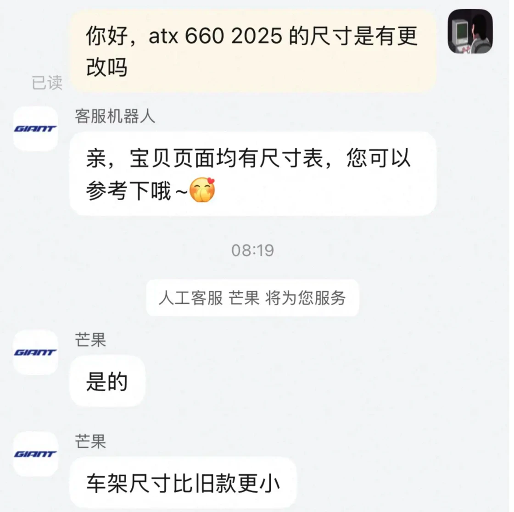

就是虽然都是 M 码，但是车架的实际尺寸是有缩小的，这个我几乎可以肉眼就看出来，毕竟我是 2024 款的车架偏大的受害者。

这个尺码不匹配的问题是我这次重新选购的最大原因，毕竟骑行几何不科学，对身体是有伤害的。

速度不够快，前变速器不顺畅都可以将就，但是骑行姿势不对，这个问题就不能忽视了，于是我果断把 ATX 660 挂闲鱼，在原价 1899 的基础上，使用一年的折旧情况下，最终 1150 出手了。

感觉还是挺划算的，毕竟哪怕我重新再买过 ATX 660 的 2025 款，我也只需要填补 700 块。

而这 700 块可以让我享受到 ATX 660 2025 的所有升级，比如：

-   刹车变成内走线了，更好看
-   脚撑有专门的安装孔位了， 更好看
-   线刹升级成了液压碟刹，更安全
-   M 码的尺寸更小了 （店员说是官方修正了 M 偏大的 bug）

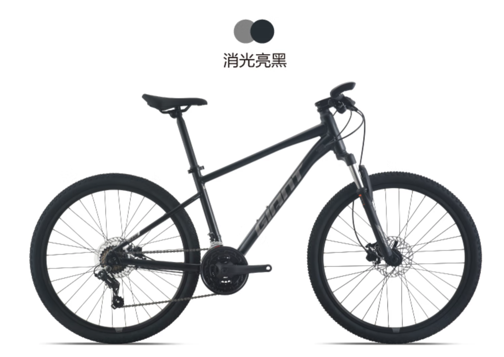

这个尺寸的教训比较深刻，建议大家选购车的时候一定要亲自测试，在官方指导的两个匹配的尺寸里来回试骑，才不会选错。毕竟套件可以升级，车架更换成本较大。

网上有说两者选一（买小不买大） 我觉得是不对的。就拿试骑的 ATX 660 2025 来说，我是冲着 S 码去体验的，但是修正后的 M 码就非常合适我的身高，S 码可能就太小了（没试骑）。所以其他参数可以听别人的，尺寸一定要自己去体验。

## 选购思路

根据以上我总结出 ATX 660 暴露的问题，我的新车购买思路就变成了如下几个条件：

**重要：**

舒适度

-   平把公路（瓜车）
-   单牙盘 （变速简单）
-   尺码必须亲自测试实车 （综合经验得出 165 净身高是 S 码合适）

**次要：**

美观度

-   筒轴
-   液压碟刹
-   内走线
-   最好有专门的脚撑孔位 （ATX 660 2025 就升级了专用孔位，看着舒服多了）

### 平把公路

平把公路是介于山地车和弯把公路之间。

和山地车相比，平把公路胎宽更窄，没有前避震器（不会泄力），所以骑行更轻且速度会更快。

和弯把公路车相比，平把公路胎宽更大，所以通过性更好。

感觉平把公路就是城市通勤的最优解，山地车就去越野，弯把公路就去竞速，平把公路就是城市通勤。

我个人刚开始是不太喜欢平把公路的，因为我喜欢极致。

我觉得山地就山地，公路就公路，你搞个四不像，两头占便宜算怎么回事。我可以嘴硬说你越野不如山地，速度比不过弯把公路啊！

后面才发现是自己的认知狭隘了，我以为的自行车选购是一条线：

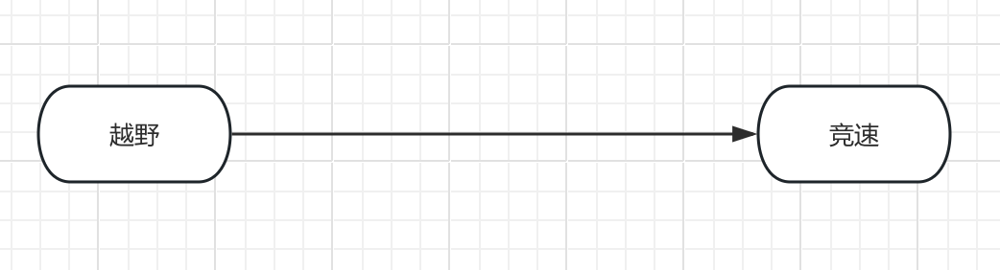

对于极致的追求，当然是在这条线的两端做选择才符合性格。

但是我忽略了，我们大部分人的使用场景是通勤，所以选择不是在一条线，而是在一个三角形里面，平把公路的定位就在这个三角形的中心，基本是个最优解。

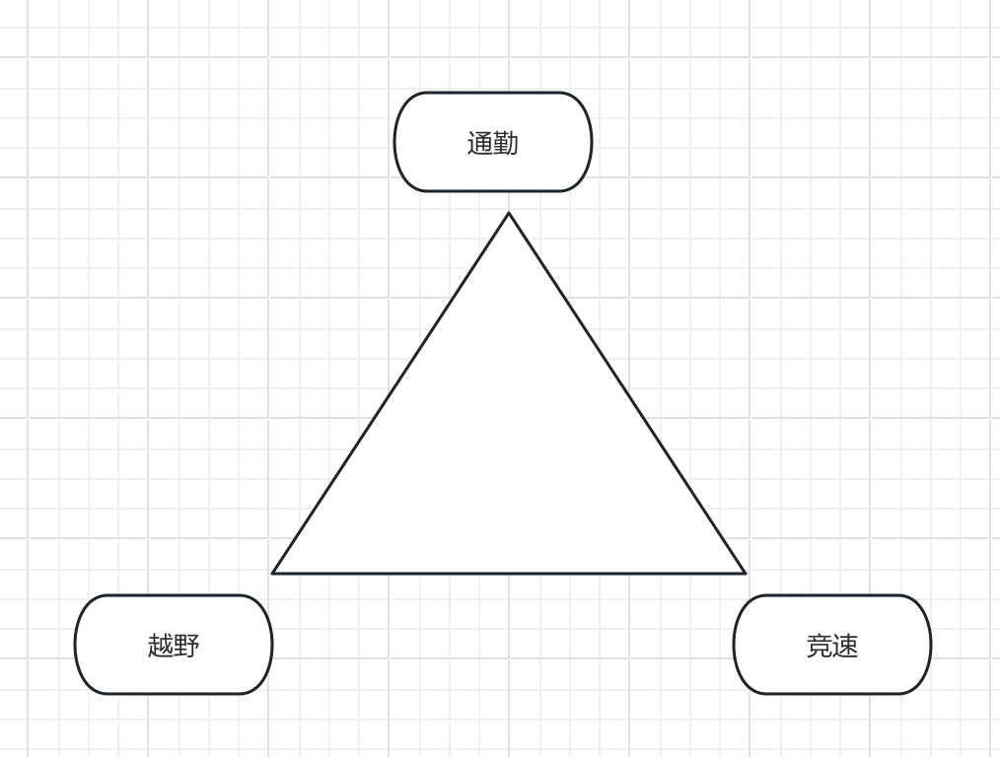

个人不喜欢弯把公路具体原因如下：

-   穷！ 弯把公路过于专业，价格偏高
-   骑行姿势要弯腰，是为了速度牺牲舒适性的 （说好的保护腰椎呢？）
-   压力大，骑着弯把就会在乎速度，可是我又不竞速
-   通过性差，我还是更喜欢跳马路牙子，公路车太金贵，易爆胎

所以山地车留给诗和远方，普通通勤车看不上，弯把公路车留给专业的大佬。而我，作为普通菜鸟，平把公路将是最优选。

这是我骑行一年的总结出来的经验之一。

### 单牙盘

前面说过，我在使用 ATX 660 的时候，几乎没有用过最小牙盘，所以觉得对于城市通勤，单牙盘足够了。

首先它更简洁好看，结构简单就不容易出问题。

我后面发现高端一些的如 XTC 800 系列是 2 盘的，而 ATX 是 3 盘的。

所以解除认知误区，**并不是牙盘越多越好**，高端的盘数反而少了。

特别是昨天去体验的崔克自行车，他不仅平把公路配备单盘，新款的山地车都全部使用单盘了。这边原理由专业的大佬来解释，我只阐述我的发现和体会。

而且单盘会让发力更直接，力量传导性更好。

### 桶轴

相比快拆，桶轴结构更稳定，不容易产生蹭碟的风险。而且可以清除我在使用快拆时的心理负担。前面说过我喜欢跳马路牙子。用快拆结构的时候，我经常担心拉起横把的时候，轮子掉下来了。这样的场景我假想过无数次，就像以前坐在教室听课，一直担心天花板上的挂扇掉下来砸到头怎么办。

而且桶轴看着也更简洁，车子更好看。

快拆顾名思义就是可以快速拆装，但是我基本只有在更换轮胎的时候需要拆轮子，所以快拆的意义不大。

### 液压碟刹

这个也是最近才了解到，毕竟在平把公路对于 ATX 系列的山地车算越级了，所以配置就高起来，也就了解到刹车有线拉碟刹和液压碟刹两种，液压碟刹的刹车手感更好，更安全。

### 内走线

完全是因为颜值，内走线确实好看很多，而且哪怕是 ATX 660 ，升级之后都是内走线了，所以加个这个条件，不算过分。

### 脚撑孔位

这个在使用 ATX 660 的时候就觉得这个脚撑的安装不舒服。很多自行车都是不设计脚撑的，这又是一个脱离现实的设计。大概只有真正玩车的大佬不安装脚撑吧？大部分普通人还是需要的，所以我觉得有特定的孔位安装会更稳定美观。

（注意看脚撑的位置，属于后装的，不协调）

而且我发现 ATX 660 2025 已经有脚撑特定孔位了，好看很多。所以我希望下一辆车子也有专用的脚撑孔位。

以上，我列出了经过自己骑行一年多，总结出来的浅薄的购车思路。

## 品牌选择

在我有限的品牌认知里，我只能大概说出这样的排位顺序：

-   1、崔克、闪电 （国际品牌，高端）
-   2、捷安特、美利达、喜德盛 （知名国产）
-   3、CAMP、速比特、JAVA 新势力品牌
-   4、 飞鸽，永久、凤凰 （不思进取的老品牌，直接忽略）

针对上面列出的选购思路，我在这些品牌当中挑选出以下候选者：

-   崔克 FX2
-   闪电 SIRRUS 2.0
-   捷安特 escape 1
-   美利达 探索者 600
-   CAMP GX300
-   速比特 开普勒 pro

| 平把公路 |          崔克 FX2          | 闪电 SIRRUS 2.0 |  捷安特 escape 1   | 美利达 探索者 600  |     CAMP GX300     | 速比特 开普勒 pro  |
| :------: | :------------------------: | :-------------: | :----------------: | :----------------: | :----------------: | :----------------: |
|  单牙盘  |     :heavy_check_mark:     |       :x:       |        :x:         | :heavy_check_mark: | :heavy_check_mark: | :heavy_check_mark: |
|   桶轴   |     :heavy_check_mark:     |       :x:       |        :x:         | :heavy_check_mark: | :heavy_check_mark: | :heavy_check_mark: |
| 脚撑孔位 |     :heavy_check_mark:     |       :x:       | :heavy_check_mark: |         ❓         |        :x:         |        :x:         |
| 全内走线 |     :heavy_check_mark:     |       :x:       |        :x:         |         ❓         | :heavy_check_mark: | :heavy_check_mark: |
| 小膈应点 | S 码的车架几何 和 M 码不同 |       无        |         无         |                    | 前叉的 3 个货架孔  |         无         |
|   价格   |            45xx            |      42xx       |        24xx        |        3999        |        25xx        |        3999        |

当我在以上几个候选名单徘徊的时候，偶然刷到了富士达跑客 500，虽然对品牌不熟悉，但是看配置居然全部符合我的预设。

`平把公路 + 单牙盘 + 桶轴 + 全内走线 + 液压碟刹 + 脚撑安装孔`

<video controls src="./assets/battle.mp4" />

有种众里寻她千百度的感觉，首先第一眼看到就很喜欢车架几何，符合我对平把公路的预设。

在满足了我所有要求的同时还一些小惊喜，比如方向限位的设计。普通自行车的方向是可以旋转超过 180 度的，跑客 500 为了保护全内走的线束，居然做了旋转限位，这是一个非常贴心的细节。

由于对品牌不熟悉，于是就快速的了解了一下，原来富士达不是一个新品牌（1992 年就创立了），只是一个不被大众熟知的品牌。

富士达是全国乃至全世界最大的自行车代工厂，出货量排名第一。这样我就联想到 HTC ，做手机代工的品牌。然后自己也开始做手机，由于之前对 HTC 手机做工设计的好感，也顺延到富士达这个代工品牌了。

所以品牌没问题了，但是品牌知名度确实低，应该很多人和我一样，不知道富士达自行车的。可能前期都是在做代工，后面才开始做自己的自行车吧。

由于是给闪电、崔克等品牌做代工，所以对它的工艺什么的我就不太担心了。

然后稍微研究了一下富士达的车系，感觉也是挺齐全的，而且跑客系列也是有不同定位等级的，跑客 100、跑客 300、跑客 500、

说明跑客这个系列也算主要系列，而且看宣传是 2024 款 升级到 2025 款，所以从更新频率来看也算是足够高了。

当富士达这个品牌和跑客这个系列都简单了解确定没问题之后，我就开始找购买渠道了。在厦门只有偏远的同安有一家，作罢。于是上淘宝，发现淘宝店铺卖的还是 2024 款，于是特意下载了抖音上直播间，刚好有主播在介绍 2025 款的跑客 500，简单了解就下单了。

这次的选购逻辑是：

-   跑客 500 是唯一全部满足我的预设条件的
-   因为知名度低，所以没有品牌溢价
-   因为知名度低，所以堆料诚意，性价比高

其实对于自行车配件的品牌和等级我并不了解，但是看了一些专业人士的评测，富士达跑客 500 的配置是堆料很足的。比如辐条、转轴，轮胎等（这些容易忽视的小件）。虽然我不懂，但是我能判断。当一个很细节的配件都可以拿来说道的时候，应该是很有底气的。

## 富士达跑客 500

<Pictures :width="300">
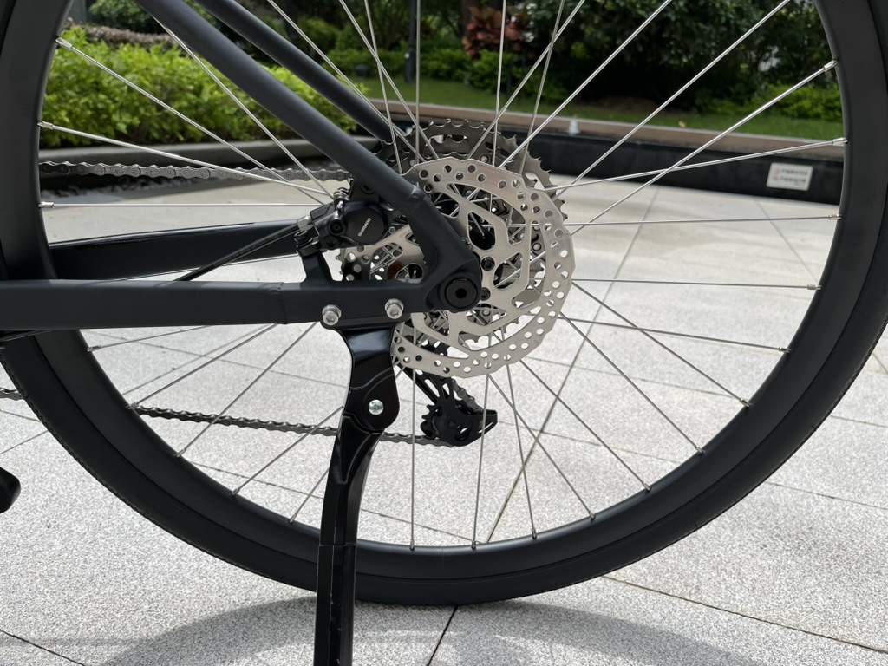
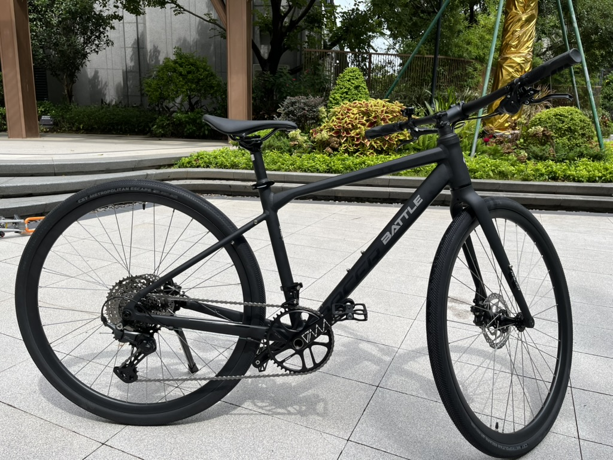
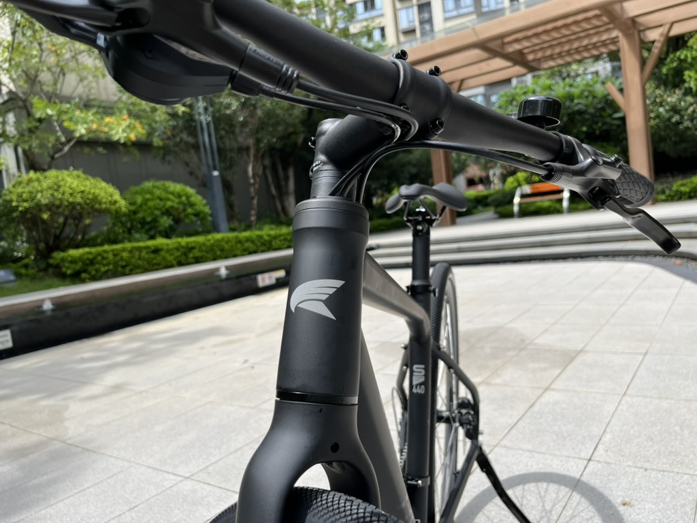
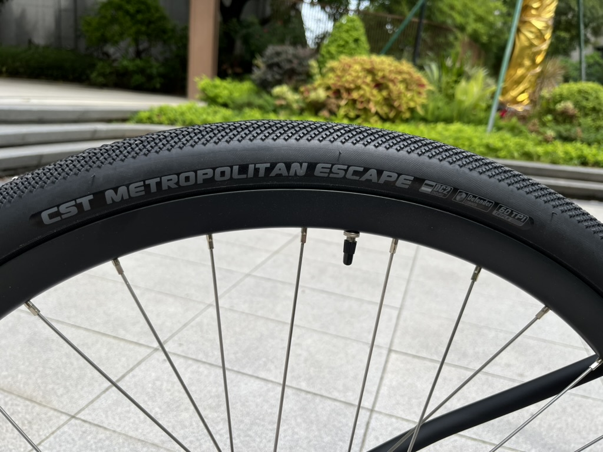
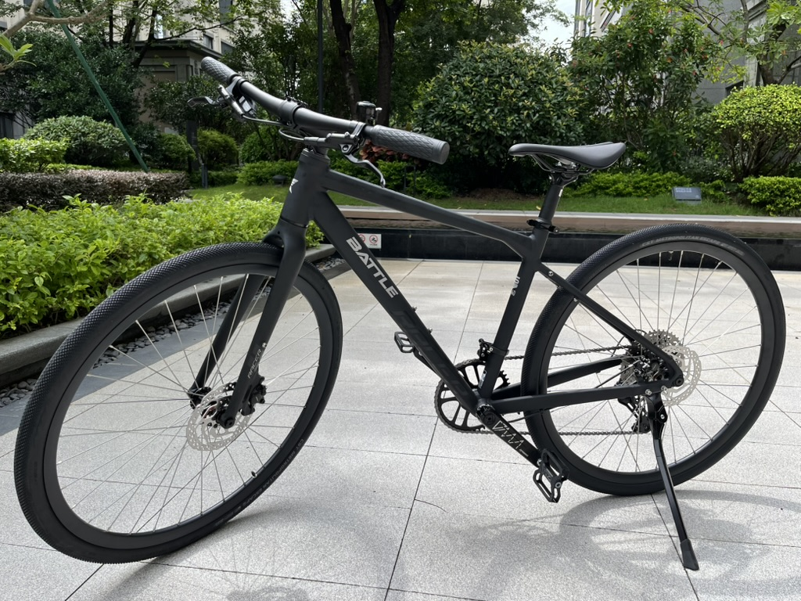
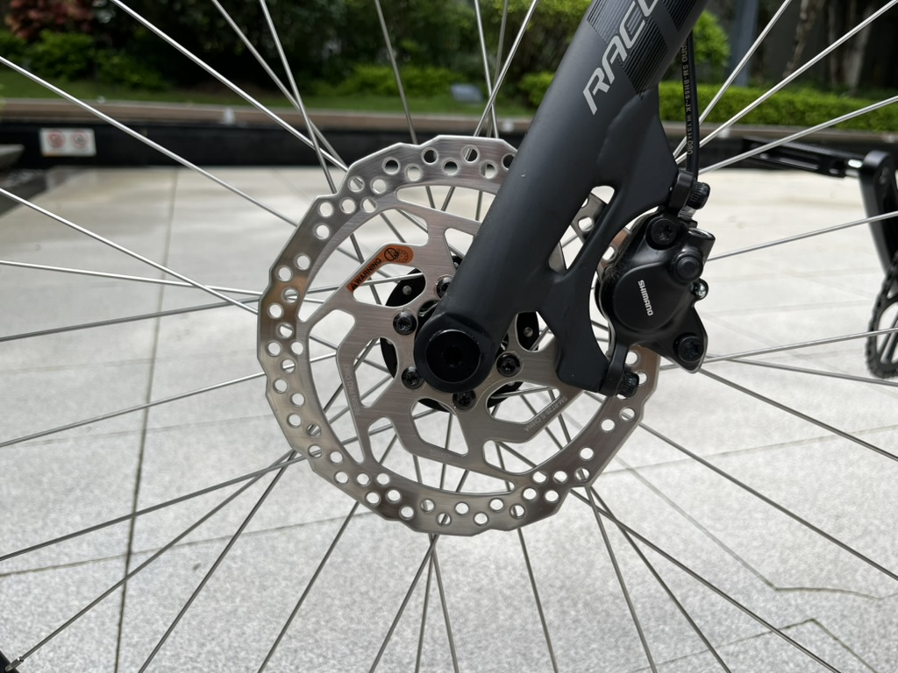
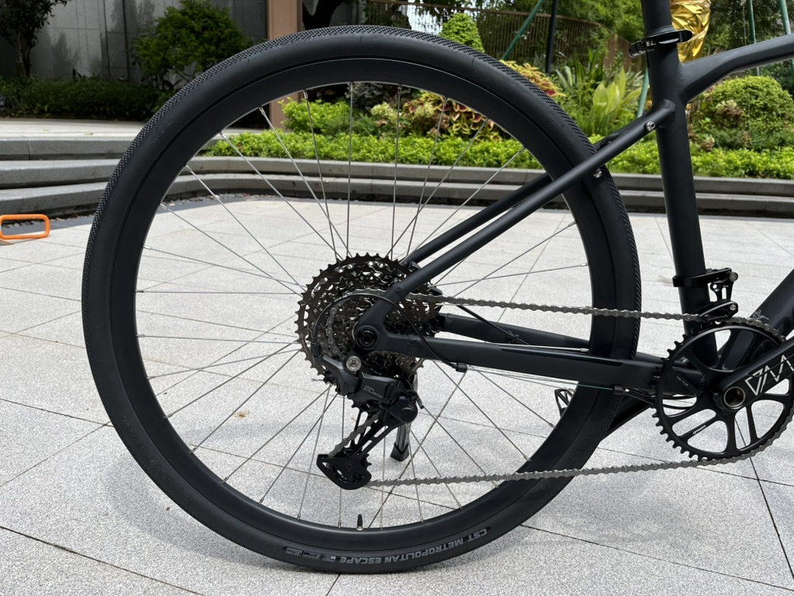
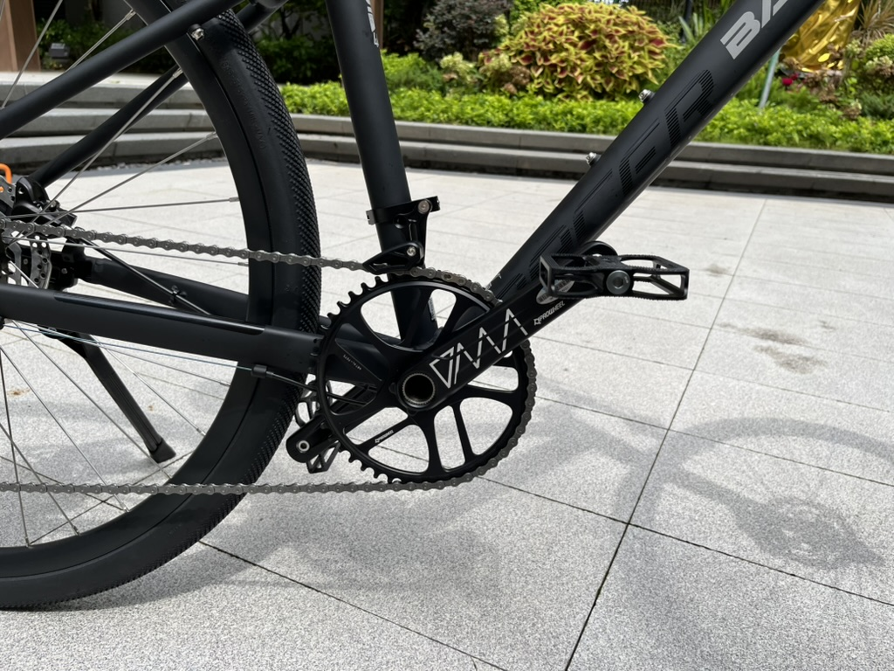
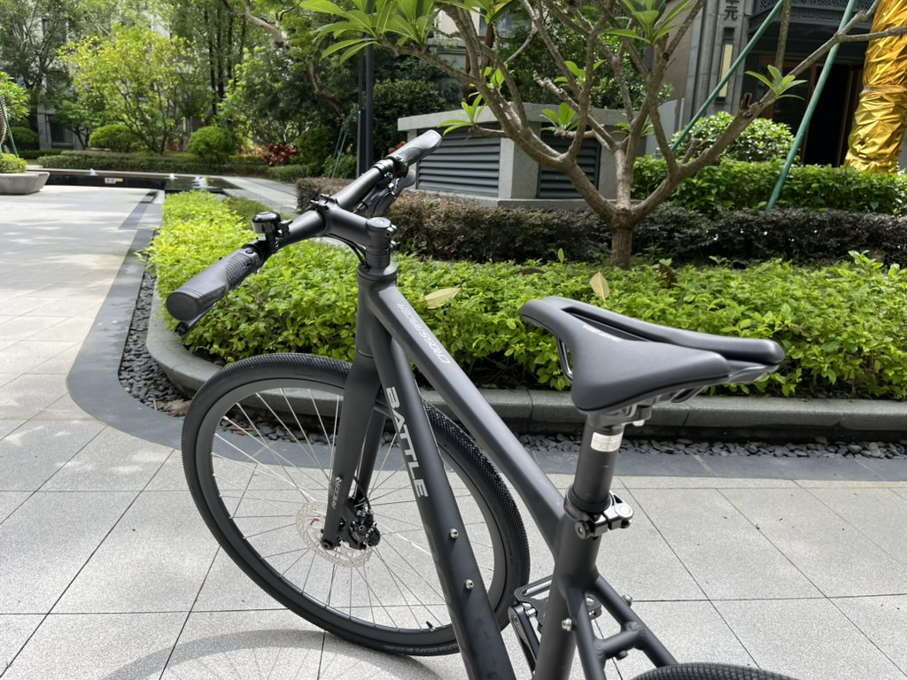
</Pictures>

品牌认知度不高加上黑色的车身看着普普通通的提好，不会太张扬。

跑客 500 的骑行质感有点类似之前去试骑的崔克 FX3，那可是 6K+ 的高端货。

我说的的质感特别指踩下脚踏，带动曲柄，转动牙盘，绷紧链条，带动飞轮的这一系列的动力传动。非常直接，感觉踩下去的每一份力都转化到后轮去了。

公路车的轻巧优势也很明显，每次去海边要进入跑道的时候有个围栏，现在可以比较轻松的举起车子跨过围栏了。

总之到手已经骑了几天，感觉物有所值，相比之前的 atx 660 的骑行体验提升还是非常大的。

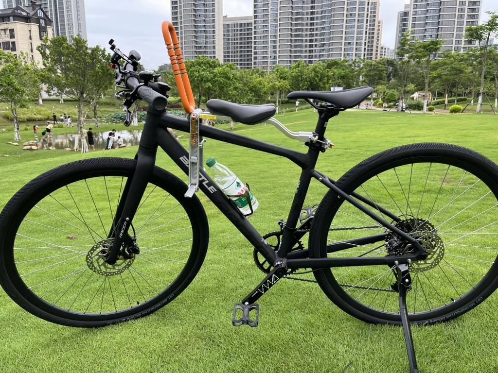

我又可以带上小玥子去海边，去公园瞎溜达了。
