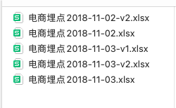
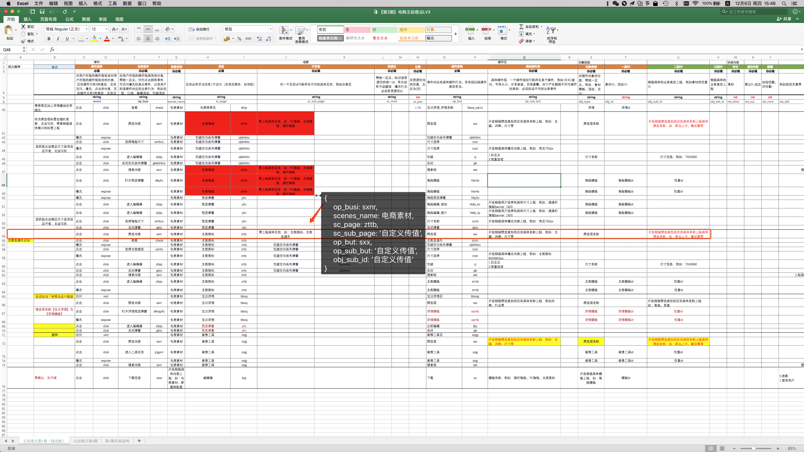
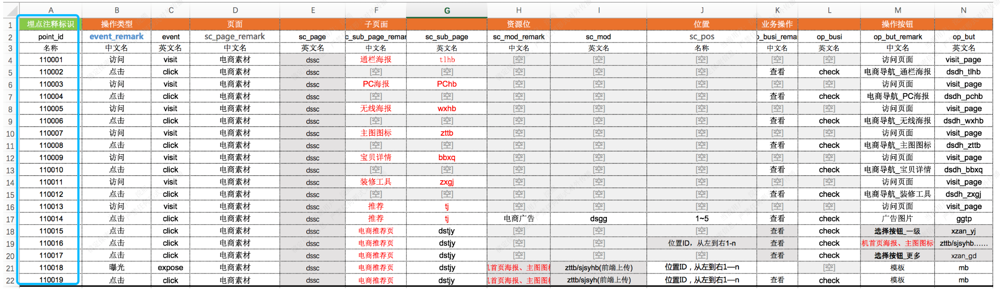

# 半自动化埋点

## 混乱的时期

公司需要对用户在网站上的行为做数据分析，以便更好的做产品规划和运营方案，于是埋点变成了业务开发的环节之一。

在我接手这份需求的时候，团队上没有一个比较规范的埋点流程，都是运营人员将需要埋的点编写在 excel 文档上，发给开发，开发人员对着 excel 表格上的要求，将点`埋`到代码中。

这样就导致了数据不易于维护的问题，运营在修改某个埋点需要携带的数据的时候，他们是更新一下 excel 表格，传给开发，开发再对着标注出有修改的部分，更新埋点代码。

在每次迭代中，运营也会不断更新埋点数据，然后发送不同版本的 excel 文档过来，很快，你将陷入非常繁琐且容易出错的校对埋点的工作中。

感受一下埋点文档的混乱：



然后在对着一堆密密麻麻的表格数据去`抠`出埋点字段：



每行表格，对应一条埋点数据，每列对应的是不同字段和需要上传的值。上传的值分 2 种：一种是运营和产品经理定义的静态数据，如截图里面的 op_busi：sxnr，sc_page:zttb，等，还有一种是动态数据，如截图里的 op_sub_but,obj_sub_id ,这种数据是根据用户在具体操作的时候，上报的具体值，比如你点击的海报的 id 是多少，分类信息是什么等。而我们需要做的就是把这些字段，组装成一个对象，然后通过规定的事件，上报到神策后台。如下：

```js
onPosterDialogClose() {
   // 神策埋点
   this.$tracker.trackEvent('click', {
       scenes_name: '电商素材',
       sc_page: 'yltc',
       op_busi: 'gbtc',
       op_but: 'gbtc',
       ext1: this.typeName,
    });
 },
```

这里是一个`关闭海报弹窗`的埋点，当用户关闭海报预览弹窗时，触发的是 click 事件，然后上报对应的数据，而 ext1 字段就是动态数据，它的值取决于 `this.typeName` 是多少，其他字段都是静态数据，是我们从文档里抄写过来的。

静态字段加上动态字段让业务代码变得臃肿了。

## 当下的问题

-   文档是通过 excel 文档编写的，没有规定的格式，运营只是把每个字段信息需要的数据写出来.
-   每次更新 excel 文档，开发需要去校对哪些点的字段信息是修改了，需要在代码里做同步的修改。
-   代码里夹杂了太多的埋点信息，对于理解业务代码是一种干扰。
-   测试困难，开发和测试人员都需要校对一遍每个点的所有字段的值是否携带正确。

## 解决方案

### 规范文档

和运营同事共同规范了一下埋点需求文档的格式，让每个埋点都带一个独立的 point_id，然后我们把.xlsx 文件通过 node 脚本转成一份 json 数据。

这样每个数据都有一个独立的 point_id, 所以我们可以通过这个独立的 point_id 去找到对应的静态数据，完成了静态数据的自动化读取，减少了抄写和校验的工作。

最终，我们只需要关心动态数据和 point_id 是否有上传正确。后续如果运营修改了某个点的静态字段，开发只需要重新生成一份 json 数据就好。在后期维护上也极大的节省了时间。



### 生成埋点数据

```js
const fs = require('fs');
const xlsx2json = require('xlsx2json');
// 值为'数值'的字段
const need2number = ['res_time', 'res_suc', 'res_num'];
// 需要删除的字段
const needDelete = (k, v) => {
    return k.includes('_remark') || k === 'event' || ['[空]', '', undefined, null, NaN].includes(v);
};

xlsx2json('./sc.xlsx', {
    sheet: 0, // 第几个表 如果不填会读取所有表
    dataStartingRow: 3, // 数据从哪一行开始
    keysRow: 1, // key值用哪一行的
}).then((jsonArray) => {
    let result = jsonArray.map((item) => {
        Object.entries(item).forEach(([k, v]) => {
            item[k] = v.trim();
            if (need2number.includes(k)) {
                item[k] = Number(v);
            }
            if (needDelete(k, v)) {
                Reflect.deleteProperty(item, k);
            }
        });
        return item;
    });
    fs.writeFile('sc-data.json', JSON.stringify(result, null, 2), (err) => {
        if (err) throw err;
        console.log('神策数据生成成功！');
    });
});
```

生成的数据如下：

```json
[
    {
        "point_id": "110017",
        "sc_page": "dssc",
        "sc_sub_page": "dstjy",
        "op_busi": "check",
        "op_but": "xzan_gd",
        "op_sub_but": "开发根据一级ID名称上报，例如手机首页海报、主图图标等…（文案与页面显示完全一致）"
    },
    {
        "point_id": "110018",
        "sc_page": "dssc",
        "sc_sub_page": "dstjy",
        "sc_mod": "zttb/sjsyhb(前端上传)",
        "sc_pos": "位置ID，从左到右1—n",
        "op_but": "mb",
        "obj_type": "mb",
        "obj_id": "海报ID"
    },
    {
        "point_id": "110019",
        "sc_page": "dssc",
        "sc_sub_page": "dstjy",
        "sc_mod": "zttb/sjsyh(前端上传)",
        "sc_pos": "位置ID，从左到右1—n",
        "op_busi": "check",
        "op_but": "mb",
        "obj_type": "mb",
        "obj_id": "海报ID"
    }
]
```

### 读取埋点数据

```js
// 获取神策数据
let scData = require('../lib/sc-excel/sc-data.json');
// 这些字段需要 字符串
const neetToStr = ['sc_pos', 'obj_id', 'obj_sub_id', 'obj_ext_id', 'ext1', 'ext2', 'ext3'];

export function getScData(point, customObj = {}) {
    Object.entries(customObj).forEach(([k, v]) => {
        if (neetToStr.includes(k) && typeof v === 'number') {
            customObj[k] = String(v);
        }
        if ([undefined, NaN, null, ''].includes(v)) {
            throw new Error(`"pointId" = ${point} 传入的自定义数据的 ${k} 值为 ${v} 不合法!`);
        }
    });
    let o = scData.find((item) => item.point_id === point);
    if (o) {
        return { ...o, ...customObj };
    }
    throw new Error(`没有找到对应point_id:${point}的神策数据!`);
}
```

我们将埋点的静态字段信息都存在了独立的 json 文件里，这样在具体的业务代码只是通过`point_id`去获取，极大的减少了业务代码里面的噪音代码，减少阅读干扰。

改造后的代码：

```js
getSensorLogData(id, index) {
   const pos = index + 1;
   this.$tracker.trackEvent('click', this.$getScData('110014', {
      'sc_pos': String(pos),
      'obj_id': String(id),
     }));
 },
```

## 结果

以上：我们实现了.xslx 文件自动生成 json 数据，然后通过封装的公共方法 this.$getScData，只需要传入对应埋点的 point_id，就可以得到对应的静态数据，如果有需要上传动态数据，则在第二个参数里传入即可。

这样我们省去了抄写和校对静态数据的工作，因为只要 point_id 没错，我们就能保证对应的静态数据是对的，把工作的重心放在动态数据上，而且如果运营或产品经理若更新了需求文档，若只是静态值改变的话，我们只需要重新生成一下 json 数据就好，无需改动项目代码。

利用一点点工程化的思维，把繁琐的事情变得简单，易于维护，提升了工作体验，是一件值得记录的事情。

## 补充

关于和产品经理的沟通：

当拿到产品经理给的埋点需求文档时，不要急着开始工作，可以咨询她们每个埋点的用途和她希望得到的结果。因为有一些产品经理提的埋点需求是不合理或者无意义的，最重要的是有一些埋点是可以可以通过“合并同类项”来达到目的的。

场景 1：《电商素材》项目下，有 PC 海报，无线海报，和通栏海报等这些栏目，产品那边给的第一期埋点需求就有 pc 海报的关闭预览弹窗，无线海报的关闭预览弹窗，通栏海报的关闭预览弹窗共 3 个类似的埋点需求。

其实这个是可以合并成一个`关闭预览弹窗`，然后通过一个动态数据来区别，是 pc、无线、还是通栏。这样达到数据收集和区分需求，我们的代码也简洁很多。

场景 2：之前埋点有个需求是给海报一个点击事件的埋点，然后预览弹窗一个曝光的埋点。从前端的角度，用户点击了海报，必然产生预览弹窗的曝光，所以可以说服产品，两个埋点保留一个就好。

所以在接到埋点需求到时候，和产品沟通一下，把不必要的去掉，不合理的改掉，这样也是提升效率的方式之一。
