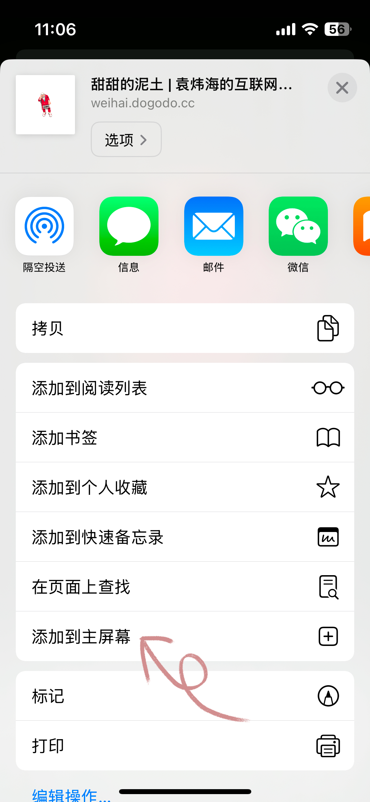
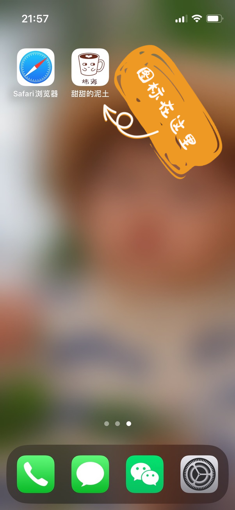

# 关于本站

这是袁炜海的博客站，在这纷杂的互联网上给自己开垦的一块自留地。

这边可以自由的书写内容，也可以自由的排版，对站点进行个性化定制。

本站采用 [vitepress](https://vitepress.dev/zh/) 构建，设计简单但功能强大。 无论从主题风格，还是开发体验都非常符合我的审美。

## PWA 体验

如下简单配置之后，本网站就能够以 APP 的形式添加到桌面。
::: details 配置文件

::: code-group
<<< @/public/manifest.webmanifest{json}
<<< @/.vitepress/config.ts#snippet
:::

如果你想体验 PWA ，那么简单操作几步即可：

1、 打开手机浏览器（苹果: safair | 安卓: chrome）在网址输入框输入 `weihai.dogodo.cc`

2、 点击浏览器的分享按钮，在弹出的选项中点击 `添加到主屏幕`

3、 就会在你的主屏幕上添加一个图 3 中显示的 APP 图标

点击该 APP 图标，就能以应用的方式打开本网站，它将比在浏览器中提供更好的体验

<PicturesScrollX>
    
    
    
</PicturesScrollX>

## PWA 的 hack

为了让 PWA 模式更接近原生 APP 的体验，我将网页的滚动条去掉了。为了去掉这个滚动条费了不少功夫。

经过几番折腾发现在 `:root` 级别里对滚动条进行 css 的设置是无效的。

所以为了隐藏滚动条，我将 `root` 设置了 `overflow:hidden;` 将滚动的容器设置到 `body` 上。

如下 css 样式：

<<< @/.vitepress/theme/custom-root.css

这样设置之后滚动条如期消失了，不过影响了 `页面导航` 的锚点定位。

于是定制了 `VPDocOutlineItem.vue` 组件，修改里面的锚点跳转的逻辑

<<< @/.vitepress/theme/components/VPDocOutlineItem.vue#snippet{4,5}

这样就涉及到对默认主题的定制，好在 vitepress 提供了原组件覆盖的方式。[重写内部组件](https://vitepress.dev/zh/guide/extending-default-theme#overriding-internal-components)

我也修改了 `VPLocalNavOutlineDropdown.vue` 组件，为了让返回顶部的功能正常运行。

<<< @/.vitepress/theme/components/VPLocalNavOutlineDropdown.vue#snippet

隐藏了滚动条但是希望有其他方式表示阅读进度，于是写了个进度条，放在 `VPLocalNavOutlineDropdown.vue`

<<< @/.vitepress/theme/components/ProgressBar.vue

经过这一番折腾，本站终于有了一个让我比较满意的 PWA 的表现形式。

## 遗留的问题

现在 PC 的体验是保留和 `vitepress` 一样。手机端进行了如上所述的定制。在 PWA 的模式下，和微信应用内打开都是非常完美的。但是在 Safari 上，只要点击一次锚点，那个页头部分就无法保持定位了。

好在我自己基本都是通过 PWA 的模式查看，偶尔分享给少数朋友，他们是通过微信打开，所以通过手机端的 Safari 上查看的占比较少。就先不管了。Safari 那个视窗高度变来变去，出点问题也正常，毕竟我做了 `hack`。
