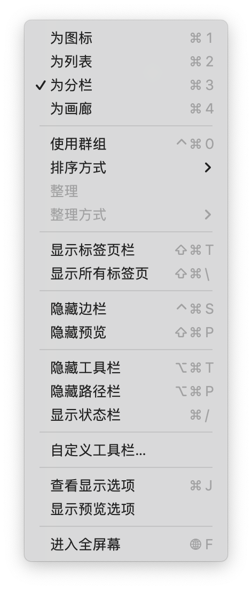
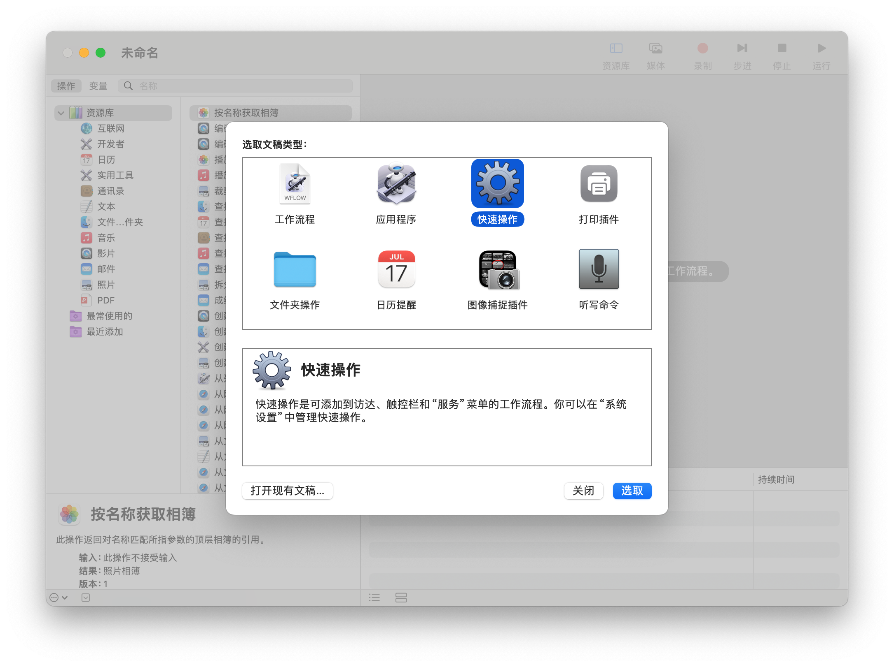
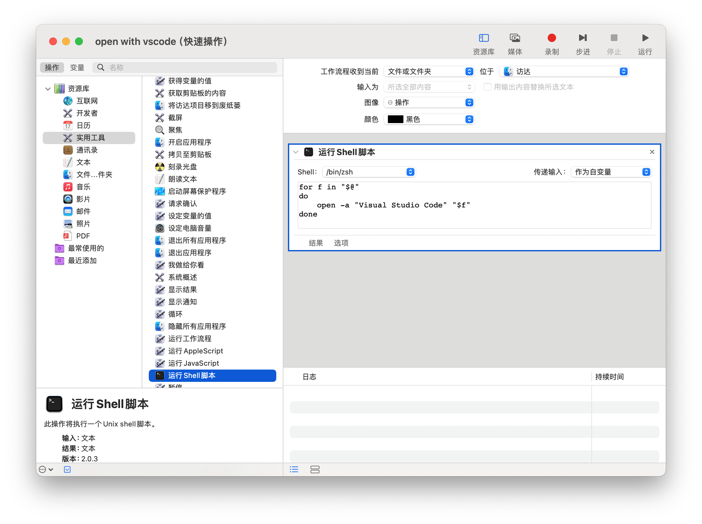
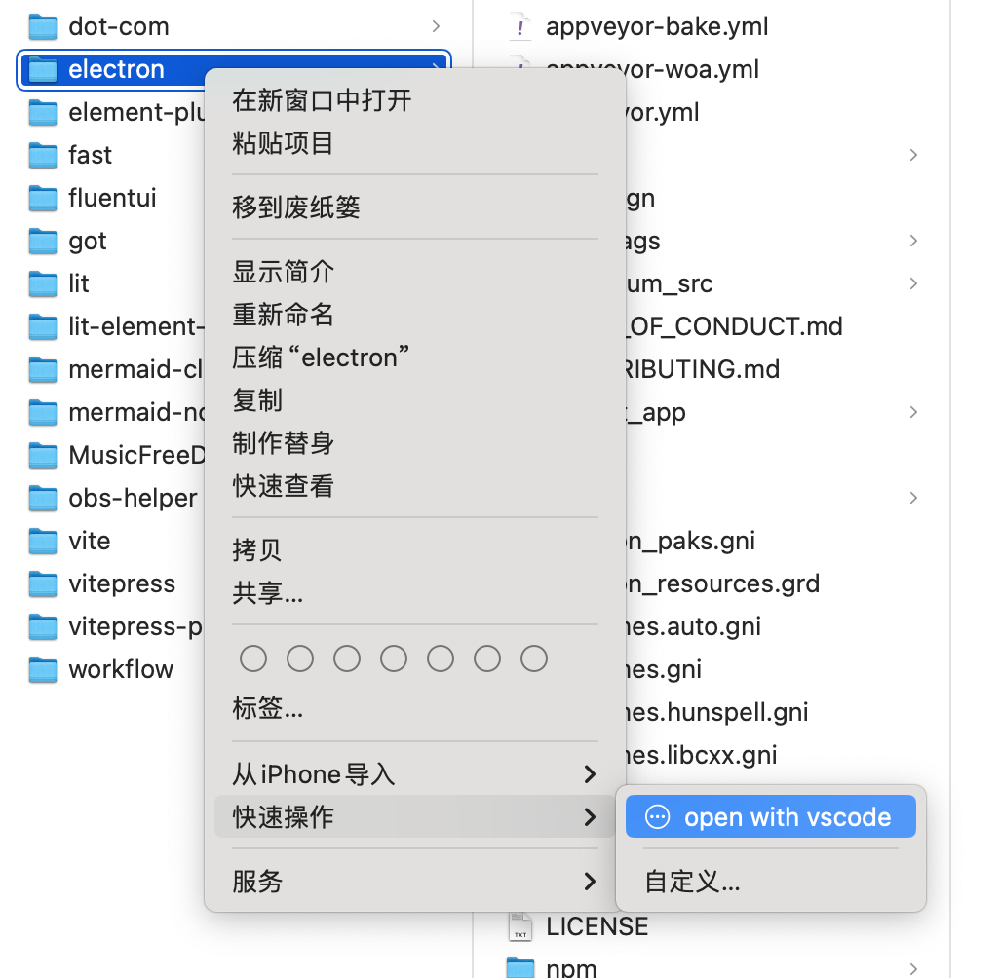
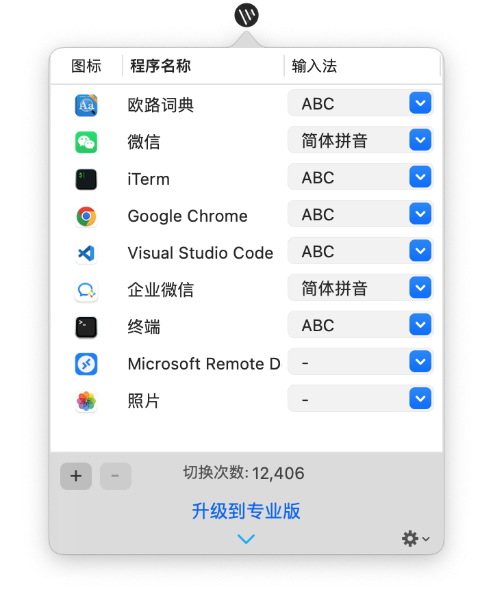

# Mac OS 装机指南

工欲善其事，必先利其器。作为靠编程谋生的程序员而言，一套量身定制的开发环境就如一把利剑对于一个闯荡江湖的武侠一样重要。

背景：

-   职业：WEB 前端开发
-   工具：MacBook Pro

由于 Mac OS 的干净整洁，一直都是我的电脑首选。从 16 年至今，都是使用 mac 开发，在此沉淀一篇配置文章，以便在更换电脑的时候，轻车熟路的进行配置。

个人性格原因，喜欢小而美，且一直坚持断舍离原则，只保留必要的东西，甚至可以忍受一点由于极简带来小麻烦。所以只要 macOS 自带的 APP 能满足我的基本需求，我就不会安装一个替代的第三方 APP。

每次重装系统，都是对所需软件的重新审视，一般 1-2 年就会重装一次系统，要么是因为更换设备，要么是为了解决某些莫名其妙的问题，或者彻底卸载顽固软件。目前沉淀的这套装机指南已经可以让我在 30 分钟之内就快速搭建好工作环境。

## 原生软件的拥趸

我使用的原生 APP 有：

### 输入法

不喜欢安装第三方输入法，感觉太多附加功能，臃肿不堪，还是内置的输入法效率最高。见过 winnows 系统的搜狗输入法，居然还会在右下角弹出今日热点之类的狗皮膏药，像这类垃圾软件就应该彻底消亡。

输入法软件应该是一个存在感非常低的软件才符合它的角色。它应该有极高的效率，随时唤醒，用完即退，不要多余追求存在感。所以我基本是原生输入法的忠实拥趸。

### 备忘录

16 、17 年左右也用过印象笔记之类的，后来还是觉得太臃肿，功能很强大，而我需要的只是记录简单的文字。所以卸载了印象笔记，改用苹果自带的备忘录，非常简洁，该软件后期也在不断优化，比如也支持共享。而且天然享受 iCloud 的同步功能，使我在多个苹果设备之间无缝查看备忘的文字。

### 邮件

能简单收发即可，自带的完全满足需求，所以绝对不会安装第三方邮件客户端。

如下的一些软件使用频率不高所以自带的基本都可以满足需求

-   地图、
-   音乐、
-   截屏、
-   提醒事项、
-   keynote、
-   Safari（日常）

苹果的 APP 完成度非常高，相比国内的 APP 而言少了运营模块，整个 APP 完全面向生产力，无广告（零容忍），所以日常的 APP 我基本使用原生的。

## 电脑设置

得益于苹果强大的 iCloud 同步能力，在配置新电脑的时候只要登陆 Apple ID，所有数据都会同步过来（照片、备忘录、提醒、文档等等）。只需做一些简单设置，就可以进行日常使用。

### 改名字

[官方指导](https://support.apple.com/zh-cn/guide/mac-help/mchlp2322/mac)，先给电脑设置一个好听的名字吧！

如果不设置，那么默认名称为 username@macbook

### 搜索引擎

将 Safari 和 Chrome 的首页设置为 Bing，搜索引擎切换为 Bing，因为他们默认的都是垃圾百度引擎，为什么不设置成谷歌？原因你懂，而且 Bing 有国内版和国际版本，也基本够用了。

### 桌面与程序坞

#### 程序坞

-   开启 将窗口最小化至应用程序图标（这样就不会额外显示最近打开的应用）
-   关闭 在程序坞中显示最近使用的应用程序

#### 桌面与台前调度

-   关闭 点按墙纸以显示桌面

个人非常讨厌台前调度，对于追求效率的桌面操作来说，一切动画都是多余的，我更喜欢传统的方式将多个应用叠放，然后鼠标点击某个应用就快速将当前应用聚焦。

#### 调度中心

-   关闭 根据最近的使用情况自动重新排序列空间（这样不会打乱自己排布好的屏幕顺序，影响体验）
-   开启 显示具有单独空间

### 输入法，短语

设置一些常用的语句，比如身份证号码和手机号码，还有收货地址等，这样在输入的时候，可以快速联想出来。

比如我输入 350783 在候选列表就会有我设置好的身份证号码。

### 鼠标跟随速度

由于妙控鼠标在系统可视化设置里最高只能设置 3 ，移动鼠标需要较大的手腕弧度，我一般设置成 12 ，符合我个人的使用习惯。

```
defaults read -g com.apple.mouse.scaling
defaults write -g com.apple.mouse.scaling 12
```

### Finder 的显示设置



相比 windows 的资源管理器，我特别喜欢 mac 的 Finder，高效简洁。特别是分栏的浏览方式，很适合管理文件。

截止 2024 年 10 月， windows 的资源管理还无法分栏浏览。

### 快速操作

创建的快速操作脚本会保存在： /Users/alan/Library/Services

#### vscode 打开

打开`自动操作`



效果：


## 必装软件

### 自动切换输入法

[官方地址](https://www.better365.cn/AutoSwitchInput.html)，由于编程开发是英文，交流沟通是中文，所以在微信和 vscode 等软件来回切换的时候经常都要切换中英文。你是英文状态下在 vscode 写代码，切到微信回复个消息要切换到中文，然后回到 vscode 又要切成英文，非常繁琐，`自动切换输入法lite` 是一款免费的小软件，可以设置不同软件在激活的时候自动切换到指定的语言。典型的小而美的软件 👍。



### 微信输入法

::: details 折腾过程

<!--@include: ./input/index.md-->

:::

### MooM （废弃）

这是 mac 上一款管理窗口的付费软件，我最常用的就是左右分屏功能，由于在公司用的是 27 寸 4K 显示器，我可以轻松的将 Chrome 和 vscode 左右分屏，一边负责代码，一边负责页面呈现和调试，无需窗口切换，非常高效。

设置 -> mouse -> zoom button controls > pop up controls when hovering over a zoom button (取消勾选)

避免和系统自带的左右分屏冲突，moom 只保留鼠标拖拽到屏幕边缘触发分屏.

> 升级到 mac os 15.0.1 之后弃用，系统自带左右分屏了。

### iHost

管理本地 host 的免费软件，可以轻松的对 host 文件进行编辑和分类，自由的切换分组。[Github](https://github.com/toolinbox/iHosts)

### 视频播放器

开源播放器[iiNA](https://iina.io)，只专注于视频播放，没有其他附属功能。

### 欧陆词典

欧陆词典它只是在状态栏有一个搜索图标，方便随时查询单词。

### 解压软件 （废弃）

之前一直使用的是 [keka](https://github.com/aonez/Keka)，直到写这篇文章的时候，发现我上次装机忘记装 keka 了，也一直正常使用到现在，所以我大概率是不需要解压软件了，mac 自己可以对 zip 文件进行压缩和解压，满足我极少情况下的需求。可能是职业原因，基本文件都在云上，压缩文件这类“本地处理”的情景越少了。

### SCROLL REVERSER（鼠标反转）

如果你不是使用妙控鼠标，而是罗技等第三方鼠标，那么滚轮的方向和触摸板的方向是不一致的，可以使用这款[软件](https://pilotmoon.com/scrollreverser/?_blank)颠倒一下鼠标滚轮方向。

### 官方实用软件

[开发者实用工具](https://developer.apple.com/download/all/?q=Additional)，比如系统级别的网络设置，类似 chrome 上的网络设置。

## 系统快捷键

[官方地址](https://support.apple.com/zh-cn/HT201236)

| 快捷键                | 功能                             |
| --------------------- | -------------------------------- |
| cmd + shift + .       | 显示/隐藏 被隐藏的文件           |
| cmd + shift + opt + v | 把富文本粘贴为纯文本             |
| cmd + ctr + Q         | 锁屏                             |
| cmd + shift + G       | 进入文件夹                       |
| cmd + opt + esc       | 强制关闭面板                     |
| cmd + shift + 3       | 全屏截图 （加 ctr 截图到粘贴板） |
| cmd + shift + 4       | 自定义区域截图                   |
| cmd + shift + 4       | 再按 space 键（截图程序窗口）    |

## 开发环境

### 神秘的墙

这是配置开发环境的前提，我已经在 iCloud 备份好了相应的软件。下次记得重装之前要记录一下最新的订阅地址，确保电脑可以第一时间翻墙。

### 必备软件

-   [chrome](https://www.google.cn/chrome/index.html) 登陆谷歌账号可以同步所有书签和账号密码
-   [vscode](https://code.visualstudio.com/) 登陆 github 账号可以同步所有偏好设置和插件
-   [Git](https://git-scm.com/downloads)
-   ~~[nvm](https://github.com/nvm-sh/nvm) 用于管理 node~~ pnpm env 替代了
-   ~~[node](https://nodejs.org/en/) 推荐直接使用 nvm 安装。~~
-   [oh-my-zsh](https://ohmyz.sh/) (提供非常多的快捷命令：如 gst = git status)
-   [HomeBrew](https://brew.sh/zh-cn/) （安装开发软件很实用 如 brew install nginx）[墙内安装脚本](https://gitee.com/cunkai/HomebrewCN)
-   [Remote Desktop](https://learn.microsoft.com/en-us/windows-server/remote/remote-desktop-services/clients/remote-desktop-mac#what-about-the-mac-beta-client) 用于访问 window 测试机

#### oh-my-zsh

这个如果没有 🪜 很难安装。这边推荐使用[国内镜像](https://gitee.com/mirrors/oh-my-zsh/)

根据如下步骤：

-   进入到用户根目录 （正常直接打开终端，默认就是）。

-   下载安装脚本：

```bash
wget https://gitee.com/mirrors/oh-my-zsh/raw/master/tools/install.sh
```

-   赋予安装脚本权限：

```bash
chmod +x install.sh
```

-   执行脚本

```
./install.sh
```

> 如果没有 🪜，可以修改一下该脚本

vim ./install.sh

```sh{3,4}
# Default settings
ZSH=${ZSH:-~/.oh-my-zsh}
REPO=${REPO:-ohmyzsh/ohmyzsh}
REMOTE=${REMOTE:-https://github.com/${REPO}.git}
BRANCH=${BRANCH:-master}
```

改为

```sh{3,4}
# Default settings
ZSH=${ZSH:-~/.oh-my-zsh}
REPO=${REPO:-mirrors/ohmyzsh}
REMOTE=${REMOTE:-https://gitee.com/${REPO}.git}
BRANCH=${BRANCH:-master}
```

按 esc 键退出编辑模式

按 :wq 保存

重新执行 ./install.sh

-   安装插件

```bash
git clone https://github.com/zsh-users/zsh-syntax-highlighting.git ${ZSH_CUSTOM:-~/.oh-my-zsh/custom}/plugins/zsh-syntax-highlighting

git clone https://github.com/zsh-users/zsh-autosuggestions ${ZSH_CUSTOM:-~/.oh-my-zsh/custom}/plugins/zsh-autosuggestions

```

将插件声明到配置文件 .zshrc

```sh
plugins=(git zsh-syntax-highlighting zsh-autosuggestions)
```

-   更新 .zshrc 配置

```bash
source .zshrc
```


### 环境准备

配置 Github 和 Git

```
ssh-keygen -t rsa -C "GitHub的注册邮箱"

// 一路回车

// 验证是否成功
ssh -T git@github.com

// 一般会报错如下：
Permission denied (publickey)

// 将刚才生成的 id_rsa.pub 的内容复制到 [Github](https://github.com/settings/keys)

// 再次验证

Hi yuanweihai! You've successfully authenticated,
but GitHub does not provide shell access. &nbsp;

git config --global user.email "邮箱地址"
git config --global user.name "你的名字"

```

以上我们就完成了 web 开发的最基本设置。可以 git clone 你的代码仓库到本地进行开发了。

参考配置：

/Users/alan/.ssh/config

```
Host 阿里云
  HostName 39.101.76.167
  User root
  IdentityFile /Users/alan/.ssh/vscode-ssh.pem
Host github.com
  HostName ssh.github.com
  Port 443
  User git
Host git.cocos.org
  HostName git.cocos.org
  User git
  IdentityFile /Users/alan/.ssh/id_rsa
```

## 重置系统之前需要备份的文件

.Cocos/
ihost 的配置文件
.ssh/
vpn 的订阅地址和软件，方便重装之后可以快速爬墙。

所有项目用移动硬盘备份，避免后期重新配置 git 。
